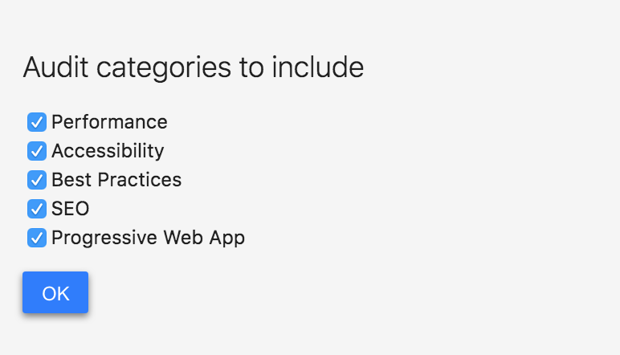

## 使用 Lighthouse 测评 PWA

Lighthouse 是 Google Chrome 推出的一个开源自动化工具，能够对 PWA 多方面的效果指标进行评测，并给出最佳实践的建议以帮助开发者改进 PWA 的质量。它的使用方法也非常简单，我们只需要提供一个要测评的网址，它将针对此页面运行一系列的测试，然后生成一个有关页面性能的报告。通过报告我们就可以知道需要采取哪些措施来改进应用的性能和体验。

### 使用入门

针对不同的适用场景，我们可以通过多种方式来安装并使用 Lighthouse：

- Chrome 浏览器插件。Chrome 插件的形式提供了更加友好的用户界面，方便读取报告。
- Chrome DevTools。该工具集成在最新版本的 Chrome 浏览器中，无需安装即可使用。
- Lighthouse CLI 命令行工具。方便将 Lighthouse 集成到持续集成系统中。
- 编程的方式。我们也能通过 Node.js 模块引入 Lighthouse 工具包，以编程的形式来使用它。

下面我们依次介绍上述这几种使用方法。

### Chrome 插件

下载 Google Chrome 52 或更高版本，并安装 [Ligthouse Chrome 插件](https://chrome.google.com/webstore/detail/lighthouse/blipmdconlkpinefehnmjammfjpmpbjk)。打开需要进行测评的页面，并点击 Chrome 工具栏上的 Lighthouse 图标如下图：


如果在工具栏上没有看到此图标，它可能隐藏在 Chrome 的主菜单中。点击此图标后，我们会看到一个展开菜单，如下图


在 `Options` 选项里，可以选择需要的测评项，包括性能、无障碍访问性、最佳实践、SEO、PWA，默认情况下，选择全部即可。



点击 Generate report 按钮以针对当前打开的页面运行 Lighthouse 测试。

在完成测评后，Lighthouse 将打开一个新标签，并在页面的结果上显示一个报告。


在这里，我们就能看到关于 PWA, Performance, Accessibility, Best Practices 四个方面存在的问题以及相关建议。根据这些去优化你的站点吧！

### Chrome DevTools

在最新版本的 Chrome 浏览器中，Lighthouse 已经直接集成到了调试工具 DevTools 中了，因此不需要进行任何安装或下载。我们先打开需要进行测试的页面，打开 Chrome DevTools，选择 `Audits` 面板，就能看到 Lighthouse 工具的一些配置选项，选择需要的配置后，点击 `Run audits`，工具就会对当前页面进行性能的测评。


### 命令行工具（Lighthouse CLI）

上述两种工具提供了较为基础、快捷的使用方式，针对进阶的高级开发者，Lighthouse 的命令行工具更为合适。它提供了多种详细的使用参数，通过参数的配置，能够更灵活地进行测评并输出报告结果。此外，在一些自动化的持续集成场景中，命令行工具显得十分有用。

#### 安装

安装 [Node](https://nodejs.org/zh-cn/download/)，需要 Node 8 LTS(8.9) 及以上版本。

以全局方式安装：

```shell
npm install -g lighthouse
# or use yarn:
# yarn global add lighthouse
```

#### 运行 CLI

针对一个页面运行 `lighthouse` 命令，进行测评：

```shell
lighthouse https://www.example.com/
```
> 注意：
> CLI 相较于插件和 DevTools 存在一些尚未修复的问题，比如对 Ubuntu 系统支持不好，会抛 NO_FCP 的错误。对于某些网站支持不好，这些网站可能存在以下特征导致 NO_FCP 错误的发生：
> 1. 初始渲染的时候页面不包含文本，而只包含一个 spinner
> 2. 你的站点的启动和渲染主要内容在 5-10s 的延迟之后发生

> [点击](https://github.com/GoogleChrome/lighthouse/issues/6154)查看最新解决方案

默认情况下，运行报告将以 html 的格式输出在当前目录的 `./<HOST>_<DATE>.report.html` 文件中，如上述命令结果将存储在 www.example.com_2019-04-02_16-51-15.report.html。我们也可以指定输出的格式与路径，如：

```shell
lighthouse https://example.com/ --output html --output-path ./report.html
```

如果需要将结果在标准输出流中以 json 格式输出：

```shell
lighthouse https://example.com/ --output json
```

将结果以 json 文件的形式输出到本地目录：

```shell
lighthouse https://example.com/ --output json --output-path ./myfile.json
```

输入 `--help` 选项可以查看可用的输入、输出选项

```shell
lighthouse --help
```

#### 生命周期

Lighthouse 运行测评的过程有一套完整的生命周期，可以划分成三个主要流程：首先是 Collecting 流程，这一步会调用内置的 Driver，其作用是通过 Chrome DevTools Protocol 调起浏览器，并创建新的 tab 请求待测评的站点，通过浏览器采集站点数据并将结果（称之为 Artifacts）保存在本地临时目录。然后进入 Auditing 流程，读取 Artifacts 数据，根据内置的评判策略逐条进行检查并计算出各项的数字形式得分。最后进行 Report 流程，将评分结果按照 PWA、性能、无障碍访问、最佳实践等纬度进行划分，以 JSON、HTML 等格式输出。如下图：


命令行工具基于此提供了生命周期的选项，我们可以让 CLI 只运行整个测评过程的一个或多个特定生命周期。比如，使用 --gather-mode（-G）只进行资源采集的生命周期，命令行工具将会启动浏览器，采集被测试站点的相关数据，并将结果以 json 的形式存储到本地，默认是 `./latest-run/` 目录，然后退出进程：

```shell
lighthouse https://example.com/ -G
```

如果想要跳过浏览器的交互，直接从本地读取页面的临时数据，运行测评和产出结果报告，则可以使用 --audit-mode（-A），默认将从 `./latest-run/` 目录读取：

```shell
lighthouse https://example.com/ -A
```

两个选项同时使用，就会运行整个测评的生命周期，与直接运行 lighthouse 命令相比，会在当前目录保存一份测试站点的数据。

```shell
lighthouse https://example.com -GA
```

如果不想使用默认的 `./latest-run/` 目录，我们也能自定义站点的 json 数据的保存目录，如：

```
lighthouse -GA=./mycustomfolder https://example.com
```

### 编程的方式使用 Lighthouse

除了上述几种方式之外，Lighthouse 也提供了 NPM 包，我们能够以 Node.js 模块的形式引入到项目代码中，结合另一个 NPM 模块 `chrome-launcher` 用于调起浏览器，就可以随心所欲地以编程的方式使用了。

首先要在项目中安装依赖模块：
```shell
npm install lighthouse chrome-launcher
# yarn add lighthouse chrome-launcher
```

在使用 lighthouse 接口之前，需要先用启动一个 chrome，所以我们可以封装一个名为 launchChromeAndRunLighthouse 的方法，来完成这两步。chromeLauncher 工具包提供了 launch 方法，接收一个启动所需的参数 opts，这个参数用于配置 chrome 的启动环境、启动方式等，在返回的 promise 对象中，我们能获取到 chrome 实例。再将待测试 url 及 opts 提供给 lighthouse，测试完成后需要关掉 chrome 实例，然后就能拿到我们需要的测试报告 results 了。

```javascript
const lighthouse = require('lighthouse')
const chromeLauncher = require('chrome-launcher')

function launchChromeAndRunLighthouse(url, opts, config = null) {
  return chromeLauncher.launch({chromeFlags: opts.chromeFlags}).then(chrome => {
    opts.port = chrome.port
    return lighthouse(url, opts, config).then(results => {
      return chrome.kill().then(() => results)
    })
  })
}

const opts = {
  chromeFlags: ['--show-paint-rects']
}

launchChromeAndRunLighthouse('https://example.com', opts).then(results => {
  // Use results!
})
```
值得一提的是这里的 result 包含了多种类型的数据格式，如 `results.lhr` 是 javascript 对象（Lighthouse Result Object），而 `results.report` 则是用于 HTML/JSON/CSV 输出结果的字符串，可以按需选择。

#### 性能报告

对于一些只关注应用性能的使用场景，可以用 onlyCategories 配置项来设定只运行性能这个维度的测试：

```javascript
// ...
const flags = {onlyCategories: ['performance']}
launchChromeAndRunLighthouse(url, flags).then(results => {
  // Use performance results!
})
```

除此之外，我们可以自定义自己需要的测评维度，Lighthouse 的 [Github 仓库](https://github.com/GoogleChrome/lighthouse/tree/master/docs/recipes/custom-audit)提供了一些自定义的示例和方法。

注意，用编程的方式使用 lighthouse 时，在上述代码的 flags 参数的使用上，与 CLI 的方式有所区别。考虑到以 node 模块引入的情况下，开发者自己来控制这些选项更为简单和灵活，部分 flag 选项值只在 CLI 的模式下生效。node 模块和 CLI 中都能使用的选项值，可以参考 [官方的定义](https://github.com/GoogleChrome/lighthouse/blob/888bd6dc9d927a734a8e20ea8a0248baa5b425ed/typings/externs.d.ts#L82-L119)。

#### 开启测试日志

如果运行期间需要查看测试的日志，可以引入 lighthouse-logger 模块，它支持打印不同级别的日志。用法如下：

```javascript
const log = require('lighthouse-logger')
const flags = {logLevel: 'info'}

log.setLevel(flags.logLevel)

launchChromeAndRunLighthouse('https://example.com', flags).then(...)
```

### 自定义配置

你可能已经注意到 lighthouse 在调用的时候还有第三个参数：`lighthouse(url, opts, config)`，这个 config 参数能够帮助我们用更细粒度的控制整个测评。这种细粒度的配置在 CLI 中也是支持的，只是使用方式略有区别：

我们可以指定一个配置文件 custom-config.js 如下，它在继承默认的配置的基础上进行了一定的自定义：

```javascript
module.exports = {
  extends: 'lighthouse:default',
  settings: {
    onlyAudits: [
      'first-meaningful-paint',
      'speed-index-metric',
      'estimated-input-latency',
      'first-interactive',
      'consistently-interactive',
    ],
  },
}
```

如果使用 CLI，需要用 --config-path 指向该配置文件：
```bash
lighthouse --config-path=path/to/custom-config.js https://example.com
```

对于 Node 模块的形式，也基本相似，将配置对象当做 lighthouse 方法的第三个参数传入即可：

```javascript
const lighthouse = require('lighthouse')
const config = require('./path/to/custom-config.js')
lighthouse('https://example.com/', {port: 9222}, config)
```

如果评测过程中有这种比较高阶的配置需求，可以详细了解相关的[属性文档](https://github.com/GoogleChrome/lighthouse/blob/master/docs/configuration.md)，这里我们就不作展开了。

除了这些官方提供的工具之外，一些开源项目也将 Lighthouse 进行了集成。例如使用 Webpack 构建的应用，可以使用 `webpack-lighthouse-plugin`，在构建的过程中完成 Lighthouse 测评；`lighthouse-mocha-example` 则能够在 Mocha 的测试用例中增加 Lighthouse 的测评项等等，整个工具生态日渐繁荣，相信对于我们测评 PWA 性能，构建更完美的 PWA 大有裨益。