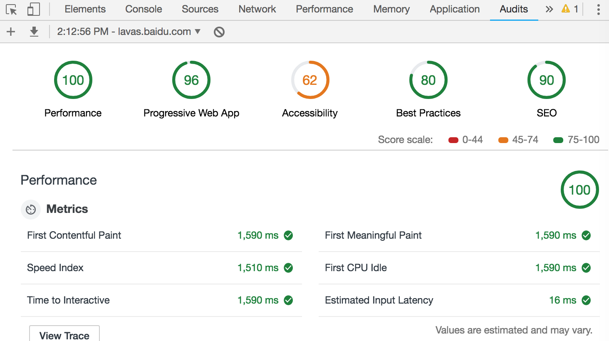

## Lighthouse 评分指南

使用 Lighthouse 对网站进行测评后，我们会得到一份评分报告，它包含了性能（Performance），PWA（Progressive Web App），访问无障碍（Accessibility），最佳实践（Best Practice），搜索引擎优化（SEO）等几个部分。这里我们将介绍一下 Lighthouse 是如何计算这几个评分的。

### 性能评分

性能评分的分值区间是0到100，如果出现0分，通常是在运行 Lighthouse 时发生了错误，如果反复出现了0分的情况，可以在 Lighthouse 的 GitHub 仓库去[反馈 bug](https://github.com/GoogleChrome/lighthouse/issues/new)。满分100分代表了站点已经达到了98分位值的数据，而50分则是75分位值的数据。

#### 影响评分的性能指标

性能测试指标分成了 Metrics，Diagnostic，Opportunities 三部分。通常情况下，只有 Metrics 部分的指标项会对分数产生直接影响，Lighthouse 会衡量以下性能指标项：

- 首次内容绘制（First Contentful Paint）。即浏览器首次将任意内容（如文字、图像、canvas 等）绘制到屏幕上的时间点。

- 首次有效绘制（First Meaningful Paint）。衡量了用户感知页面的主要内容（primary content）可见的时间。对于不同的站点，首要内容是不同的，例如：对于博客文章，标题及首屏文字是首要内容，而对于购物网站来说，图片也会变得很重要。

- 首次 CPU 空闲（First CPU Idle）。即页面首次能够对输入做出反应的时间点，其出现时机往往在首次有效绘制完成之后。该指标目前仍处于实验阶段。

- 可交互时间（Time to Interactive）。指的是所有的页面内容都已经成功加载，且能够快速地对用户的操作做出反应的时间点。该指标目前仍处于实验阶段。

- 速度指标（Speed Index）。衡量了首屏可见内容绘制在屏幕上的速度。在首次加载页面的过程中尽量展现更多的内容，往往能给用户带来更好的体验，所以速度指标的值约小越好。

- 输入延迟估值（Estimated Input Latency）。这个指标衡量了页面对用户输入行为的反应速度，其基准值应低于 50ms。

#### 性能指标评分的计算

每一项性能指标对评分的贡献都有其计算逻辑，Lighthouse 会将原始的性能值映射成为 0-100 之间的数字。评分使用 HTTPArchive 上的真实站点性能数据作为样本，统计出对数正态分布。例如，FMP（First Meaningful Paint）的原始值是从页面初始化开始到主要内容渲染成功的耗时，根据真实站点的数据，顶级性能的站点的 FMP 值约为 1220ms，这个值会被映射成 Lighthouse 的 99 分。

针对不同的评分，Lighthouse 用了不同的颜色进行标注，分值区间和颜色的对应关系如下：

- 0 - 49（慢）：红色
- 50 - 89（平均值）： 橙色
- 90 - 100（快）： 绿色

#### 性能评分的分配权重

各个指标对性能评分的贡献并不相同，Lighthouse 提供了[评分详情表](https://docs.google.com/spreadsheets/d/1Cxzhy5ecqJCucdf1M0iOzM8mIxNc7mmx107o5nj38Eo/edit#gid=0)，形式如下图，来查阅具体权重分配情况。权重较大的指标，对性能评分的影响更大一些，最终的总体性能评分是这些性能指标分数的加权平均值。我们可以用这个分数计算的[表格](https://docs.google.com/spreadsheets/d/1dXH-bXX3gxqqpD1f7rp6ImSOhobsT1gn_GQ2fGZp8UU/edit?ts=59fb61d2#gid=283330180)作为参考，以了解不同的指标是如何影响最终评分的。

从表中可以看出，性能的指标项权重分配如下：

- 3X - 首次内容绘制
- 1X - 首次有效绘制
- 2X - 首次 CPU 空闲
- 5X - 可交互时间
- 4X - 速度指标
- 0X - 输入延迟估值

这些权重的分配方式仍在探究之中，Lighthouse 的团队也在努力试图收集更多站点的数据样本，来将这套计算方法规范化。

#### 减少性能评分的波动

当我们使用 Lighthouse 对实际站点进行测试时，难以避免会有一些影响评分的变量存在。每次访问，站点可能会加载不同的广告、脚本等，网络状况也可能不同。杀毒软件、浏览器插件以及一些其他对页面加载有干预的程序都可能导致评分的较大波动。所以，我们应尽量避免上述因素的影响，以得到更加一致性的数据。可以考虑使用持续集成系统或者第三方服务（如 [WebPageTest](https://webpagetest.org/easy)）进行测试，往往会有更准确的数据。

#### 提高性能评分

前面提到性能评分分为了三部分，Metrics 部分的指标项会直接影响分数，可以作为我们的主要参考点。另外的两部分中， Opportunities 提供了详细的建议和文档，来解释低分的原因，帮助我们具体进行实现和改进。Diagnostics 部分的列表项则为进一步改善性能的实验和调整，给出了指导。这两者不会纳入分数的计算。

### PWA 评分

#### 基准指标项

PWA（Progressive Web App）评分的分值区间也是0-100。Lighthouse 使用 PWA 基准检查项列表（Baseline PWA Checklist）进行测评，测评结果将这些指标项分成了四个类别，共包含12个自动测试项和3个手动测试项，其中各个自动测试项的评分权重是相同的。PWA 的评测指标对我们来说非常重要，我们可以从这四个类别详细了解一下基准指标项。

##### 快速可靠

1. 页面在移动网络条件下能够快速加载。
2. 在离线条件下页面能够返回状态码200。这里我们可以通过 Service Worker 来实现离线可用。
3. start_url 在离线条件下返回状态码200。start_url 是前面章节我们提到过的 manifest.json 中的一个属性，它指定了用户打开该 PWA 时加载的 URL。

##### 可安装

1. 始终使用 HTTPS。
2. 注册 Service Worker 来缓存页面以及 start_url。
3. 使用 manifest 文件来实现安装 PWA 的需求，浏览器能够主动通知用户将应用添加到桌面，增加留存率。

##### PWA 优化

1. 将 HTTP 流量重定向到 HTTPS。
2. 配置自定义启动画面。
3. 设置地址栏主题颜色。
4. 页面内容针对视口大小自适应，对移动用户的展示更友好。
5. 使用了 `<meta name="viewport">` 标签，并设置了 width 或 initial-scale 属性。
6. 当 JavaScript 文件不可用时，提供降级措施，页面能显示基本内容而不出现白屏。

##### 手动测试项

1. 站点跨浏览器可用，如主流浏览器 Chrome, Edge, Firefox 及 Safari 等。
2. 页面间切换流畅，即使在较差的网络环境下，切换动画也应该简洁顺畅，这是提高用户感知体验的关键。
3. 保证每个页面都有独一无二的 URL，能够在新的浏览器窗口打开，且方便在社交媒体上进行分享。

#### 示范性指标项

除了上述基准指标项之外，为了让 PWA 的体验更加完美，还有 Lighthouse 未实现检查的进阶指标，也就是可以作为示范性参考的 PWA 的指标，这些指标大多需要人工进行确认，它们也分成了几个类别，我们可以针对性地改进 PWA。

##### 可索引 & 社交支持

1. 站点的内容可以被 Baidu，Google 等搜索引擎收录索引。
2. 提供必要的 `Schema.org` 标记数据，搜索引擎都会依据这些标记来优化搜索结果，让人们更容易找到正确的网页。
3. 提供必要的社交标记数据，如 Twitter 的 `<meta name="twitter:card" content="summary" />` 标签，能够便于被这些社交站点的爬虫抓取。
4. 提供 Canonical URL，一般适用于页面内容能使用多个 URL 访问的场景。
5. 页面使用 History API，对于单页应用，确保 URL 不要使用片段标识符，如 `https://example.com/#!user/26601` 中 #！后面的部分。

##### 用户体验

1. 当页面加载时，确保页面内容不跳动或闪烁。
2. 从详情页返回列表页时，记录之前的滚动位置。
3. 输入文字时，键盘不会挡住输入框。
4. 在 Standalone 模式下（从主屏幕启动的情况），页面内容可分享。
5. 在不同的移动设备及桌面电脑上，站点能够自适应。
6. 不要过度使用安装 APP 的推送。
7. 在适当的时候显示添加到桌面的推送，避免打断用户正常使用流程。

##### 性能

1. 首次加载速度尽可能快，即使是在慢速 3G 移动网络下，可交互时间也应该在 5s 以内（在基准指标中，这个时间是 10s）。

##### 缓存

1. 站点使用 cache-first (缓存优先)的缓存策略。尽可能地使用这种策略，确保在慢网络环境和离线环境的加载速度始终相当。
2. 用户处于离线状态时，应当适当地给出通知。可以使用 Network Information API 来实现。

##### 推送通知

1. 告知用户通知功能的使用背景和原因，保证得到许可。
2. 建议用户开启推送通知的 UI 应当尽量友好，不能太强势。
3. 站点显示权限请求时，屏幕的其他主体内容应当适度变暗，让用户更清楚地看到站点需要开启通知权限的理由。
4. 推送通知的内容应当及时、准确，且具有较强的关联性。
5. 给用户提供开启、关闭通知的操作权限。

##### 附加功能点

1. 使用 Credential Management API，帮助用户实现跨设备登录。
2. 使用 Payment Request API，帮助用户方便地调起更友好的原生界面（native UI）进行支付操作。

### 访问无障碍评分

访问无障碍评分的分值由相关指标的加权平均值计算而来。可以在[评分详情](https://docs.google.com/spreadsheets/d/1Cxzhy5ecqJCucdf1M0iOzM8mIxNc7mmx107o5nj38Eo/edit#gid=0)查阅每项指标的具体权重。同理，较大权重的指标项对分数的影响较大。无障碍性的每个指标项测试结果为`pass`或者`fail`，与性能指标项的计算方式不同，当页面只是部分通过某项指标时，页面的这项指标将不会得分。例如，如果页面中的一些元素有`屏幕阅读器友好`的命名，而其他的元素没有，那么这个页面的  screenreader-friendly-names 指标项得分为0。

### 最佳实践评分

最佳实践评分的分数区间为0-100。影响这项评分的指标项的权重都是相同的。如果我们想计算某个指标项对总体评分的贡献，用指标项的数量除以100即可。指标项和权重同样可以参考上文提供的评分详情表，我们可以结合测评结果一一进行优化。

