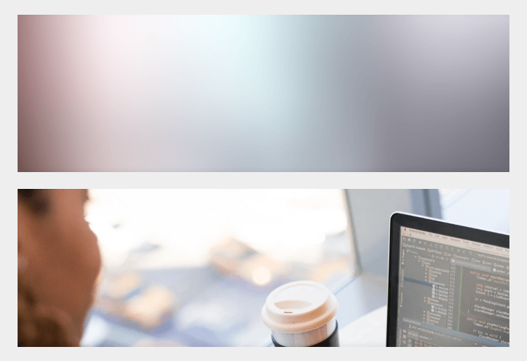
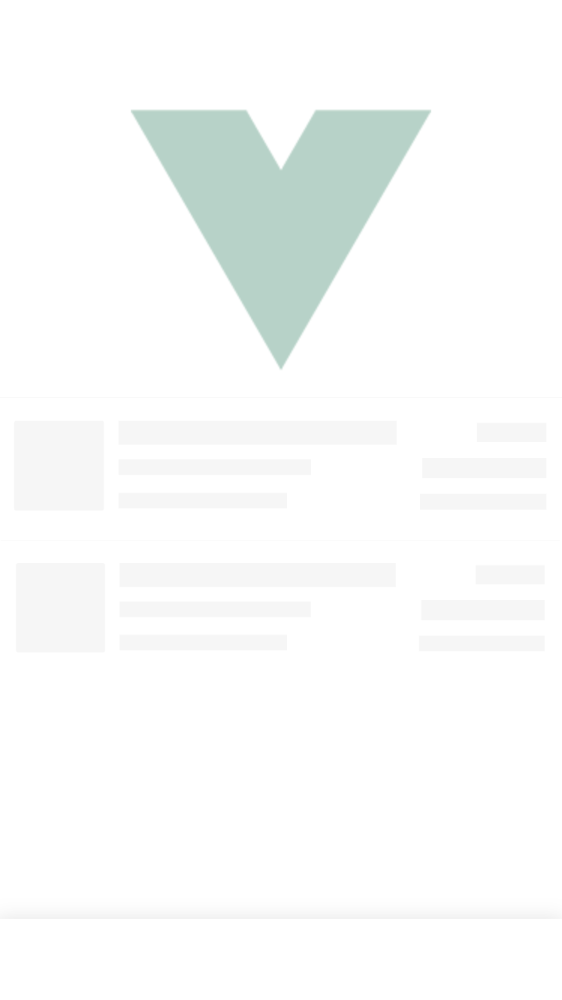
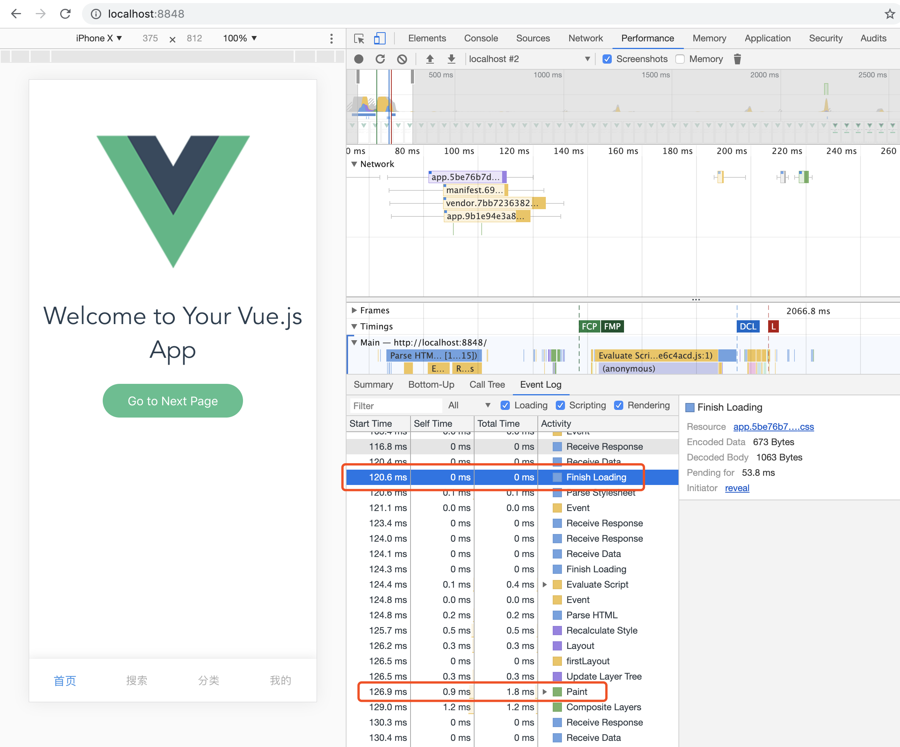
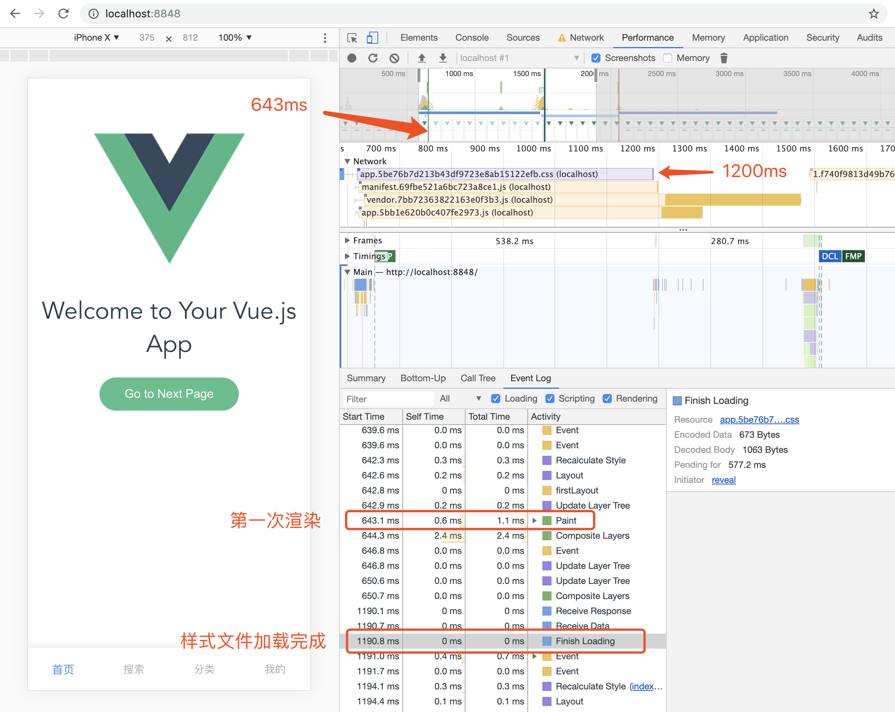

# 骨架屏

在前面的章节，我们说过，首屏速度对于用户留存率至关重要。

很多站点都会在完成基本功能后（或者同时）进行性能优化，常见的性能优化手段包括静态资源合并，压缩文件，使用 CDN，包括上一小节介绍的 App Shell 等，这些的确能够显著地缩短加载时间。但是我们想象一下，在首次打开时，主体内容渲染完成之前，页面基本上是空白的，这对于用户体验是非常不友好的。如果我们用能够快速渲染的静态图片/样式/色块进行占位，让用户对后续会渲染的内容有一定的预期，这要比白屏等待要好的多，这就是骨架屏。如上一节的结尾所述，它本质上并不提升页面的加载速度，却能提升感官体验，让网页“看起来”更快。

## 骨架屏长什么样

您可能没听说过骨架屏这个名字，但应该很早就在其他 App 上看到过，骨架屏常见的种类有列表、图片和两者的混合。

下面的图是[饿了么 Web 站点](https://h5.ele.me/msite/) 骨架屏的效果，这种效果是比较常见的类型，它使用各种形状的色块来模拟图片和文字，有些图标也会使用圆形色块。为了追求效果，还可以在色块表面添加动画效果，如波纹，看起来就像具有 loading 效果的骨架屏。


在图片居多的站点，使用低像素的图片进行占位也是一个不错的选择，图片配色及变化和原图相近即可，如果觉得生成低像素的图片成本较高，可以降级使用纯色色块代替，但色块的颜色最好和图片主体颜色相似，如果觉得这个成本还是很高，那么可以直接采用上面例子中统一颜色的色块。



骨架屏的精髓，并不是用什么来占位，而是无论什么内容占位，一定要保持渲染前和渲染后结构相似，不能差距太大，最好保持色块/图片间距一样，避免页面渲染后内容跳动。

## 骨架屏能用在哪里

现在的 Web 应用，从架构上来说分为前端渲染(CSR)和后端渲染(SSR)两种，骨架屏适用于前端渲染的页面，而后端渲染的页面渲染首屏时所有内容都已经存在了，因此无需骨架屏。但是，即使是后端渲染的页面有时也会存在前端渲染的区域，比如列表的加载，只要是用到 JavaScript 来渲染内容的地方，都可以选择性的使用骨架屏来占位。

由于近几年 Angular/React/Vue 的推出，前端渲染的站点越来越多，它们让开发复杂 Web App 变的很简单。它们的流行也大大提高了 App Shell 和骨架屏的普适性，大部分此类站点都可以采用这种模式。

## 在 Vue 项目中使用骨架屏

我们以 Vue 开发的单页应用为例，在其它框架上，实现思路是一致的。在这个示例中，为了方便调试，笔者将 Service Worker 的注册逻辑删除了。

开发者可以下载示例代码并启动，如下所示：

```bash
# 从 GitHub 下载代码到本地 pwa-book-demo 目录
$ git clone https://github.com/lavas-project/pwa-book-demo.git

# 进入到 chapter02/appskeleton-01 目录
$ cd chapter02/appskeleton-01

# 安装 npm 依赖
$ npm install

# 启动 chapter02 appskeleton-01 示例
$ npm run dev
```

为了方便调试，我们将 `src/main.js` 中 Vue 实例的挂载时间推迟了 2s，在这期间，我们能看到骨架屏的效果。

```javascript
// src/main.js
const app = new Vue({
  router,
  components: { App },
  template: '<App/>'
})

router.onReady(() => {
  // 将 mount 时间延后 2s，便于查看效果
  setTimeout(() => app.$mount('#app'), 2000)
})
```

然后，我们需要在 `index.html` 中添加骨架屏，如下：

```html
<!-- skeleton 的内联样式 -->
<style>
  body {
    margin: 0;
  }
  .skeleton {
    text-align: center;
    padding-top: 60px;
  }
  .skeleton-bottom {
    position: fixed;
    bottom: 0;
    left: 0;
    right: 0;
    height: 56px;
    box-shadow: 0 3px 14px 2px rgba(0, 0, 0, .12);
    display: flex;
  }
</style>

...

<!-- Vue 实例挂载点 -->
<div id="app">
  <div class="skeleton">
    <!-- 上半部分图片的占位采用缩小的图片 -->
    
    <div class="skeleton-section">
      <!-- 中间内容区域采用文字类型的骨架占位 -->
      
      
    </div>
    <!-- 底部导航栏采用空的结构占位 -->
    <div class="skeleton-bottom"></div>
  </div>
</div>
```

填写完成之后，刷新页面您能看到下图所示的骨架屏。



## 进阶优化：更快的展现骨架屏

在上面的例子中，为了让骨架屏尽早展现，我们需要做到以下两点：

1. 把骨架屏的 HTML 内联在 `index.html` 中，而不是用 JavaScript 来渲染
2. 骨架屏的 CSS 最好内联，保证骨架屏在最短的时间内渲染

可惜的是，尽管我们这么做了，也不一定能取得想要的结果，通过实际测试会发现骨架屏很难被用户看到，或者说它展示的时间不如预期的早。

### 现状分析

我们在上面的示例基础上来分析一下原因是什么。用 Chrome 调试工具中的 Performance 记录渲染流程，为了简单一些，我们可以将网络设置成 Slow 3G，会比较明显的发现骨架屏出现的时间非常短。

> 为了更接近生产环境，先将示例编译之后再调试。

```bash
# 在 chapter02/appskeleton-01 目录中
# 编译
$ npm run build
# 进入到编译后的 dist 目录
$ cd dist
# 安装静态文件调试服务
$ npm install -g edp
# 在 dist 目录中启动本地静态文件服务
$ edp ws start
```

打开 Chrome 浏览器访问 `http://localhost:8848`。下图是笔者用调试工具记录的页面渲染流程，发现页面第一次渲染是在 `app.*.css` 加载完成之后。



按照预想，骨架屏应该在 HTML 加载完成之后立刻渲染出来，也就是在浏览器获取外链资源的同时，这也是为什么我们把骨架屏的 HTML 和样式都内联的原因，然而事与愿违，浏览器并不买账。

### 浏览器做了什么

熟悉浏览器的开发者很快就能理解，这与浏览器的渲染顺序有关。

相信大家都整理过行李箱。在整理行李箱时，会根据每个行李的大小合理安排，大的和小的配合，填满一层再整理上面一层。如果突然有人跑来和你说电脑不用带了，要多带两件衣服，这时除了想打他之外，你还需要重新安排行李。在浏览器中，这个过程叫做重排（reflow），而那个馊主意就是新加载的样式文件。显而易见，重排的开销是很大的，需要尽力避免。

既然每个 CSS 文件都可能会触发重排和重绘，那索性等待 `<head>` 中所有的外链样式文件加载完成之后再渲染，这个流程本身是没有问题的，却在骨架屏的应用中出了一些问题。

页面从加载到展现的大致顺序如下：

1. 加载 HTML 文件
2. 解析 DOM
3. 并行加载 CSS/JS 资源
4. 如果 `<head>` 中存在外链的样式，则阻塞渲染等待样式文件加载并解析完成
5. 如果 `<head>` 中存在外链的 script，则阻塞渲染等待 script 文件加载并执行完成

在 Vue 的项目编译完成之后，`<head>` 标签中的结构如下，在 `<head>` 标签中插入了一个外链的样式文件，导致骨架屏渲染推后。

```html
<head>
  <meta charset=utf-8>
  <meta name=viewport content="width=device-width,initial-scale=1">
  <link rel=manifest href=/static/manifest.json> <title>PWA Chapter02 Demo - App Skeleton</title>
  <style>
    body {
      margin: 0;
      padding-top: 60px;
    }
    .skeleton {
      text-align: center;
    }
    .skeleton-bottom {
      position: fixed;
      bottom: 0;
      left: 0;
      right: 0;
      height: 56px;
      box-shadow: 0 3px 14px 2px rgba(0, 0, 0, .12);
      display: flex;
    }
  </style>
  <!-- 编译后插入在 head 中的外链样式文件 -->
  <link href=/static/css/app.5be76b7d213b43df9723e8ab15122efb.css rel=stylesheet>
</head>
```

为了尽早展现骨架屏，我们将骨架屏渲染所需的样式和 HTML 内联，却被页面中其他的外链样式文件阻塞了渲染。拿上一节中的 Vue 示例来举例，由于浏览器解析完 DOM 之后是并行加载外链资源的，所以在样式文件加载完成之后，JavaScript 文件也基本已经加载完成，因此在骨架屏真的渲染出来之后没多久就被 JavaScript 渲染的真正内容取代，这就是为什么骨架屏出现非常靠后，效果大打折扣。

所以，我们需要告诉浏览器，请放心大胆的先渲染骨架屏。

### 避免样式文件的加载阻塞骨架屏的渲染

Webpack 编译的 Vue 项目，会在 `index.html` 的 `<head>` 插入外链的样式文件，`<link ref="stylesheet" href="http://xxxx">`，这无疑会阻塞骨架屏的渲染。浏览器还提供了预加载机制，使用方法非常简单，只需将 `rel="stylesheet"` 改为 `rel="preload"`，浏览器会在空闲的时候加载并缓存，之后再使用就不用重复加载。

这看似无关的技术，在骨架屏的应用里将起到很大的作用，因为**预加载的资源不会阻塞渲染**.

我们通过这种方式告诉浏览器，先不要管 `app.xxx.css`，直接渲染后续内容，在 `app.xxx.css` 文件加载完成之后，再将它重新设置为样式文件，如下代码所示：

```html
<link rel="preload" href="/static/css/app.5be76b7d213b43df9723e8ab15122efb.css" as="style" onload="this.onload=null;this.rel='stylesheet'">
```

方法的核心是通过改变 `rel` 让浏览器重新认定这个 `<link>` 标签是样式文件，这样既不阻塞骨架屏的渲染，也能正常应用外链样式文件。

### 这样就完了吗？

如果不将 `<link>` 标签 `rel="stylesheet"` 改为 `rel="preload"`，浏览器会根据资源的书写顺序来顺序执行，即先应用外链样式，再执行外链 JavaScript 文件渲染主体内容。但是根据上面的步骤，我们使用预加载来加载样式文件，这样做的结果就是我们无法保证浏览器会先应用样式再运行 JavaScript 渲染内容，一旦 JavaScript 先执行并渲染出了内容，再应用外链样式，会导致页面重排和重绘，用户会先看到排版完全是乱的页面，再看到正常的页面，对用户体验是不小的伤害。

因此，我们还需要考虑到文件加载顺序的问题，在样式文件加载完成前，即使 JavaScript 已经渲染好了内容，也先不要替换掉骨架屏，等待样式文件加载完成后，再触发 JavaScript 进行挂载。

在 Vue 的项目中需要修改 `src/main.js` 和 `index.html` 文件。

```javascript
// src/main.js
const app = new Vue({
  router,
  components: { App },
  template: '<App/>'
})

/**
 * 挂载 Vue 渲染好的 HTML 元素到 #app 中，替换掉骨架屏
 */
window.mount = function () {
  app.$mount('#app')
}
```

```html
<!-- index.html -->
<link rel="preload" href="/static/css/app.5be76b7d213b43df9723e8ab15122efb.css" as="style" onload="this.onload=null;this.rel='stylesheet';window.mount()">
```

这样就好了吗？

还不够完善，如果样式文件在 JavaScript 文件之前加载，那么 `mount` 函数还没有声明，执行会出错，最终也导致主体内容没有渲染到页面上。还需要完善，增加一个标记告诉 JavaScript 样式是否加载完成，经过改造代码如下，同样还是 `src/main.js` 和 `index.html` 文件。

```javascript
// src/main.js
const app = new Vue({
  router,
  components: { App },
  template: '<App/>'
})

/**
 * 挂载 Vue 渲染好的 HTML 元素到 #app 中，替换掉骨架屏
 */
window.mount = function () {
  app.$mount('#app')
}

// 如果样式文件已经加载完成了，直接挂载
if (window.STYLE_READY) {
  window.mount()
}
```

```html
<!-- index.html -->
<link rel="preload" href="/static/css/app.5be76b7d213b43df9723e8ab15122efb.css" as="style" onload="this.onload=null;this.rel='stylesheet';window.STYLE_READY=1;window.mount&&window.mount();">
```

考虑到浏览器不支持 JavaScript 的情况，那么还需要增加一个 `<noscript>` 标签。

```html
<link rel="preload" href="/static/css/app.5be76b7d213b43df9723e8ab15122efb.css" as="style" onload="this.onload=null;this.rel='stylesheet';window.STYLE_READY=1;window.mount&&window.mount();">
<noscript><link href="/static/css/app.5be76b7d213b43df9723e8ab15122efb.css" rel="stylesheet"></noscript>
```

经过这番改造之后，我们再来看一下在 Chrome 中的表现，这个示例是在 Fast 3G 网络环境下展现的，如下图所示。骨架屏在 650ms 左右的时刻渲染完成，而样式文件是在 1200ms 左右才加载完成，没有阻塞骨架屏的渲染，符合期望。



### 如何在 Vue 项目中使用骨架屏

如果让开发者在 Vue + Webpack 项目中进行上面的改写，代价是比较高的，为此，百度 Web 生态团队写了一个 Webpack 插件，[vue-skeleton-webpack-plugin](https://github.com/lavas-project/vue-skeleton-webpack-plugin)。

## 总结

骨架屏从优化关键渲染路径思路出发，配合 App Shell 和 Service Worker 等技术，进一步优化页面在加载阶段的感知体验。通过本节学习示例，我们看到配合 Vue/Webpack 等一系列技术，为应用添加骨架屏可以变得更加简单。

