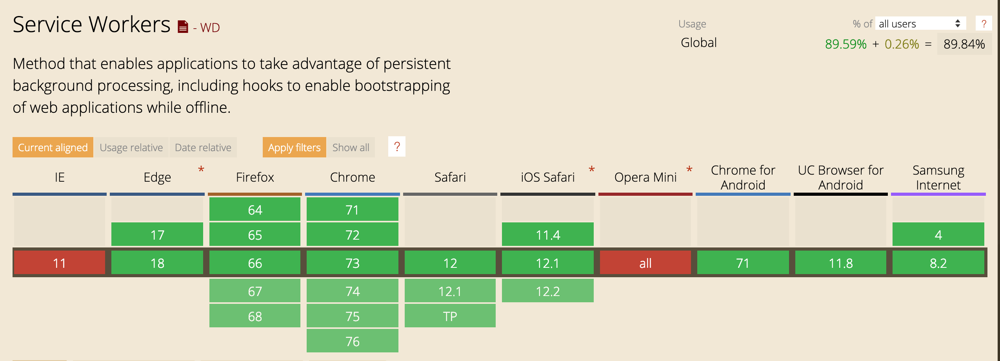

# Service Worker 简介

丢失网络连接是一个困扰 Web 用户多年的难题，即使是世界上最好的 Web App，如果因为网络原因访问不了它，那体验也是非常糟糕的。本小节要介绍的 Service Worker 能提供一种良好的统筹机制对资源缓存和网络请求进行缓存和处理，是 PWA 实现离线可访问、稳定访问、静态资源缓存的一项重要技术。

通常所讲的 Service Worker 指的是 Service Worker 线程。了解浏览器工作原理的开发者都知道浏览器中执行的 JavaScript 文件是运行在一个单一线程上，称之为 **主线程**。而 Service Worker 是一种独立于浏览器主线程的 **工作线程**，与当前的浏览器主线程是完全隔离的，并有自己独立的执行上下文（context）。

首先借一个简单的例子来了解一下什么是 Service Worker，假如现在有一个最简单的前端项目 serviceWorkerDemo ，目录结构如下：

```bash
.
└── serviceWorkerDemo
    ├── index.html
    └── sw.js
```

`index.html` 文件的内容如下：

```html
<!DOCTYPE html>
  <head>
    <title>Service Worker Demo</title>
  </head>
  <body>
    <script>
      navigator.serviceWorker.register('./sw.js')
    </script>
  </body>
</html>
```

HTML5 提供的一个 Service Worker API，能够进行 Service Worker 线程的注册、注销等工作，在该示例中，通过 `navigator.serviceWorker.register()` 方法就能够注册一个 Service Worker，在当前的浏览器主线程的基础上新起一个 Service Worker 线程。

在示例项目的目录中还有一个 `sw.js`，有时候开发者会将这个 JavasScript 脚本文件称之为 Service Worker，这种说法不是很严谨，通常将可以被 `navigator.serviceWorker.register()` 方法注册的 JavaScript 文件称之为 Service Worker 文件，可以是任何命名，在这个示例中命名为 `sw.js`，其内容就是在 Service Worker 线程上下文中执行的内容（如果文件为空代表 worker 线程什么也不会做），由于 Service Worker 线程是独立于主线程的工作线程，所以在 `sw.js` 中的任何操作都不会影响到主线程。

接下来，我们来运行一下上面简易的示例，可以借助 local-web-server 工具在示例项目根目录下启动一个本地服务器，帮助我们查看一下 Service Worker 的具体运行状态，如下操作：

```bash
$ npm install -g local-web-server
$ ws
```

> 提示：
> 为了方便介绍，本章所有的 Demo 示例在提到 “运行” 的时候，都指的是在 Demo 项目的根目录通过 `ws` 命令启动 local-web-server，其默认 host 为 `127.0.0.1`，默认端口号为 `8000`。

使用 Chrome 浏览器访问示例站点 `http://127.0.0.1:8000` 的，可以在开发者模式的 `Applications > Service Worker` 面板中看到当前 Service Worker 线程的状态，在完成了 Service Worker 注册安装之后，结果如下图所示：


当调节当前的网络状态为「离线」，依然可以看到 Service Worker 还是生效状态，通过这个例子可以发现，Service Worker 不仅是一个独立于主线程的的一个工作线程，并且还是一个可以在离线环境下运行的工作线程，这样就为 PWA 的离线与缓存功能提供了可行性基础。

## 为什么有 Service Worker

在了解了 Service Worker 是一个工作线程的本质之后，接下来继续了解一下为什么会有 Service Worker 这个技术出现呢？W3C（国际万维网联盟）早在 2014 年 5 月就提出了 Service Worker HTML5 API 草案，用来进行 Web 资源和请求的持久离线缓存。Service Worker 的来历可以从两个方面来介绍。

一方面，浏览器中的 JavaScript 都是运行在一个单一主线程上的，在同一时间内只能做一件事情。随着 Web 业务不断复杂，在 JavaScript 中的代码逻辑中往往会出现很多耗资源、耗时间的复杂运算过程。这些过程导致的性能问题在 Web App 日益增长的复杂化过程中更加凸显出来。所以 W3C 提出了 Web Worker API 来专门解放主线程，Web Worker 是脱离在主线程之外的工作线程，开发者可以将一些复杂的耗时的工作放在 Web Worker 中进行，工作完成后通过 postMessage 告诉主线程工作的结果，而主线程通过 onmessage 得到 Web Worker 的结果反馈，从而释放了主线程的性能压力。

代码执行性能问题好像是解决了，但 Web Worker 是临时存在的，每次做的事情的结果不能被持久存下来，如果下次访问 Web App 同样的复杂工作还是需要被 Web Worker 重新处理一遍，这同样是一件消耗资源的事情，只不过不是在主线程消耗罢了。那能不能有一个 Worker 线程是一直是可以持久存在的，并且随时准备接受主线程的命令呢？基于这样的需求 W3C 推出了最初版本的 Service Worker，Service Worker 在 Web Worker 的基础上加上了持久离线缓存能力，可以通过自身的**生命周期**特性保证复杂的工作只处理一次，并持久缓存处理结果，直到修改了 Service Worker 的内在的处理逻辑。

而另一方面，为了解决 Web 网络连接不稳定的问题，W3C 在很早的时候提出了 ApplicationCache 机制来解决离线缓存的问题，做法是在 HTML 页面中可以指定一个清单文件 `manifest.appcache`，清单中指定需要离线缓存的静态资源，ApplicationCache 能够解决离线可访问的问题。假设已经存在一个简单的项目 applicationCacheDemo，项目目录如下：

```bash
.
└── applicationCacheDemo/
    ├── index.html
    └── manifest.appcache
```

下面是一个简单的 `manifest.appcache` 配置文件内容：

```bash
CACHE MANIFEST
# version xx.xx.xx
CACHE:
cached.png
cached.js

NETWORK:
noCached.html
noCached.css

FALLBACK:
/ 404.html
```

`CACHE` 字段配置了需要当前页面离线缓存的静态资源，`NETWORK` 字段配置了当前页面不需要离线缓存的静态资源，`FALLBACK` 字段指定了一个后备页面，当资源无法访问时，浏览器会使用该页面。该段落的每条记录都列出两个 URI，第一个表示资源，第二个表示后备页面。两个 URI 都必须使用相对路径并且与清单文件同源。可以使用通配符。有了 `manifest.appcache` 文件之后，可以在 `index.html` 的 HTML 文件中的 `<html>` 标签进行引入从而指定当前页面的静态资源离线缓存的情况，如下面代码所示：

```html
<!DOCTYPE html>
<html manifest="./manifest.appcache">
<!--...-->
</html>
```

虽然通过 ApplicationCache 机制能够解决 Web App 的离线缓存的问题，但是同时也带来了不小的问题：

- 在 manifest.appcache 文件中定义的资源全部被成功加载后，这些资源文件连同引用 manifest.appcahe 文件的 HTML 文档一并被移动到永久离线缓存中。所以如果想只缓存 JS、CSS、图片等文件，而不希望缓存 HTML 文档以保持获得最新内容的情况来说，是个非常大的问题。

- 根据 ApplicationCache 的加载机制，如果仅仅修改被缓存资源文件的内容（没有修改资源文件的路径或名称），浏览器将直接从本地离线缓存中获取资源文件。所以在每次修改资源文件的同时，需要修改 manifest.appcache 文件，以触发资源文件的重新加载和缓存，维护成本太高。

- 靠一个 manifest.appcache 配置文件来维护一个复杂的站点的缓存策略实在是一件非常艰难的工作，毕竟单纯靠配置是非常不灵活的。

- 对动态请求无法处理。

通过一段时间的实践后，W3C 决定废弃 ApplicationCache，虽然其仍然保留在 HTML 5.0 Recommendation 中，但会在 HTML 后续版本中移除。一些主流浏览器甚至已经将 ApplicationCache 标注为不推荐使用，并引导开发者使用 Service Worker。Service Worker 就很好的解决了 ApplicationCache 的痛点问题，它能够通过非常多的缓存策略来灵活的管理 Web App 的离线缓存，大大降低维护成本（我们会在后面章节详细的讲解这部分的内容）。

基于 Woker 工作线程的离线能力和离线缓存机制的双重迫切需求，通过不断的实践和发展，W3C 最终提出的 Service Worker API 可以以独立工作线程的方式运行，结合持久缓存调度策略，能够很好的解决离线缓存问题。并且可以以非侵入的方式与现存的 Web App 结合使用，从可以实现 PWA 渐进式的离线与缓存的效果。

## Service Worker 的特点

Service Worker 功能虽然强大，但是使用 Service Worker 还是有一定的条件以及一些专有的特点的。

出于安全的考虑 Service Worker **必须运行在 HTTPS 协议下**，Github 提供的 [git page](https://pages.github.com/)是个用来测试 Service Worker 的好地方，因为它就直接就支持 HTTPS，直接就可以测试静态页面和静态资源，为了便于本地开发，`localhost`、`127.0.0.1` 这种非 HTTPS 协议也被浏览器认为是安全源。

Service Worker 线程**有自己完全独立的执行上下文**。**一旦被安装成功就永远存在，除非线程被程序主动解除**，而且 Service Worker 在访问页面的时候可以直接被激活，如果关闭浏览器或者浏览器标签的时候会自动睡眠，以减少资源损耗。

Service Worker 是完全异步实现的，内部的接口的异步化都是通过 Promise 实现，并且在 Service Worker 中**不能直接操作 DOM**，出于安全和体验的考虑，UI 的渲染工作必须只能在主线程完成。

Service Worker **可以拦截并代理请求，可以处理请求的返回内容**，可以持久化缓存静态资源达到离线访问的效果，和 ApplicationCache 不同，Service Worker 的所有的离线内容**开发者完全可控**，甚至是可以控制动态请求，第三方静态资源等。

由于 Service Worker 可以离线并且在后台工作，所以可以进行 **推送消息**（第六章会详细说明）、**后台同步**资源等功能，在不久的将来，利用 Service Worker 的这一特性，甚至可以衍生出更多的 Web App 原生化的功能。

## 浏览器支持程度

由于 W3C 标准或草案的提出之后各大浏览器的实现步伐是不一样的，参考 [Can I Use](https://caniuse.com) 截止 2019-04-02 的数据，如下图所示当前各大浏览器对 Service Worker 的支持情况如下。



从上图可以看出，Service Worker 的支持程度已经达到 `89.84%`。其中 Chrome 作为开路先锋早早的在 V40 版本就已经支持 Service Worker，并在 Devtools 中还提供了完善的 Debug 方案，Apple 方面从 MacOS Safari 11.1 和 iOS Safari 11.3 开始全面支持，IE Edge 从 17 版本开始也全面支持。

目前 Apple 和微软都已经支持了 Service Worker，所以对于 “离线可访问” 这样的 PWA 特性来讲，几乎可以在任何的现代浏览器中被实现。

更详细的 Service Worker 浏览器支持信息，可以在 [Jake Archibald 的 Is ServiceWorker Ready](https://jakearchibald.github.io/isserviceworkerready/) 网站上查看所有浏览器的支持情况。

由于 Service Worker 的功能是渐进式的，如果浏览器不支持 Service Worker，在架构设计上 Web App 也应该能够正常运行，为了防止 JavaScript 报错，所以通常在注册之前需要进行嗅探处理。修改 serviceWorkerDemo 的 `index.html` 代码如下所示：

```html
<!DOCTYPE html>
  <head>
    <title>Service Worker Demo</title>
  </head>
  <body>
    <script>
      if ('serviceWorker' in navigator) {
        navigator.serviceWorker.register('./sw.js')
      }
    </script>
  </body>
</html>
```

## 小结

本节介绍了 Service Worker 的一些基本概念和 Service Worker 的一些背景和功能，但是对注册的细节，Service Worker 生命周期等细节没有做深入介绍，这些内容对于使用 Service Worker 对 Web App 进行离线缓存处理有重要作用。接下来的章节将会对 Service Worker 的这些细节做更加详细的介绍。
