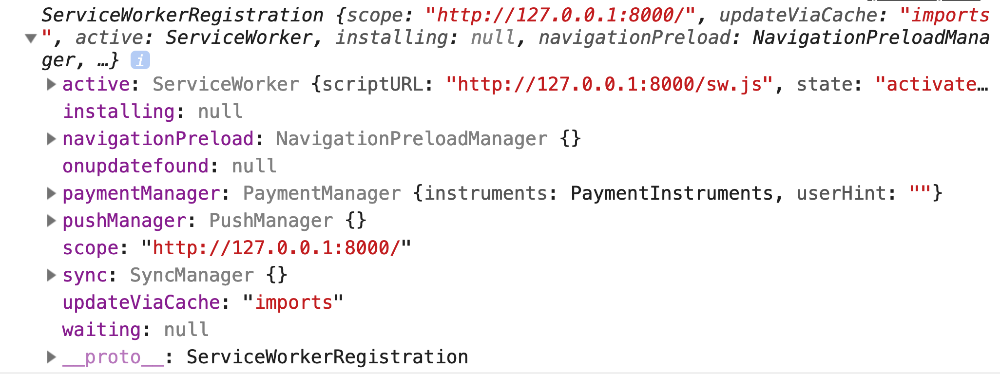

# Service Worker 注册

通过前面对 Service Worker 概念的介绍，我们对 Service Worker 的一些概念和原理有了一定的了解，在本节将会重点介绍 Service Worker 注册的相关内容。主要会介绍如何为 Web App 注册一个 Service Worker、在不同的项目架构下注册 Service Worker 的方法、Service Worker 注册的一些细节和注意点等。

## 作用域

Service Worker 是有自己的作用域的，Service Worker 作用域是一个 URL path 地址，指的是 Servcie Worker 能够控制的页面的范围，例如：某个 Service Worker 的作用域为 `https://somehost/a/b/`，那这个 Service Worker 能控制 `https://somehost/a/b/` 目录下的所有页面，可以包含下面列出的页面：

- `https://somehost/a/b/index.html`
- `https://somehost/a/b/c/index.html`
- `https://somehost/a/b/anothor.html`
- ...

所谓的 “控制页面” 指的是 Service Worker 可以处理这些页面里面的资源请求和网络请求，然后通过 Service Worker 自身的调度机制构建离线缓存策略。如果页面不在 Service Worker 的作用域范围内，Service Worker 就无法处理页面的任何资源或请求。

为了加深对 Service Worker 作用域的理解，接下来还是来看下 serviceWorkerDemo 这个示例，在 `index.html` 中修改一下代码如下所示：

```html
<!DOCTYPE html>
  <head>
    <title>Service Worker Demo</title>
  </head>
  <body>
    <script>
      if ('serviceWorker' in navigator) {
        navigator.serviceWorker.register('./sw.js')
          .then(reg => {
            console.log(reg)
          })
      }
    </script>
  </body>
</html>
```

首先从上面代码可以看出 `navigator.serviceWorker.register()` 方法返回的是一个 Promise，这个 Promise 中 resolve 返回的是 Service Worker 注册成功后返回的 ServiceWorkerRegistration 对象。运行之后将这个对象打印出来的结果如下图所示。



ServiceWorkerRegistration 对象中的 scope 的值就是当前的 Service Worker 的作用域，在这个示例中为 `http://127.0.0.1:8000/`。

为了更直观的看到 Service Worker 作用域的工作原理，接下来新建一个 serviceWorkerScopeDemo 项目，项目目录结构如下：

```bash
.
└── serviceWorkerScopeDemo
    ├── a
    │   └── b
    │       └── sw.js
    └── index.html
```

将 `sw.js` 放入 `/a/b/` 目录下，将 `index.html` 中的注册 Service Worker 逻辑修改一下，代码如下所示：

```html
<!DOCTYPE html>
  <head>
    <title>Service Worker Scope Demo</title>
  </head>
  <body>
    <script>
      if ('serviceWorker' in navigator) {
        navigator.serviceWorker.register('./a/b/sw.js')
          .then(reg => {
            console.log(reg.scope)
            // http://127.0.0.1:8000/a/b/
          })
      }
    </script>
  </body>
</html>
```

将 `navigator.serviceWorker.register()` 方法的 Service Worker 文件 URL 改成 `./a/b/sw.js`，运行结果打印出来的 scope 结果为 `http://127.0.0.1:8000/a/b/`。通常情况下在注册 `sw.js` 的时候会忽略 Service Worker 作用域的问题，Service Worker 默认的作用域就是注册时候的 path, 例如：Service Worker 注册的 path 为 `/a/b/sw.js`，则 scope 默认为 `/a/b/`。

也可以通过在注册时候在 `navigator.serviceWorker.register()` 方法中传入 `{scope: '/some/scope/'}` 参数的方式自己指定作用域，如下代码所示：

```html
<!DOCTYPE html>
  <head>
    <title>Service Worker Scope Demo</title>
  </head>
  <body>
    <script>
      if ('serviceWorker' in navigator) {
        navigator.serviceWorker.register('./a/b/sw.js', {
          // 手动指定一个作用域
          scope: '/a/b/c/'
        }).then(reg => {
          console.log(reg.scope)
          // http://127.0.0.1:8000/a/b/c/
        })
      }
    </script>
  </body>
</html>
```

将 scope 配置 `{scope: '/a/b/c/'}` 传入 `navigator.serviceWorker.register()` 方法，运行后打印出来的内容为 `http://127.0.0.1:8000/a/b/c/`。也就是说可以通过参数为 Service Worker 指定一个作用域。当然，这个自定义作用域是不可以随意指定的，可以通过如下代码修改 `index.html`：

```html
<!DOCTYPE html>
  <head>
    <title>Service Worker Scope Demo</title>
  </head>
  <body>
    <script>
      if ('serviceWorker' in navigator) {
        navigator.serviceWorker.register('./a/b/sw.js', {
          scope: '/a/'
        }).then(reg => {
          console.log(reg.scope)
        })
      }
    </script>
  </body>
</html>
```

上面代码将作用域指定为 `/a/`，运行后浏览器会报错，报错的内容如下图所示。


通过报错信息知道 `sw.js` 文件所在的 URL 的 path 是 `/a/b/`，则默认的作用域和最大的作用域都是 `/a/b/`，不允许指定超过最大作用域范围的 `/a/` 为作用域。

通俗的讲，Service Worker 最多只能在 Service Worker 文件 URL path 范围内发挥作用，以上面代码为例，`/a/b/`，`/a/b/c/`，`/a/b/c/d/` 下的页面都可以被注册的 Service Worker 控制。但是 `/a/`、`/e/f/` 目录下面的页面是不受注册的 Service Worker 的控制的（当然浏览器也会抛出错误告知开发者）。也就是说，在最大作用域的基础上才能通过 scope 配置在注册 Service Worker 的时候指定自定义的作用域。

> 注意：
> 类似于 Ajax 的跨域请求可以通过对请求的 Access-Control-Allow-Origin 设置，我们也可以通过服务器对 sw.js 这个文件的请求头进行设置，就能够突破作用域的限制，只需要在服务端对 sw.js 请求设置 Service-Worker-Allowed 请求头为更大控制范围或者其他控制范围的 scope 即可。如：`Service-Worker-Allowed: /a/`。

## Service Worker 作用域污染

通过对 Service Woker 作用域的了解会发现一个问题：**会不会存在多个 Service Worker 控制一个页面的情况呢？** 接下来再新建 serviceWorkerScopeDemo1 项目来了解注册多个 Service Worker 的情况下会有些什么神奇的情况发生。项目目录如下所示：

```bash
.
└── serviceWorkerScopeDemo1
    ├── a/
    │   ├── a-sw.js
    │   └── index.html
    ├── b/
    │   └── index.html
    └── root-sw.js
```

如果 `/a/index.html` 页面是如下方式注册 Service Worker：

```html
<!DOCTYPE html>
  <head>
    <title>Service Worker Scope DEMO1 PageA</title>
  </head>
  <body>
    <script>
      if ('serviceWorker' in navigator) {
        navigator.serviceWorker.register('./a-sw.js')
      }
    </script>
  </body>
</html>
```

而 `/b/index.html` 页面是如下方式注册 Service Worker：

```html
<!DOCTYPE html>
  <head>
    <title>Service Worker Scope DEMO1 PageB</title>
  </head>
  <body>
    <script>
      if ('serviceWorker' in navigator) {
        navigator.serviceWorker.register('../root-sw.js')
      }
    </script>
  </body>
</html>
```

`http://127.0.0.1:8000/a/index.html` 页面（称为 A 页面）在 `/a/` 作用域下注册了一个 Service Worker，而 `http://127.0.0.1:8000/b/index.html` 页面（称为 B 页面）在 `/` 作用域下注册了一个 Service Worker，这种情况下 B 页面的 Service Worker 就可以控制 A 页面，因为 B 页面的作用域是包含 A 页面的最大作用域的，这个时候这种情况就称之为**作用域污染**，这时候就会出现如下图所示的情况，A 页面被两个 Service Worker 所控制。


在开发环境开发者在 Chrome 浏览器还可以通过 Devtools 进行手动 “unregister” 来清除掉污染的 Service Worker，但是如果在线上环境被安装了 Service Worker 之后这就是个持久的过程。除非用户手动清除存储的缓存（这个也是不可能的），否则就会出现 Service Worker 交叉控制页面的问题。

当然，线上出现作用域污染的情况也是有办法解决的，比较合理的一种做法是在 A 页面新上线的 `/a/index.html` 版本中注册 Service Worker 之前借助 `navigator.serviceWorker.getRegistrations()` 方法将污染的 Service Worker 先注销掉，然后在注册自己的所在作用域的 Service Worker。具体做法还是看下示例，将 serviceWorkerScopeDemo1 项目的 `/a/index.html` 文件修改后代码如下所示：

```html
<!DOCTYPE html>
  <head>
    <title>Service Worker Scope Demo1 PageA</title>
  </head>
  <body>
    <script>
      if ('serviceWorker' in navigator) {
        navigator.serviceWorker.getRegistrations()
          .then(regs => {
            for (let reg of regs) {
              // 注销掉不是当前作用域的所有的 Service Worker
              if (reg.scope !== 'https://127.0.0.1:8000/a/') {
                reg.unregister()
              }
            }
            // 注销掉污染 Service Worker 之后再重新注册自己作用域的 Service Worker
            navigator.serviceWorker.register('./a-sw.js')
          })
      }
    </script>
  </body>
</html>
```

通过这样的方式，运行 serviceWorkerDemo 项目会发现，A 页面只会有一个被自己注册的 Service Worker 生效，在复杂的项目架构中，Service Worker 的作用域污染问题会经常发生，在设计 Service Worker 注册逻辑的时候，尤其是大型的 Web App 项目的时候需要考虑到这点。

## Service Worker 注册设计

由于 Service Worker 注册会有意想不到的作用域污染问题，而 Web App 项目又有多种形式存在，有 SPA（单页面应用），MPA（多页面应用）等架构方式，那到底怎么进行 Service Worker 注册才合适呢？

### SPA 注册 Service Worker

SPA 在工程架构上只有一个 `index.html` 的入口，站点的内容都是异步请求数据之后在前端渲染的，应用中的页面切换都是在前端路由控制的。

通常会将这个 `index.html` 部署到 `https://somehost`，SPA 的 Service Worker 只需要在 `index.html` 中注册一次。所以一般会将 `sw.js` 直接放在站点的根目录保证可访问，也就是说 Service Worker 的作用域通常就是 `/`，这样 Service Worker 能够控制 `index.html`，从而控制整个 SPA 的缓存。

SPA 每次路由的切换都是前端渲染的，这个过程本质上还是在 `index.html` 上的前端交互。通常 Service Worker 会预先缓存 SPA 中的 AppShell 所需的静态资源以及 `index.html`。当然有一种情况比较特殊，当用户从 `https://somehost/a` 页面切换到 `https://somehost/b` 页面的时候，这时候刷新页面首先渲染的还是 `index.html`，在执行 SPA 的路由逻辑之后，通过 SPA 前端路由的处理，继续在前端渲染相应的路由对应的渲染逻辑，这部分的逻辑都是在已经缓存的 JavaScript 中完成了。

### MPA 注册 Service Worker

MPA 这种架构的模式在现如今的大型 Web App 非常常见，这种 Web App 相比较于 SPA 能够承受更重的业务体量，并且利于大型 Web App 的后期维护和扩展。MPA 可以理解为是有多个 HTML 文件对应着多个不同的服务端路由，也就是说 `https://somehost/a` 映射到 `a.html`，`https://somehost/b` 映射到 `b.html`。

那么 MPA 架构下怎么去注册 Service Worker 呢？是不同的页面注册不同的 Service Worker，还是所有的页面都注册同一个 Service Worker？结论是：需要根据实际情况来定。

#### MPA 注册单个 Service Worker

在每个页面之间的业务相似度较高，或者每个页面之间的公共静态资源或异步请求较多，这种 MPA 是非常适合在所有的页面只注册一个 Service Worker。

例如 `https://somehost/a` 和 `htps://somehost/b` 之间的公共内容较多，则通常情况下在 `/` 作用域下注册一个 Service Worker。这样这个 Service Worker 能够控制 `https://somehost` 域下的所有页面。

MPA 维护单个 Service Worker 有如下特点：

- 可以统一管理整个站点的缓存。
- 不会造成页面之间的作用域污染。
- 后期维护成本相对较低。

#### MPA 注册多个 Service Worker

MPA 注册多个 Service Worker 适用于主站非常庞大的 Web App，并且是以 path 分隔的形式铺展垂类子站的大型 Web App，这种情况下就不适合只在 `/` 作用域下只注册一个 Service Worker 了。

例如：`https://somehost/a` 和 `https://somehost/b` 几乎是两个站点，其中公共使用的静态资源或异步请求非常少，则比较适合每个子站注册维护自己的 Service Worker，`https://somehost/a` 注册 Servcie Worker 的作用域为 `/a/`，最好是存在 `/a/sw.js` 对应的 Service Worker 文件 URL 可访问，尽量不要使用某一个公用的 `/sw.js` 并使用 scope 参数来自定义作用域，这样会增加后期的维护成本以及增加出现 bug 的风险。

子站在实现上还要考虑一点是，防止其他页面的 Service Worker 对自身页面造成污染，需要在注册子站 Service Worker 之前将不是子站 path 作用域的 Service Worker 先注销掉。

注册多个 Service Worker 有如下特点：

- 需要严格要求每个子站管理好自己的 `sw.js` 及作用域。
- 防止对其他子站的 Service Worker 造成影响。
- 相比较整个站点只注册一个 Service Worker，这种维护多个 Service Worker 的方式更加灵活。
- 随着子站的增多，风险相对会更加大，也更加难以维护。

## Service Worker 更新

当在页面中通过 `sw.js` 注册了一个 Service Worker 之后，如果 `sw.js` 内容发生了变更，Service Worker 该如何更新呢？

拿 SPA 为例，作为 AppShell 的载体 `index.html` 是会被缓存起来的，AppShell 的静态资源也都会被缓存起来的，由于 Service Worker 的注册入口必须是在主线程完成，所以 Service Worker 的注册必然是需要在 `index.html` 的 `<script></script>` 标签或者被缓存住的 JavaScript 文件中来实现的。

如果 Web App 功能发生了升级更新，我们预期的结果是当用户刷新页面的时候希望浏览器立即更新当前页面的缓存，并且立即加载最新的内容和资源，呈现最新的效果给用户看到。可是用户在刷新页面的时候看到的还是之前缓存的老的内容，这时候该如何处理呢？

通常在每次进行 Web App 升级的时候，都必须伴随着 Service Worker 文件 `sw.js` 的升级，当浏览器检测到 `sw.js` 的升级之后，就会重新触发注册、安装、激活、控制页面的流程，并在这个过程中就会更新当前 Web App 的离线缓存为最新的上线内容。

在执行 `navigator.serviceWorker.register()` 方法注册 Service Worker 的时候，浏览器通过自身 diff 算法能够检测 `sw.js` 的更新包含两种方式：

- Service Worker 文件 URL 的更新
- Service Worker 文件内容的更新

在实际项目中，在 Web App 新上线的时候，通常是在注册 Service Worker 的时候，通过修改 Service Worker 文件的 URL 来进行 Service Worker 的更新，一般采用以下代码所示的方式处理：

```js
if ('serviceWorker' in navigator) {
  navigator.serviceWorker.register('./sw.js?v=20190401235959')
}
```

每次 Web App 上线构建的时候，维护一个最新的唯一构建版本号，将构建版本号写入 Service Worker 文件 URL 的版本号参数中，这样的话，就能够保证每次 Web App 有最新上线功能的时候，都能够有最新的 Service Worker 文件 diff 让浏览器能够检测到。当然，除了改变 Service Worker 文件 URL，还可以改变 Service Worker 文件的内容，如下代码所示：

```js
// sw.js
self.version = '20190401235959'
```

> 注意：
> 在 sw.js 中，`self` 为 Service Worker 线程的全局命名空间，类似于主线程的 `window`，在 sw.js 中是访问不到 `window` 命名空间的。

在 Web App 每次上线新的功能，项目进行构建的时候，可以将最新的唯一构建版本号写在 `sw.js` 文件内，这样也能保证每次 Web App 都能够有最新的 Service Worker 文件 diff 被浏览器检测到。

## Service Worker 容错

由于 Service Worker 一旦上线就会永久生效，如果发现线上 Service Worker 有 bug 该怎么办呢？有一种亡羊补牢的方法是重新上一次线，注销掉有 bug 的 Service Worker，假如现在有一个现存的项目 serviceWorkerUnregisterDemo，项目目录如下：

```bash
.
└── serviceWorkerUnregisterDemo/
    ├── index.html
    └── sw.js
```

如果需要紧急下线该项目的 Service Worker，则 `index.html` 代码如下所示：

```html
<!DOCTYPE html>
  <head>
    <title>Service Worker Unregister Demo</title>
  </head>
  <body>
    <script>
      if ('serviceWorker' in navigator) {
        navigator.serviceWorker.getRegistrations()
          .then(regs => {
            for (let reg of regs) {
              // 注销掉所有的 Service Worker
              reg.unregister()
            }
          })
      }
    </script>
  </body>
</html>
```

这种方法是在发现 Service Worker 出现问题之后，必须重新上线 Web App 来解决问题，这样的成本比较高。一般大型 Web App 上线的过程也非常复杂，上线周期长，所以这种止损效果较差，不是很可取。还有一种方法可以避免重新上线 Web App，只需要在 Service Worker 注册的时候通过一个 “**开关请求**” 做一个容错降级的处理，这个开关请求需要满足几个条件：

- 能够快速上线，和 Web App 的上线解耦
- 不能被缓存（无论是 HTTP 缓存还是 Service Worker 缓存）

在实际项目中，通常开关请求会维护成一个 JavaScript 文件（当然也可以是任何一种请求类型，只不过 JavaScript 文件通常比较好维护，而且无需考虑请求跨域的问题），放在某一个可以快速上线的静态资源服务器。那么现在可以修改 serviceWorkerUnregisterDemo 项目的 `index.html` 代码来看看具体如何解决问题的，代码如下面所示：

```html
<!DOCTYPE html>
  <head>
    <title>Service Worker Unregister Demo</title>
  </head>
  <body>
    <script>
      if ('serviceWorker' in navigator) {
        // 正常进行注册 Service Worker
        navigator.serviceWorker.register('./sw.js?v=20190401235959')
        let script = document.createElement('script')
        // 假设这个 JS 中存在 Service Worker 开关全局变量
        script.src = 'https://some-static-cdn-host/sw-on-off.js'
        script.async = true
        script.onload = () => {
          // Service Worker 开关全局变量的名称
          if (window.SW_TURN_OFF) {
            navigator.serviceWorker.getRegistrations()
              .then(regs => {
                for (let reg of regs) {
                  // 注销掉所有的 Service Worker
                  reg.unregister()
                }
              })
          }
        }
        document.body.appendChild(script)
      }
    </script>
  </body>
</html>

```

假如在 `https://some-static-cdn-host/sw-on-off.js` 静态资源服务器维护了一个开关 JavaScript 文件，那这个文件正常情况下的代码内容如下所示：

```js
/**
 * @file https://some-static-cdn-host/sw-on-off.js
 */

// 当 Web App 线上出现紧急问题的时候将值设为 true 并上线
window.SW_TURN_OFF = false
```

## 小结

本节从注册 Service Worker 的角度出发，详细的介绍了在注册 Service Worker 的过程中需要考虑哪些问题，在不同的项目架构或者不同的情况下，注册 Service Worker 的考量点都是不一样的，接来下将会详细介绍 Service Worker 的技术细节，了解 Service Worker 到底是如何进行 PWA 的离线缓存的。
