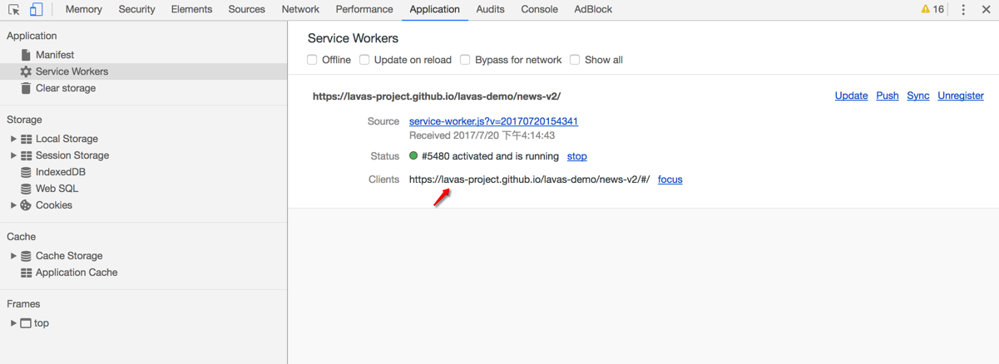
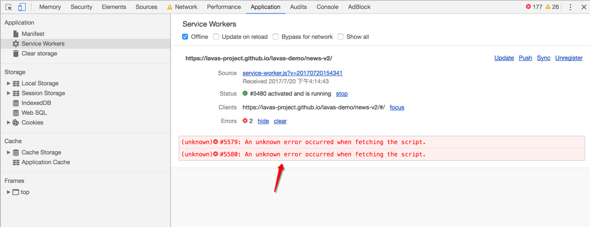

# Service Worker 调试

在开发 Service Worker 文件的过程中，如何调试呢？怎么才能确保线下开发的 Service Worker 文件在经过注册后到线上去运行是符合预期的呢？在这小节中将详细介绍如何调试 Service Worker。

Service Worker 作为独立于主线程的独立线程，在调试方面其实和常规的 JavaScript 开发类似，通常开发者关注的点大概有如下几点：

- Service Worker 文件 JavaScript 代码是否有报错。
- Service Worker 能否顺利安装、激活或者更新。
- 在不同机型上的兼容性是不是有问题。
- 不同类型资源和请求的缓存策略的验证。

## debug 环境下的开发跳过等待状态

根据 Service Worker 生命周期的特性，如果浏览器还在使用旧的 Service Worker 版本，即使有 Service Worker 新的版本也不会立即被浏览器激活，只能进行安装并进入等待状态，直到浏览器 Tab 标签被重新关闭打开。

在开发调试 Service Worker 时，肯定希望重新加载后立即激活，通常开发者不希望每次都重新打开当前页面调试，为此可以在 `install` 事件发生时通过 `skipWaiting()` 来跳过 Service Worker 的 waiting 状态。这样每次 Service Worker 安装后就会被立即激活，通常在 `sw.js` 中实现如下代码所示：

```js
self.addEventListener('install', () => {
  if (ENV === 'development') {
    self.skipWaiting()
  }
})
```

## 借助 Chrome Devtool 进行调试

使用 Chrome 浏览器，可以通过进入控制台 `Application -> Service Workers` 面板查看和调试。其效果如下图所示：



如果 Service Worker 线程已安装到当前打开的页面上，接下来会看到它将列示在此窗格中。例如：在上图中，展示的是在 `https://lavas-project.github.io/lavas-demo/news-v2/#/` 的作用域内安装了一个 Service Worker 线程。

为了更熟练的运用 Chrome Devtools 调试 Service Worker，首先需要熟悉以下这些选项：

- **Offline**： 复选框可以将 DevTools 切换至离线模式。它等同于 Network 窗格中的离线模式。

- **Update on reload**：复选框可以强制 Service Worker 线程在每次页面加载时更新。

- **Bypass for network**：复选框可以绕过 Service Worker 线程并强制浏览器转至网络寻找请求的资源。

- **Update**：按钮可以对指定的 Service Worker 线程执行一次性更新。

- **Push**：按钮可以在没有负载的情况下模拟推送通知。

- **Sync**：按钮可以模拟后台同步事件。

- **Unregister**：按钮可以注销指定的 Service Worker 线程。

- **Source**：告诉当前正在运行的 Service Worker 线程的安装时间，链接是 Service Worker 线程源文件的名称。点击链接会将定向并跳转至 Service Worker 线程来源。

- **Status**：告诉 Service Worker 线程的状态。此行上的数字指示 Service Worker 线程已被更新的次数。如果启用 `update on reload` 复选框，接下来会注意到每次页面加载时此数字都会增大。在状态旁边会看到 `start` 按钮（如果 Service Worker 线程已停止）或 `stop` 按钮（如果 Service Worker 线程正在运行）。Service Worker 线程设计为可由浏览器随时停止和启动。 使用 stop 按钮明确停止 Service Worker 线程可以模拟这一点。停止 Service Worker 线程是测试 Service Worker 线程再次重新启动时的代码行为方式的绝佳方法。它通常可以揭示由于对持续全局状态的不完善假设而引发的错误。

- **Clients**：告诉 Service Worker 线程作用域的原点。如果已启用 `show all` 复选框，`focus` 按钮将非常实用。 在此复选框启用时，系统会列出所有注册的 Service Worker 线程。如果这时候点击正在不同标签中运行的 Service Worker 线程旁的 `focus` 按钮，Chrome 会聚焦到该标签。

如果 Service Worker 文件在运行过程中出现了任何的错误，将显示一个 `Error` 新标签，如下图所示。



当然也可以直接访问 `Chrome://serviceworker-internals` 来打开 serviceWorker 的配置面板，查看所有注册的 Service Worker 情况。

> 注意：
> 如无必要，不要选中顶部的 `Open DevTools window and pause javaScript execution on Service Worker startup for debugging` 复选框，否则每当刷新页面调试时都会弹出一个开发者窗口来。

在 Firefox 中，可以通过 `Tools -> Web Developer -> Service Workers` 打开调试面板。也可以访问 `about:debugging#workers` 直接进入该面板。

## 查看 Service Worker 缓存内容

通过前面的章节已经了解过，Service Worker 使用 Cache API 进行缓存的读写，同样可以在 Chrome DevTools 上查看缓存的资源列表。

Cache Storage 选项卡提供了一个已使用（Service Worker 线程）Cache API 缓存的只读资源列表，如下图所示。


如果打开了两个或多个缓存，那在 Application 标签下的 Caches 面板将看到它们会陈列在 Cache Storage 下拉菜单下方，如下图所示。


当然，Cache Storage 提供清除 Cache 列表的功能，在选择 `Cache Storage` 选项卡后在 Cache Storge 缓存的 key 的 item 上右键点击出现 `delete` ，点击 `delete` 就可以清除该缓存了，如下图所示。


也可以选择 `Clear Storage` 选项卡进行清除缓存。

## 网络跟踪

此外经过 Service Worker 的 `fetch` 请求 Chrome 都会在 Chrome DevTools Network 标签页里标注出来，其中：

- 来自 Service Worker 的内容会在 Size 字段中标注为 `from ServiceWorker`
- Service Worker 发出的请求会在 Name 字段中添加 ⚙  图标。

如下图所示，第一个名为 `300` 的请求是一张 jpeg 图片， 其 URL 为 `https://unsplash.it/200/300`，该请求是由 Service Worker 代理的， 因此被标注为 `from ServiceWorker`。

为了响应页面请求，Service Worker 也发出了名为 `300` 的请求（这是下图中第二个请求），但 Service Worker 把 URL 改成了 `https://unsplash.it/g/200/300`，因此返回给页面的图片是灰色的。


## 真机调试

由于 Service Worker 必须要在 HTTPS 环境下才能被注册成功，所以在真机调试的过程中还需要解决 HTTPS 调试问题，当然 `127.0.0.1` 和 `localhost` 是被允许的 host，但是在真机调试上无法指定为到 PC 上的本地服务器，所以真机 debug 必须要求是已经部署好的 https PWA 站点。

### Android inspect 远程调试

对于 Android 设备，可以借助于 Chrome 的 inspect 方法进行调试 PWA，其中有几个事项是需要提前准备的：

- PC 上已安装 Chrome 32 或更高版本。
- PC 上已安装 USB 驱动程序（如果使用 Windows），确保设备管理器报告正确的 USB 驱动程序。
- 一根可以将 Android 设备连接至开发计算机的 USB 线。
- 一台 Android 4.0 或更高版本的 Android 设备。

接下来可以通过以下步骤进行调试：

1. 将 Android 设备通过 USB 线与 PC 连接。
2. 在 Android 设备上进行一些设置，选择 `设置 > 开发者选项 > 开启 USB 调试`。
3. 在 PC 上打开 Chrome，使用一个 Google 帐户登录到 Chrome。（远程调试在隐身模式或访客模式下无法运行）。
4. 在 PC 的 Chrome 浏览器地址栏输入 `chrome://inspect`。
5. 在 `Remote Target` 下找到对应的 Android 设备。
6. 点击远程设备链接进入 Chrome Devtools。

这样的话就可以在 Chrome 的 Devtools 直接调试运行在 Android 手机端 Chrome 的 PWA 站点，体验完全和在本地 PC 电脑上 debug 一摸一样。

### iOS 远程真机调试

对于 iOS 设备运行的 PWA，真机 debug 有点麻烦，好在 Apple Safari 也提供了一套远程调试的方案，可以借助于 Web Inspector（web 检查器）机制来完成真机调试。在开始调试之前需要准备以下工具：

- 一台 Mac 电脑。
- 一个 icloud 账号。
- 一个 Apple 的移动设备（iPhone）。
- 用 iCloud 账号登陆 Mac 和 iPhone。
- 对 iPhone 进行设置：`设置 > Apple ID 用户中心入口 > iCloud > 打开 Safari`。
- 对 iPhone 进行设置：`设置 > Safari浏览器 > 高级 > 打开 Web Inspector`。
- 对 Mac 进行设置：` > 系统偏好设置 > iCloud > 勾上 Safari`。
- 对 Mac 进行设置：`打开 Safari > Safari 菜单 > 偏好设置 > 高级 > 勾选“在菜单栏中显示开发菜单”`（这时候 Safari 的系统菜单栏多了一个 `开发` 标签）。

当完成了准备工作后，下面可以开始调试了，调试步骤如下：

1. 用 USB 线连接 iPhone 和 Mac。
2. 在 iPhone 上打开 PWA 站点。
3. 打开 Mac 上 Safari 菜单栏的 `开发` 标签，就可以点击进 `我的 iPhone`。
4. 接下来会发现 `我的 iPhone` 子菜单里有在 iphone 上打开的 PWA 站点，这时候就可以用 Safari 的 Devtools 进行调试。
