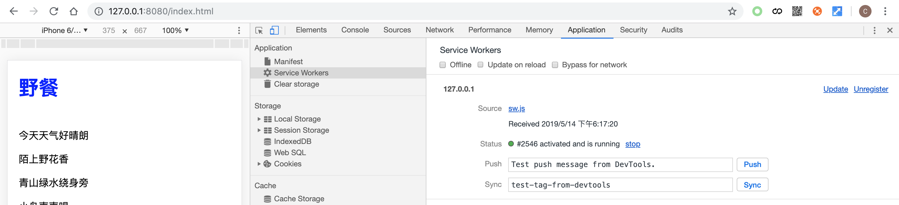
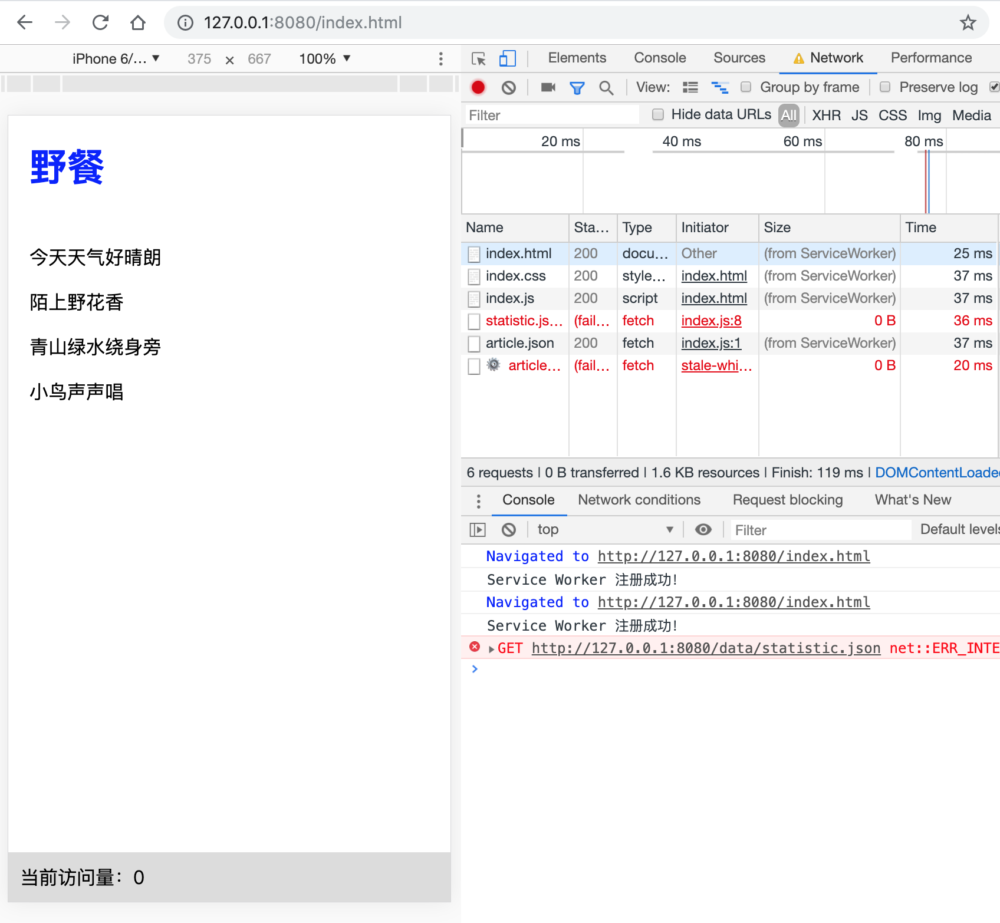

# 资源请求响应策略

在 Service Worker 环境下，可以通过 Fetch API 发送网络请求获取资源，也可以通过 Cache API、IndexedDB 等本地缓存中获取缓存资源，甚至可以在 Service Worker 直接生成一个 Response 对象，以上这些都属于资源响应的来源。资源请求响应策略的作用，就是用来解决响应的资源从哪里来的问题。

接下来将介绍一些常用的策略及其简易实现，这些给出的策略代码其主要作用是演示策略的基本实现思路而移除了不少容错兜底的相关逻辑，读者可以在理解思路的基础上对这些代码进行补充完善，并尝试应用到实际的生产环境当中。

由于这些策略都涉及到较为复杂的异步操作，因此在介绍策略的编程实现时将会使用 ES7 的 Async 函数语法来简化代码逻辑。对 Async 函数不太了解的同学可以首先查看第三章 Async 函数的介绍进行简要学习。

## 准备工作

在介绍响应策略前，首先得统一策略函数的一些基本格式以及声明一些共用方法。

### 统一策略函数格式

在前面资源请求的拦截代理一节中我们封装了 Router 来统一管理请求响应的分发，对应的响应策略函数以当前请求对象 request 为参数，以响应对象 response，或者异步返回 response 的 Promise 对象最为返回值，这就构成了策略函数的基本格式：

```js
/**
 * 策略函数格式
 *
 * @param  {Request} request 当前请求对象
 * @return {Response|Promise.<Response>} 响应对象
 */
function strategy (request) {
  // ...
  return response
}
```

由于这些响应策略都或多或少地使用到了 Fetch API、Cache API 的功能，不同的策略在不同的应用场景下所使用的配置可能不一样，为了实现灵活且规范化的配置，我们在这里统一使用高阶函数的形式进行实现：

```js
function strategyFactory ({
  // Fetch API 配置
  fetchOptions,
  // Cache 名称
  cacheName = 'runtime-cache',
  // cache.match 配置
  matchOptions
} = {}) {
  return request => {
    // 使用 Fetch API 发请求就可以将 fetchOptions 作为参数传入：
    fetch(request, fetchOptions).then(response => {/* 相关处理 */})
    // ...
    // 使用 cacheName 获取缓存对象
    caches.open(cacheName).then(cache => {
      // 使用 matchOptions 配置查找缓存
      cache.match(request, matchOptions)
    })

    // ...
    return response
  }
}
```

我们就可以通过这个形式的函数参数传入各项配置，而函数的返回结果就是配置好的策略函数本身：

```js
let strategy = strategyFactory({
  fetchOptions: {
    mode: 'cors'
  },
  cacheName: 'v1',
  matchOptions: {
    ignoreSearch: true
  }
})
// 配合 Router 进行策略的注册与使用
router.registerRoute('/data.txt', strategy)
```

### 公用方法

接下来定义一些常用的方法以便简化接下来的策略实现代码。这些公用方法以局部方法的形式定义在策略工厂函数的函数体内，这样就可以直接使用到工厂函数所传入的参数了。

`cacheResponse()` 的作用是往缓存中写入资源：

```js
const cacheResponse = async (request, response) => {
  // 使用 cacheName 参数打开缓存
  let cache = await caches.open(cacheName)
  await cache.put(request, response)
}
```

`getCachedResponse()` 的作用是从缓存中查找资源并返回：

```js
const getCachedResponse = async request => {
  let cache = await caches.open(cacheName)
  return cache.match(request, matchOptions)
}
```

`fetchAndCatch()` 的作用是发起网络请求，并且把成功响应的对象存入缓存中：

```js
const fetchAndCatch = async request => {
  let response = await fetch(request.clone(), fetchOptions)
  // 请求资源失败时直接返回
  if (!response.ok) {
    return
  }
  // 网络请求成功后，将请求响应结果复制一份存入缓存中
  // 更新缓存过程无需阻塞函数执行
  cacheResponse(request, response.clone())
    // 同时缓存更新行为只需静默执行即可
    .catch(() => {})

  // 返回响应结果
  return response
}
```

有了这些公用方法，后面的策略实现过程将变得简单很多。

## Network First

Network First，网络优先策略。该策略会优先尝试发送网络请求获取资源，在资源获取成功的同时会复制一份资源缓存到本地，当网络请求失败时再尝试从本地缓存中读取缓存资源。Network First 策略一般适用于对请求的实时性和稳定性有要求的情况。其代码实现如下所示：

```js
function networkFirst ({
  fetchOptions,
  cacheName = 'runtime-cache',
  matchOptions
} = {}) {
  // ...（定义getCachedResponse、fetchAndCatch）

  return async request => {
    let response

    try {
      // 优先发起网络请求，并将请求返回结果缓存到本地
      response = await fetchAndCatch(request)
    } catch (e) {}

    if (response == null) {
      // 网络资源请求失败时，从本地缓存中读取缓存
      response = await getCachedResponse(request)
    }

    return response
  }
}
```

假设我们需要对 `/api` 类型的接口请求使用 Network First 的缓存策略，相关代码如下所示：

```js
router.registerRoute(/\/api/, networkFirst())
```

## Cache First

Cache First，缓存优先策略。该策略会优先从本地缓存读取资源，读取失败后再发起网络请求，成功获得网络请求响应结果时会将该结果缓存到本地。对于实时性要求不太高的资源，可以使用该策略提高加载速度。缓存优先策略的代码如下所示：

```js
function cacheFirst ({
  fetchOptions,
  cacheName = 'runtime-cache',
  matchOptions
} = {}) {
  // ...（定义 getCachedResponse、fetchAndCatch）

  return async request => {
    let response

    try {
      // 优先匹配本地缓存
      response = await getCachedResponse(request)
    } catch (e) {}
    // 匹配不到缓存或者缓存读取出现异常时，再去发起网络请求
    // 并且将请求成功的资源写入缓存中
    if (response == null) {
      response = await fetchAndCatch(request)
    }

    return response
  }
}
```

下面演示 Cache First 策略的使用方法。对于 jQuery 这样公共 JS 库就非常适合使用 Cache First 策略，例子中的 jQuery 的代码托管在非同源的 CDN 上面，因此需要传入 fetchOptions 参数去指定该策略中的 fetch 方法请求跨域资源时的请求模式为 `cors`：

```js
router.registerRoute(
  'https://code.jquery.com/jquery-3.3.1.min.js',
  cacheFirst({
    fetchOptions: {
      mode: 'cors'
    }
  })
)
```

## Network Only

Network Only，仅通过发送正常的网络请求获取资源，并将请求响应结果直接返回。该策略适用于对实时性要求非常高的资源，或者是无需进行缓存的资源。比如验证码图片、统计数据请求等等。策略的代码实现如下所示：

```js
function networkOnly ({
  fetchOptions
} = {}) {
  return request => fetch(request, fetchOptions)
}
```

## Cache Only

Cache Only，仅从缓存中读取资源。这个策略一般需要配合预缓存方案使用。策略的代码实现如下所示：

```js
function cacheOnly ({
  cacheName,
  matchOptions
} = {}) {
  // ...（定义 getCachedResponse）

  return async request => {
    let response = await getCachedResponse(request)
    return response
  }
}
```

## Stale While Revalidate

Stale While Revalidate，该策略跟 Cache First 策略比较类似，都是优先返回本地缓存的资源。不同的地方在于，Stale While Revalidate 策略无论在缓存读取是否成功的时候都会发送网络请求更新本地缓存。这样的好处是，在保证资源请求响应速度的同时，还能够保证缓存中的资源一直保持一个比较新的状态；它的缺点也比较明显，就是每次请求资源的时候，都会发起网络请求占用用户的网络带宽。其代码实现如下所示：

```js
function staleWhileRevalidate ({
  fetchOptions,
  cacheName = 'runtime-cache',
  matchOptions
} = {}) {
  // ...（定义 getCachedResponse、fetchAndCatch）

  return async request => {
    let response
    // 首先读取本地缓存
    try {
      response = await getCachedResponse(request)
    } catch (e) {}
    // 发起网络请求并更新缓存
    let fetchPromise = fetchAndCatch(request)
    // 如果存在本地缓存，则静默更新缓存即可，无需阻塞函数执行
    if (response) {
      // 静默更新，无需报错
      fetchPromise.catch(e => {})
    } else {
      // 反之则将网络请求到的资源返回
      response = await fetchPromise
    }

    return response
  }
}
```

## 示例

本节的示例代码托管在 [GitHub](https://github.com/lavas-project/pwa-book-demo/chapter05/respond-strategy) 上面，读者可以自行将代码下载到本地运行和修改。本示例页面实现了文章阅读功能，页面正文展示文章主体，页脚显示文章阅读量。这是个简单的 SPA 页面，采用了 App Shell 的设计模式，框架与内容分离，内容通过异步数据请求到前端之后再进行前端渲染。

首先我们需要对这个示例的资源进行分析，并选择相应的资源请求响应策略：

- index.html、index.css、index.js：网页的 App Shell，由于框架与内容分离，可以认为 App Shell 是不常变动的，因此可以选择 Cache First；
- article.json：文章数据，文章内容可能会被作者编辑产生一定变化，但实时性要求不是很高，在这里可以选择使用 Stale While Revalidate；
- statistics.json：统计数据，返回文章的阅读量数据，这类数据并不影响文章的展示，因此可以选择 Network Only 或者是 Network First。

接下来我们将上述分析的结论转化为如下 Service Worker 代码：

```js
var router = new Router()
router.registerRoute(/\/index\.(html|css|js)$/, cacheFirst())
router.registerRoute(/\/article\.json$/, staleWhileRevalidate())
router.registerRoute(/\/statistics\.json$/, networkOnly())
```

这样示例的 Service Worker 文件就准备完毕了，然后只需要在 index.html 增加 Service Worker 的注册脚本，这样就开发完成了。

```html
<script>
  if ('serviceWorker' in navigator) {
    navigator.serviceWorker.register('/service-worker.js')
  }
</script>
```

接下来通过 `node server.js` 命令启动服务器，然后打开 Chrome 浏览器访问 `http://127.0.0.1:8080/index.html`，可以看到浏览器显示如下所示：


这时打开 Chrome 开发者工具下的 Application > Service Worker 面板，可以看到首次访问页面的时候，service-worker.js 文件开始进行注册并激活。



此时点击展开 Cache Storage 面板，在 runtime-cache 这个缓存空间并没有任何缓存内容。在刷新页面即第二次访问页面之后，runtime-cache 终于有了缓存资源：


此时断开浏览器的网络链接并再一次刷新页面，可以看到在离线情况下，页面上的文章内容和大体样式均正常显示，阅读数的请求由于我们没有对其进行缓存，因此在显示上被容错显示成了 0，这些表现均符合预期。



## 小结

本节主要介绍了一些常用的资源请求响应策略，依次分析了它们的适用场景，最后结合示例演示了在项目当中的实际应用方法。这些常用策略基本能够满足大部分的 Service Worker 开发需求，但这并不是全部，读者可以根据实际的需求，创造出其他更为复杂的策略。
