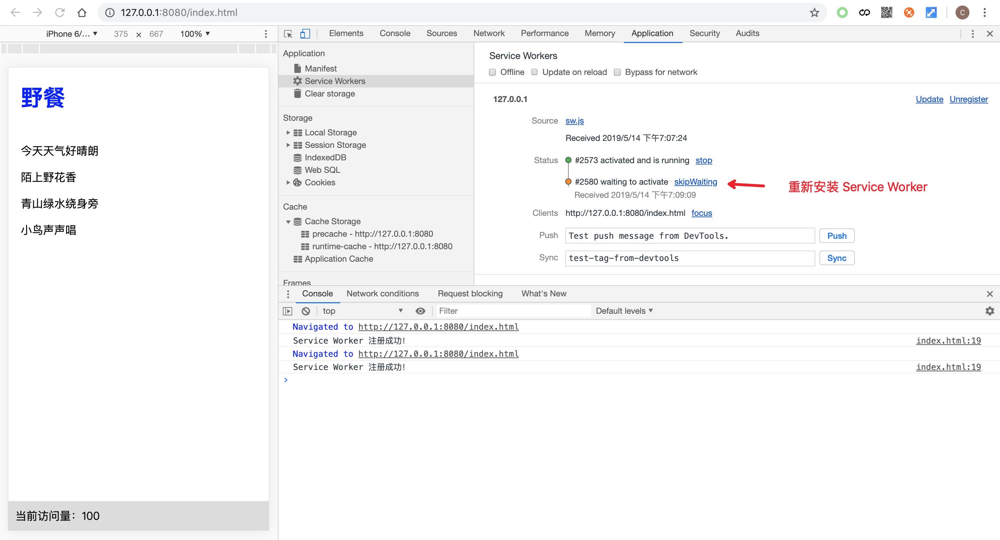
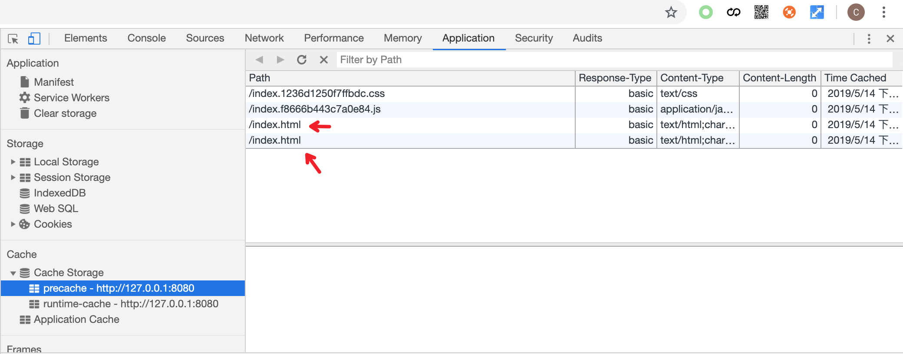
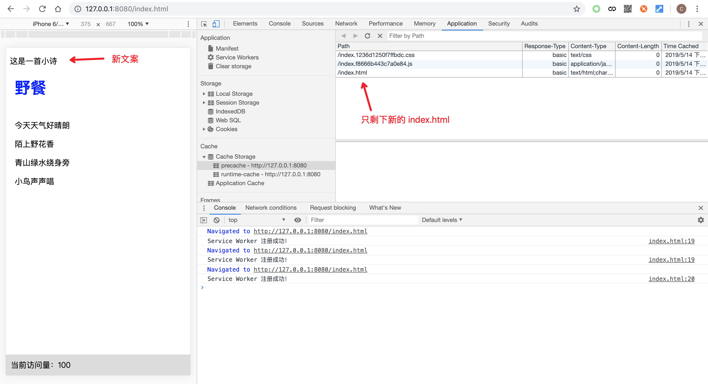

# 预缓存方案

一个网页的展现所依赖的资源可以大致分为两类：一、静态资源，比如 JS，CSS，前端渲染的 HTML 文件，样式文件中可能使用到的字体、背景图片等等。它们的作用是保证页面的前端功能和样式正常工作。这些资源只有在网站更新上线的时候才会发生变化，因此它们的内容和数量都是确定且可控的，更新频率较低，重复使用率高；二、动态资源，比如各种接口请求返回的各种数据，后端渲染的 HTML 页面，内容中的图片、视频等等。它们更侧重于页面的内容表达，因此会随着展现内容的调整而不断变化。这些资源内容变化频繁且不可控，重复使用率也较低。因此我们应该对这两种资源分别进行管理，同时针对静态资源的特点设计出更为高效的预缓存方案。

## 预缓存方案设计

首先，静态资源的特点之一是确定性，在网站开发的时候就已经能够确定下来。在前面介绍资源请求响应策略时，资源缓存都是在请求被拦截之后，经过响应策略的处理才被缓存下来，这个缓存过程是被动的，缓存的生效时间也比较慢。但由于静态资源具有确定性，因此可以主动获取所需缓存的资源列表，并且在 Service Worker 安装阶段就主动发起静态资源请求并缓存，这样一旦新的 Service Worker 被激活之后，缓存就直接能投入使用了。这是一个资源预取的过程，因此静态资源的缓存方案也称为预缓存方案。

其次，静态资源具有稳定性，在两次上线期间资源内容不会发生变化。因此可以在拦截到静态资源请求时优先返回缓存资源，从而减少网络请求数，提高了缓存利用率，并最终获得加快页面展现和离线可用的效果。

## 资源列表获取

框架型资源是可控的，它们在进行网站开发的时候就能够确定下来。比如在上一节的例子当中，很容易就能看出它的框架型资源是 index.html、index.css、index.js；如果是大型前端项目，如果借助了 webpack、Rollup 等前端构建工具，最终的生成产物也都属于框架型资源，通过简单的文件遍历就能够获取资源列表信息。接下来通过路径映射，就可以获得资源的 URL 列表：

```js
let urls = [
  '/index.html',
  '/index.js',
  '/index.css'
]
```

同时由于能够直接获得资源的内容，也可以在列表中添加资源内容相关的信息，比如文件 md5、文件版本号等信息作为资源的附加标识。通过这些标识可以用来判断资源的内容是否发生变更，为后续资源管理提供更多的信息。因此上面的 URL 列表可以进一步改写成如下形式：

```js
let resources = [
  // 通过 md5 标识
  {
    url: '/index.html',
    revision: 'abc'
  },
  // 通过文件版本标识
  {
    url: '/index.js',
    revision: '1.0.1'
  },
  // url 直接包含标识信息
  '/index.abc.css'
]
```

在获取到需要预缓存的资源列表信息之后，接下来开始设计新资源的加载与缓存。

## 新资源的加载与缓存

为了能够让静态资源在新的 Service Worker 安装完成时已缓存完毕，可以将资源加载与缓存的过程放在 `install` 事件回调里执行。

通过前面 Service Worker 生命周期的学习我们知道，Service Worker 安装阶段只会触发一次 `install` 事件，一旦安装完成便不会重复触发，只有在 Service Worker 文件内容出现变化，或者主动调用 `ServiceWorkerRegistration.update()` 的情况下才会触发 Service Worker 的重新安装。同时资源的加载与缓存过程可能由于网络原因导致缓存失败，在这种情况下需要中断 Service Worker 的安装过程，等待页面下次被访问的时候重新触发安装过程。因此加载新资源的代码如下所示：

```js
self.addEventListener('install', event => {
  event.waitUntil(cacheAll(cacheName, urls))
})
```

其中 `cacheAll()` 方法可以利用 Cache API 提供的 `addAll()` 方法简单实现：

```js
function cacheAll (cacheName, urls) {
  return caches.open(cacheName).then(cache => cache.addAll(urls))
}
```

### 重名资源的加载

在加载新资源的时候正处于新的 Service Worker 安装阶段，此时旧的 Service Worker 仍在正常工作，因此在加载新资源的时候需要格外注意，不要覆盖掉具有相同路径的旧资源。解决这个问题有以下几种方案：

1.新旧资源使用不同名称的缓存对象进行存储。

这种方案能够非常方便地解决重名问题，新旧资源使用不同名称的缓存对象进行存储，那么各自的资源在存储时就已经相互隔离，因此不需要关心资源是否重名，甚至不需要关心资源是否增减、修改等问题，全部资源都需要进行加载和缓存。这样新旧资源的管理问题就转化成了新旧存储仓库的管理问题，我们只需关心如何增加新仓库，删除旧仓库即可。

但这并不是最优方案，因为新旧资源当中可能存在没有发生变化的部分，这部分资源的重复加载其实是没必要的，既额外消耗了用户流量，也同时减缓了 Service Worker 的安装速度。所以如果要对该方案做进一步优化，可以在加载新资源之前首先通过资源比对的方式，将没有变化的资源直接从旧仓库复制到新仓库当中，剩下的再去请求网络资源。

2.确保资源不重名。

借助 Webpack、Rollup 等构建工具进行前端开发时，可以配置编译产出的静态资源名称带上文件的 md5，这样就能够保证内容发生变更的资源不会产生相同的 URL。但这种方案并不适用于所有的静态资源。举个例子，比如前端渲染的 HTML，尽管它属于静态资源，但是它的 URL 就不允许频繁变更，因此需要采用其他方案作为补充。

在前面资源列表小节内容当中，介绍了一种通过增加 revision 参数来标识文件是否发生变化的方法，我们可以利用这个参数将 URL 改造成不重名的形式。最简单的做法是，将 revision 以 Search 参数的方式拼接到 URL 当中。下面通过代码举例说明：

```js
let resource = {
  url: '/index.js',
  revision: 'abc'
}
let cacheKey = location.origin +
  resource.url +
  '?precache_url_revision=' +
  resource.revision
// 打印 http://127.0.0.1:8080/index.js?precache_url_revision=abc
console.log(cacheKey)
```
我们可以通过实例化 URL 类对象来简化上述拼接过程：

```js
let cacheKeyURL = new URL(resource.url, location)
cacheKeyURL.searchParams.set('precache_url_revision', resource.revision)
let cacheKey = cacheKeyURL.href
```

其中所增加的 Search 参数的参数名应该设置成比较特殊的名称以避免原始 URL 存在同名参数导致被覆盖。由于 revision 具有唯一性，就保证了生成的 URL 同样具有唯一性，这样作为资源存储的键值就能够保证不会覆盖掉旧资源。在缓存查询的时候主动给 URL 挂上这个参数再去查询即可。下面通过代码简单演示这个存取过程：

```js
let resource = {
  url: '/index.js',
  revision: 'abc'
}
// 存储
// 给资源 URL 拼接 precache_url_revision 参数，并作为键值存储
let cacheKeyURL = new URL(resource.url, location)
cacheKeyURL.searchParams.set('precache_url_revision', resource.revision)
cache.put(cacheKeyURL.href, response)

// 读取
if (requestURL === new URL(resource.url, location).href) {
  // 给资源请求 URL 拼接 precache_url_revision 参数，并作为键值查询
  let cacheKeyURL = new URL(requestURL, location)
  cacheKeyURL.searchParams.set('precache_url_revision', resource.revision)
  // 查找缓存资源
  cache.match(cacheKeyURL.href).then(response => {
    if (response != null) {
      // 资源匹配成功
    }
  })
}
```

经过补充方案的完善之后，即使 URL 完全一样的资源也能够解决新旧资源覆盖的问题。

### 预缓存资源加载实现

<!-- FIXME: chapter05代码不在了,下同 -->
接下来我们将采用方案 2 来演示预缓存功能的实现，读者也可以根据思路自行实现方案 1 以加深理解。在这里我们可以将预缓存功能封装成一个 Precacher 类，然后可以通过 `precache()` 方法传入预缓存资源信息。完整的代码可以移步 [GitHub](https://github.com/lavas-project/pwa-book-demo/chapter05/precache/precacher.js) 进行学习。以下是相关代码实现：

```js
class Precacher {
  constructor ({
    cacheName = 'precache',
    searchKey = 'precache_url_revision'
  } = {}) {
    this.cacheName = cacheName
    this.searchKey = searchKey
    // 存储资源信息的列表
    this.resources = []
    // 初始化事件监听
    this.initEventListener()
  }

  initEventListener () {
    // 在 `install` 事件回调执行预缓存资源加载
    self.addEventListener('install', event => {
      event.waitUntil(
        // 缓存新增/变化的资源
        cacheResources(this.cacheName, this.resources)
      )
    })
  }

  precache (resources) {
    for (let resource of resources) {
      // 格式化资源信息
      let res = formatResource(this.searchKey, resource)
      this.resources.push(res)
    }
  }
}
```

其中 install 事件中所使用的 `cacheResources()` 方法会首先找出新增或内容发生变化的资源，然后重新请求并缓存。具体实现如下所示：

```js
async function cacheResources (cacheName, resources) {
  let urls = resources.map(resource => resource.cacheKey)
  // 首先打开并缓存 CacheStorage 对象
  let cache = await caches.open(cacheName)
  // 获取已存储的所有资源键值信息
  let requests = await cache.keys()
  // 获取已存储的资源 URL
  let cachedURLs = requests.map(request => request.url)
  // 找出新增资源里面未存储过的资源 URL
  let updateURLs = urls.filter(url => !cachedURLs.includes(url))
  // 最后调用 cache.addAll() 缓存新增资源
  await cache.addAll(updateURLs)
}
```

另外在调用 `precache()` 时，传入的资源信息可能是字符串或者对象，因此需要 `formatResource()` 方法将资源信息格式化，格式化过程包括 URL 信息补全以及类型统一。经过格式化后的资源信息对象将包含两个属性：url 为补全后的资源原始 URL，cacheKey 为资源存入缓存中的键值。具体实现如下所示：

```js
function formatResource (searchKey, resource) {
  let originURL
  let cacheKeyURL
  // 当资源信息为字符串时，说明资源 URL 已经具有唯一性
  // 因此可以直接拿 URL 作为资源的存储键值
  if (typeof resource === 'string') {
    originURL = new URL(resource, location)
    cacheKeyURL = new URL(resource, location)
  }
  // 当资源信息为对象时，需要使用 revision 来生成资源存储键值
  else {
    originURL = new URL(resource.url, location)
    cacheKeyURL = new URL(resource.url, location)
    cacheKeyURL.searchParams.set(searchKey, resource.revision)
  }

  return {
    url: originURL.href,
    cacheKey: cacheKeyURL.href
  }
}
```

这样我们就通过 Precacher 简单实现了预缓存资源的加载。在使用的时候，只需要实例化 Precacher 后调用 precache 方法传入预缓存资源列表信息即可：

```js
let precacher = new Precacher()
precacher.precache([
  {
    url: '/index.html',
    revision: 'abc'
  },
  {
    url: '/index.js',
    revision: '1.0.1'
  },
  '/index.abc.css'
])
```

## 旧资源的清理

当新的 Service Worker 安装并激活成功之后，旧的预缓存资源就基本没用了，因此需要及时对旧资源进行清理。我们一般选择 `activate` 事件回调来执行旧资源的清理工作，此时 Service Worker 已经安装完成，并且已经进入激活阶段，激活完成之后新 Service Worker 就已经正式接管并开始工作了，因此在这个阶段清理旧缓存不会对旧 Service Worker 造成影响，并且在 `activate` 事件的回调当中，清理过程导致的任何出错都不会影响到 Service Worker 的激活。

接下来我们只需往 Precacher 类添加对 `activate` 事件监听以及旧资源的清理逻辑即可：

```js
class Precacher {
  // ...
  initEventListener () {
    // install ...

    // 添加 activate 事件监听清理旧资源
    self.addEventListener('activate', event => {
      event.waitUntil(
        // 清理旧缓存
        clearOldResources(this.cacheName, this.resources)
      )
    })
  }
}
```

其中 `clearOldResources()` 方法实现了对旧预缓存资源的清理，在实现思路上与前面的 `cacheResources()` 方法类似，通过比对已缓存资源和当前资源列表信息进行比对，找出旧资源并删除。具体实现如下所示：

```js
async function clearOldResources (cacheName, resources) {
  let urls = resources.map(resource => resource.cacheKey)
  // 首先打开并缓存 CacheStorage 对象
  let cache = await caches.open(cacheName)
  // 获取已存储的所有资源键值信息
  let requests = await cache.keys()
  // 找出新增的 URL
  // 获取已存储的资源 URL
  let cachedURLs = requests.map(request => request.url)
  // 找出不在资源列表信息当中的 URL
  let oldURLs = cachedURLs.filter(url => !urls.includes(url))
  // 最后调用 cache.delete() 删除旧资源
  await Promise.all(oldURLs.map(url => cache.delete(url)))
}
```

## 预缓存方案的请求响应策略

预缓存资源在加载机制保证了 Service Worker 安装并激活完成时，预缓存资源已全部处于可用状态，因此可以对预缓存资源的请求响应采用 Cache First 甚至 Cache Only 的策略。由于在预缓存资源加载阶段当中，为了避免新旧资源重名而使用修改过的 URL 作为存储键值，因此在拦截到的预缓存请求，也同样需要经过修改才能够查找到缓存的资源。接下来给 Precacher 添加 `addRoute()` 方法实现对资源的拦截与响应：

```js
class Precacher {
  // ...

  addRoute () {
    // addRoute() 方法只需执行一次
    if (this.hasAdded) {
      return
    }
    this.hasAdded = true

    const cacheFirstHandler = cacheFirst({
      cacheName: this.cacheName
    })

    const router = new Router()
    router.registerRoute(
      request => {
        return this.resources.some(
          resource => resource.url === request.url
        )
      },
      request => {
        for (let resource of this.resources) {
          if (resource.url === request.url) {
            return cacheFirstHandler(new Request(resource.cacheKey))
          }
        }
      }
    )
  }
  // 将 precache() 和 addRoute() 合成一个方法
  precacheAndRoute (resources) {
    this.precache(resources)
    this.addRoute()
  }
}
```

这样直接调用 `precacheAndRoute()` 方法就能够实现资源预缓存的同时也设置好预缓存资源的响应了。

```js
let precacher = new Precacher()
precacher.precacheAndRoute([
  {
    url: '/index.html',
    revision: 'abc'
  },
  {
    url: '/index.js',
    revision: '1.0.1'
  },
  '/index.abc.css'
])
```

## 预缓存示例

本节的示例将在上一节的示例基础上增加预缓存功能，相关示例代码托管在 [GitHub](https://github.com/lavas-project/pwa-book-demo/chapter05/precache) 上面，读者可以自行将代码下载到本地运行和修改。

首先从示例的资源分析可以看出，网页的 App Shell 部分属于静态资源，因此可以进行预缓存。

然后需要获取静态资源的 md5 值，并且将得到的 md5 值添加到 index.js 和 index.css 的文件名当中，由于 index.html 的 URL 不允许发生变化，因此在生成资源信息列表的时候给 index.html 的资源信息描述添加 revision：

```js
let resources = [
  {
    url: '/index.html',
    revision: '5ed70e0c237b4c66'
  },
  '/index.f8666b443c7a0e84.js',
  '/index.1236d1250f7ffbdc.css'
]
```

接下来修改 Service Worker，添加预缓存相关代码，同时移除重复的路由规则即可。利用上面实现的 Precacher 类可以非常方便地实现预缓存规则的添加：

```js
// 预缓存
let precacher = new Precacher()
precacher.precacheAndRoute(resources)

// 动态缓存
var router = new Router()
// 删除预缓存已经处理的路由
// router.registerRoute(/\/index\.(html|css|js)$/, cacheFirst())
router.registerRoute(/\/article\.json$/, staleWhileRevalidate())
router.registerRoute(/\/statistics\.json$/, networkOnly())
```

这样预缓存的改造工作就完成了。启动好示例服务器，使用 Chrome 浏览器重新访问 `http://127.0.0.1:8080/index.html`，这时可以通过开发者工具观察到新的 Service Worker 开始安装，同时 Cache Storage 面板多了一个名为“precache”的缓存仓库，里面的内容正是预缓存资源。接下来断开浏览器的网络连接，页面仍然能够正常显示，说明预缓存资源已添加成功并且正常工作。


接下来修改静态资源内容，用于观察预缓存资源的更新过程。首先在 index.html 上修改部分内容，比如增加 `<p>` 标签显示文案 `<p>这是一首小诗</p>`，这样 index.html 的 md5 将会变成 `asdf`，因此需要更新 service-worker.js 中的资源信息列表部分：

```js
let resources = [
  {
    url: '/index.html',
    revision: 'c607781a6a09a468'
  },
  // ...
]
// ...
```

接下来重新刷新页面，可以看到此时页面上并没有显示后面添加的文案“这是一行小诗”，说明 index.html 是从缓存中读取的。同时由于 service-worker.js 文件内容变更而触发了 Service Worker 的重新安装：



安装完成时“precache”缓存仓库中便会同时存在两条“/index.html”的存储条目：



之后在控制台点击 skipWaiting 按钮或刷新页面触发 Service Worker 进入激活阶段。当 Service Worker 激活完成时，旧的“/index.html”缓存会被删除，同时页面显示了新添加的文案，说明 Precacher 成功实现了新旧资源交替更换的管理。


