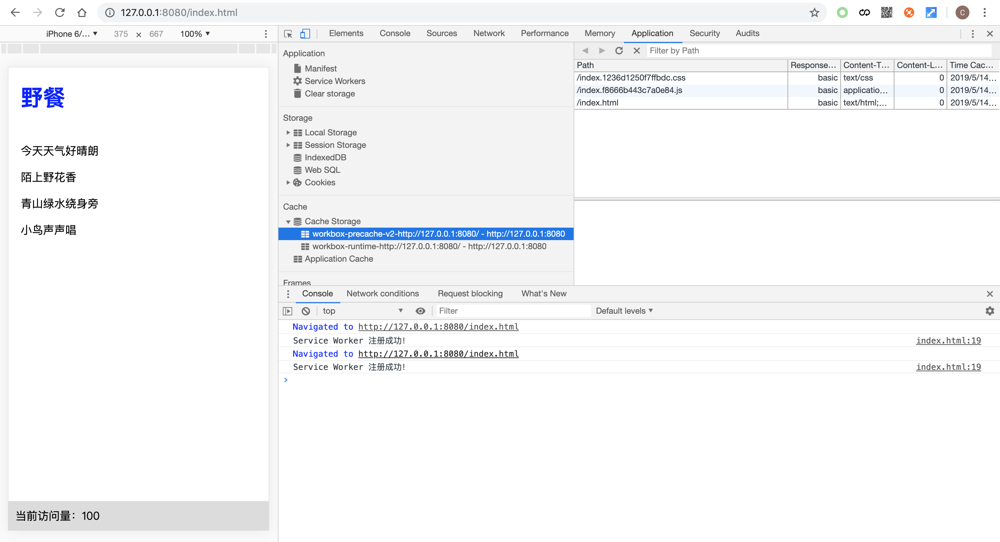

# 使用 Workbox

Workbox 是 Google Chrome 团队推出的一套 PWA 的解决方案，这套解决方案当中包含了核心库和构建工具，因此我们可以利用 Workbox 实现 Service Worker 的快速开发。本节内容将介绍 Workbox 的一些常用方法。

## 引入 Workbox

Service Worker 文件引入 Workbox 的方法非常简单，只需要在文件顶部增加一行代码即可：

```js
importScripts('https://storage.googleapis.com/workbox-cdn/releases/4.2.0/workbox-sw.js')
```

Workbox 从 3.x 版本开始便将其核心文件托管到 CDN 上进行维护，开发者也可以下载下来自行维护。

我们可以通过判断全局对象 `workbox` 是否存在来确认 Workbox 是否加载完成：

```js
if (workbox) {
  // Workbox 加载完成
}
```

一旦 Workbox 加载完成，我们便可以使用挂载到 `workbox` 对象上的各种功能了。

## Workbox 配置

Workbox 提供了默认的预缓存和动态缓存的名称，可分别通过 `workbox.core.cacheNames.precache` 和 `workbox.core.cacheNames.runtime` 获取当前定义的预缓存和动态缓存名称。在通常情况下，我们使用默认的缓存名称进行资源存取即可，假如遇到缓存名称冲突的情况，也可以调用 `workbox.core.setCacheNameDetails` 方法去修改这些默认名称。下面的代码演示了修改默认名称的方法以及修改结果：

```js
// 修改默认配置
workbox.core.setCacheNameDetails({
  prefix: 'app',
  suffix: 'v1',
  precache: 'precache',
  runtime: 'runtime'
})

// 打印修改结果

// 将打印 'app-precache-v1'
console.log(worbox.core.cacheNames.precache)
// 将打印 'app-runtime-v1'
console.log(workbox.core.cacheNames.runtime)
```

## Workbox 预缓存功能

`workbox.precaching` 对象提供了常用的预缓存功能，其中最常用的方法是 `workbox.precaching.precacheAndRoute`。它的作用跟我们前面实现的 `Precacher.precacheAndRoute()` 的功能类似， 都是将传入的资源列表进行预缓存，同时对匹配到的预缓存请求直接从本地缓存中读取并返回。

```js
workbox.routing.precacheAndRoute([
  {
    url: '/index.html',
    revision: 'asdf'
  },
  '/index.abc.js',
  '/index.bcd.css'
])
```

## Workbox 路由功能

Workbox 对资源请求匹配和对应的缓存策略执行进行了统一管理，采用路由注册的组织形式，以此来规范化动态缓存。与前面我们封装的 Router 类似，Workbox 提供了 `worbox.routing.registerRoute` 方法进行路由注册，使用方法如下所示：

```js
workbox.routing.registerRoute(match, handlerCb)
```

接下来我们将对两个参数进行介绍。

### 路由匹配规则

`workbox.routing.registerRoute` 的第一个参数 match 是路由的匹配规则，支持以下几种匹配模式：

1.对资源 URL 进行字符串匹配。URL 字符串可以是完整 URL 或者是相对路径，如果是相对路径，Workbox 首先会以当前网页的 URL 为基准进行补全再进行字符串匹配。假设当前页面的 URL 为 `http://127.0.0.1:8080/index.html`，那么如下所示所注册的路由都是能够正常匹配到 `http://127.0.0.1:8080/index.css` 这个资源请求的：

```js
workbox.routing.registerRoute('http://127.0.0.1:8080/index.css', handlerCb)
workbox.routing.registerRoute('/index.css', handlerCb)
workbox.routing.registerRoute('./index.css', handlerCb)
```

2.对资源 URL 进行正则匹配。假设我们注册这样一条正则匹配的路由规则：

```js
workbox.routing.registerRoute(/\/index\.css$/, handlerCb)
```

那么以下以 '/index.css' 为结尾的**同域资源**都能够命中这条路由规则：

- `http://127.0.0.1:8080/index.css`
- `http://127.0.0.1:8080/a/index.css`
- `http://127.0.0.1:8080/a/b/index.css`

但是对于**跨域资源**来说并不会命中这条路由规则。这是因为 Workbox 在正则匹配的模式下对跨域资源做了特殊处理，一般情况下会忽略掉对跨域资源的匹配，只有当正则表达式能够匹配到跨域资源 URL 的开头，Workbox 才会明确地知道这类跨域资源需要进行动态缓存处理。因此，如下所示的正则匹配规则才会命中 `https://third-party-site.com` 这个域下的跨域资源请求：

```js
workbox.routing.registerRoute(
  /^https:\/\/third-party-site\.com\/.*\/index\.css$/,
  handlerCb
)
```

3.自定义路由匹配方法。match 允许传入一个自定义方法来实现较为复杂的资源请求匹配规则，这个自定义方法可以仿造下面的代码实现：

```js
const match = ({url, event}) => {
  return url.pathname === '/index.html'
}
```

其中 url 是 `URL` 类的实例，event 是 fetch 事件的回调参数。url 可通过对 `URL` 类进行实例化，从 `event.request.url` 转换得到：

```js
let url = new URL(event.request.url)
```

自定义路由匹配方法有两点要求，首先要求是个同步执行函数，其次函数在表示资源请求匹配成功的时候，只需要返回一个真值（即强制转化为布尔值后为 true 的值）即可。

### 资源请求处理方法

`workbox.routing.registerRoute` 的第二个参数 handlerCb 是对匹配到的资源请求进行处理的方法，开发者可以在这里决定如何响应请求，无论是从网络、从本地缓存还是在 Service Worker 中直接生成都是可以的。比如：

```js
const handlerCb = ({url, event, params}) => {
  return Promise.resolve(new Response('Hello World!'))
}
```

其中，传入资源请求处理方法的对象包含以下属性：

- url：event.request.url 经 URL 类实例化的对象；
- event：fetch 事件回调参数；
- params：自定义路由匹配方法所返回的值。

对资源请求处理方法的要求是，函数必须是个异步方法并返回一个 Promise，且这个 Promise 解析的结果必须是一个 Response 对象。

## Workbox 缓存策略

`workbox.strategies` 对象提供了一系列常用的动态缓存策略来实现对资源请求的处理。包括了以下几种策略：

- NetworkFirst：网络优先
- CacheFirst：缓存优先
- NetworkOnly：仅使用正常的网络请求
- CacheOnly：仅使用缓存中的资源
- StaleWhileRevalidate：从缓存中读取资源的同时发送网络请求更新本地缓存

这些策略与前面介绍资源请求响应策略的章节中简易实现的缓存策略做对比可以发现，其原理基本是一致的，当然在具体实现上 Workbox 考虑得更为复杂而全面以应对各式各样的生产环境。我们可以通过前面简易实现的策略来加深对 Workbox 缓存策略的认识。

下面举个例子来演示 Workbox 缓存策略的使用。假设需要对 `/api` 的资源请求采用 NetworkFirst 的策略，那么相应的路由规则和策略的使用代码如下所示：

```js
workbox.routing.registerRoute(/\/api/, new workbox.strategies.NetworkFirst())
```

### 缓存策略配置

Workbox 缓存策略均可进行如下配置：

- cacheName：指定当前策略进行资源缓存的名称；
- plugins：指定当前策略所使用的插件列表；

对于需要使用 Fetch API 来发送网络请求的策略将会多出以下配置项：

- fetchOptions：作为 Fetch API 的第二个参数透传给当前策略中所有使用到的 Fetch API；

对于需要使用 Cache API 操作本地缓存的策略将多出以下配置项：

- matchOptions：作为 Cache 对象所提供的查找方法 `match` 的第二个参数透传给当前策略中所有使用到 `cache.match` 的地方。

接下来通过一些例子来演示缓存策略的配置以及配置生效的情况。

#### 指定资源缓存名称

假设我们需要针对图片资源单独进行存储管理，那么可以在策略中设置 cacheName 来指定缓存名称：

```js
workbox.routing.registerRoute(
  /\.(jpe?g|png)/,
  new workbox.strategies.CacheFirst({
    cacheName: 'image-runtime-cache'
  })
)
```

这样当站点图片资源缓存成功之后，打开 Chrome 开发者工具 > Applications > Cache Storage，就可以看到此时多了一个名为“image-runtime-cache”的缓存空间，里面缓存的内容全是图片资源。

#### 添加插件

Workbox 提供了一些功能强大的插件来强化缓存策略，在这里简单演示一下如何使用 workbox.expiration.Plugin 来实现对图片资源的过期管理：

```js
workbox.routing.registerRoute(
  /\.(jpe?g|png)/,
  new workbox.strategies.CacheFirst({
    plugins: [
      new workbox.expiration.Plugin({
        // 对图片资源缓存 1 星期
        maxAgeSeconds: 7 * 24 * 60 * 60,
        // 匹配该策略的图片最多缓存 10 张
        maxEntries: 10
      })
    ]
  })
)
```

#### 配置 fetchOptions

对于设置了 CORS 的跨域请求的图片资源，可以通过配置 fetchOptions 将策略中 Fetch API 的请求模式设置为 `cors`：

```js
workbox.routing.registerRoute(
  /^https:\/\/third-party-site\.com\/.*\.(jpe?g|png)/,
  new workbox.strategies.CacheFirst({
    fetchOptions: {
      mode: 'cors'
    }
  })
)
```

#### 配置 matchOptions

假设图片资源缓存的存取需要忽略请求 URL 的 search 参数，可以通过设置 matchOptions 来实现：

```js
workbox.routing.registerRoute(
  /\.(jpe?g|png)/,
  new workbox.strategies.CacheFirst({
    matchOptions: {
      ignoreSearch: true
    }
  })
)
```

## 基于 Workbox 改造 Service Worker

在前面章节内容当中，我们使用了自行封装的方法编写 Service Worker 文件，实现了示例页面的离线可访问。接下来，我们将基于 Workbox 实现同样功能的 Service Worker。

```js
// 引入 workbox 核心
importScripts('https://storage.googleapis.com/workbox-cdn/releases/4.2.0/workbox-sw.js')
// 预缓存
workbox.precaching.precacheAndRoute([
  {
    url: '/index.html',
    revision: '5ed70e0c237b4c66'
  },
  '/index.f8666b443c7a0e84.js',
  '/index.1236d1250f7ffbdc.css'
])
// 动态缓存
workbox.routing.registerRoute(
  /\/article\.json$/,
  new workbox.strategies.StaleWhileRevalidate()
)
workbox.routing.registerRoute(
  /\/statistics\.json$/,
  new workbox.strategies.NetworkOnly()
)
```

此时页面展示的效果与前面的例子是一样的：



## 小结

Workbox 的功能非常完善，插件机制也能够很好的满足各种业务场景需求，如果自己手动维护一个应用的原生的 Service Worker 文件工作量非常巨大，而且有很多潜在的问题不容易被发现，Workbox 很好的规避了很多 Service Worker 潜在的问题，也大大减小了 Service Worker 的维护成本，所以建议大家在开始考虑使用 Service Worker 的时候优先考虑 Workbox。
