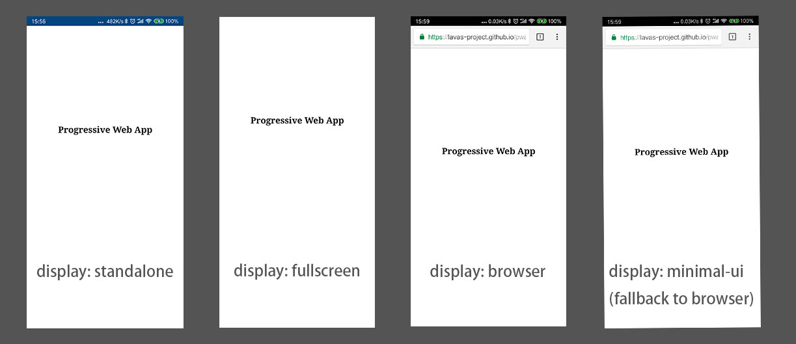
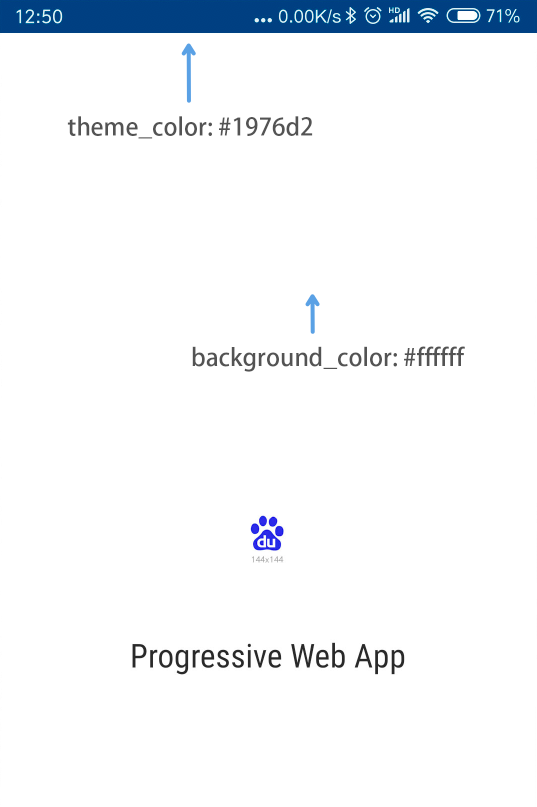
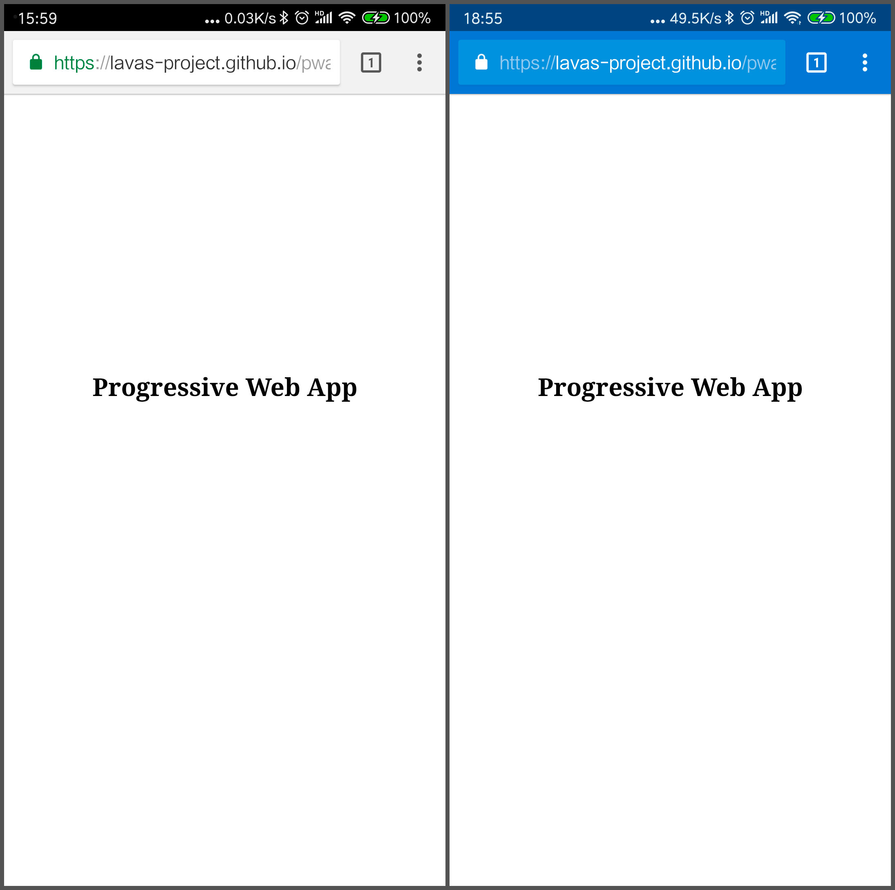
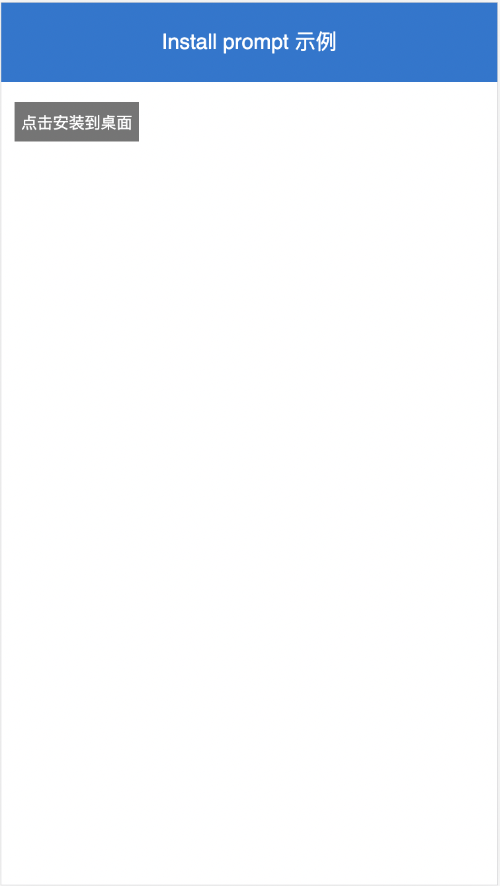
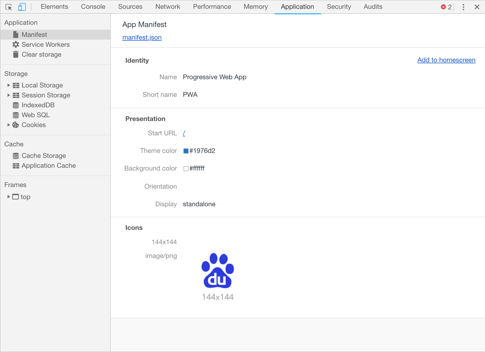

# Web 应用清单

Web 应用清单（Web App Manifest）是一份 JSON 格式的文件，它定义了网站应用的相关信息，包括应用名称、图标、启动方式等等。当网站提供了这么一份应用程序清单，并且满足一定的生效条件之后，将具有添加到主屏幕的能力。

添加到主屏幕的网站并不等同于“添加到桌面快捷方式”。如下图所示，当网站添加到主屏幕之后，它将具有如同 Native App 一样独立的图标和名称；点击图标打开网站，资源加载的过程并不会像普通网页那样出现白屏，取而代之的是一个展示应用图标和名称的启动页面，资源加载结束时加载页消失；当网页最终展现时，地址栏、工具栏等浏览器元素将不会展现出来，网页内容占满屏幕，看起来与 Native App 一样。


添加到主屏幕的好处有很多，主要在用户黏性和用户体验上，如下。

- 首先是减少了网站入口深度，用户可以直接从主屏幕直达站点；
- 其次是能够让网站具有更加接近原生体验的特性，具有启动页面，脱离浏览器 UI；
- 最后，添加到主屏幕的网站如同安装原生应用那样，被纳入应用抽屉中，并且可以通过系统设置直接对站点进行设置。

接下来看看如何使用 Web 应用程序清单。

## 添加 manifest.json

首先我们准备一份包含常用配置的 manifest.json 文件，如下。

```json
{
  "name": "Progressive Web App",
  "short_name": "PWA",
  "start_url": "/?from=homescreen",
  "icons": [
    {
      "src": "/static/img/icons/android-chrome-192x192.png",
      "sizes": "192x192",
      "type": "image/png"
    }, {
      "src": "/static/img/icons/android-chrome-512x512.png",
      "sizes": "512x512",
      "type": "image/png"
    }
  ],
  "display": "standalone",
  "background_color": "#ffffff",
  "theme_color": "#1976d2"
}
```

然后在站点 HTML 页面的 `<head>` 中通过 `link` 标签引入该文件。

```html
<link rel="manifest" href="https://path/to/manifest.json">
```

上面两个步骤就完成了 Web 应用清单文件的编写。

## 添加到主屏幕

目前存在两种方式将站点添加到主屏幕。首先第一种就是用户自主添加至桌面，当网站的 Web 应用清单生效时，部分浏览器菜单栏会多出“添加到屏幕”的选项，用户可以主动将网站添加到桌面。但是大部分用户都不会这么去做，而且目前仅有 Chrome、Firefox 等少量浏览器会提供这样的选项，因此接下来重点介绍第二种添加到主屏幕的方式：应用安装提示。

对于一些用户经常浏览的 PWA 站点，浏览器会在相应页面打开的时候，以适当的频次弹出应用安装提示，询问用户是否要将当前站点添加到主屏幕，如下图所示。用户点击按钮接受，将利用 manifest.json 文件中定义的名称、图标和启动地址等信息在主屏幕生成 PWA 应用入口。


如果期望浏览器展现应用安装提示，需要满足一定的规则：

- 需要 manifest.json 文件，并且包含以下配置
  - name 或 short_name 定义应用名称，优先采用 short_name
  - start_url 指定启动 URL
  - icons 并且包含 144×144 的 PNG 格式的方形图标声明
  - display 指定显示模式，并且必须取值 `standalone` 或 `fullscreen`
- 站点必须注册 Service Worker
  - Chrome 要求 Service Worker 且必须监听 `fetch` 事件
- 站点通过 HTTPS 访问（调试模式下允许 http://127.0.0.1 或 http://localhost 访问）
- 站点在同一浏览器中至少访问过两次，并且两次访问间隔至少为 5 分钟

安装提示展现的规则是浏览器内置的，开发者无法主动去触发它，否则每个站点都可能会不加节制地触发展现安装提示，导致功能滥用，严重破坏用户体验。因此设定了两次以上访问，并且两次访问间隔在 5 分钟以上的限制，既确保了站点是用户经常浏览的站点，也同时能保证在用户频繁切换页面的情况下不会弹出安装提示打断浏览体验。

对于不同浏览器而言，安装提示的样式和展现逻辑可能存在区别，不过都是大同小异，开发者只要满足上述提到的各项条件即可。

## 设置启动页面

从主屏幕打开的网站应用时，会首先展示启动页面，同时应用后台进行加载资源，渲染首屏等准备工作，避免了页面在这个过程中显示白屏，给用户一种从打开到展现的连贯性体验。如下图所示，启动页面一般由应用图标、应用名称和背景色构成：


启动页面通过 manifest.json 文件的以下配置生成：

- name 或 short_name 定义应用名称，优先采用 name
- icons 应用图标
- display 显示模式，必须取值 `standalone` 或 `fullscreen`
- background_color 背景颜色，支持 RGB 颜色定义

由于启动页面是资源加载过程中显示的临时页面，其展示过程会比较短，建议选择首页主色调作为背景色，这样采用相同的颜色，就可以实现从启动页面到首页的平稳过渡。

## 配置项详解

前面主要介绍了 Web 应用清单能够给 PWA 带来什么样的新功能和新体验，我们在前面的内容里只是简单介绍了这些新功能所依赖 Web 应用清单的最小化配置，并未对这些配置项的功能、取值等进行具体展开。在这个小节里，我们将对一些常用的配置项进行详细说明。

### name 和 short_name

`name`，`short_name`，用来配置网站应用的名称。其中 `name` 为应用全称，用于应用安装提示、启动页面的显示；`short_name` 为应用名的简写，用于添加到主屏幕时的应用名展示。应用名称是 Web 应用清单必须的配置项，因此 `name` 和 `short_name` 需要至少配置其中一项。如下图所示，当配置 `name` 为 Progressive Web App，`short_name` 为 PWA，那么在安装提示和启动页面上将展示 Progressive Web App，而添加到桌面的快捷方式将显示 PWA。


### icons

`icons` 用来定制应用图标。`icons` 接收的是一个图标描述对象列表，每个图标的描述对象包含三个属性：

- src：字符串，图标 URL；
- sizes：字符串，图标尺寸，格式为 `宽x高`，数值单位默认为 `px`。对于 `.ico` 类型的图标支持多种尺寸的情况，可以使用空格作为间隔，比如 `48x48 96x96 128x128`；
- type：字符串，非必填项，图标的 mime 类型，可以用来让浏览器快速忽略掉不支持的图标类型。

开发者可以传入一系列尺寸大小的图片描述对象，浏览器会自动根据当前分辨率和图标的用途选择合适尺寸的图片，比如主屏幕显示会选择 `144x144` 大小的图标，而启动页面则会选择尺寸更大一些的图标。

### start_url

`start_url` 用来定义添加到桌面后的启动 URL。`start_url` 可以采用绝对路径和相对路径的方式定义，如果采用的是相对路径，其相对的基础路径为当前 manifest.json 文件的 URL。比如 `start_url` 为 `../hello`，而 manifest.json 的路径为 `https://path/to/manifest.json` 那么启动的 URL 为 `https://path/hello`。

在目前的条件下，浏览器尚未提供任何属性值或者环境变量来帮助程序判断当前的网站是直接通过浏览器打开还是通过桌面图标启动的，但我们可以利用 `start_url` 来简单地实现这个功能。通过在 `start_url` 增加 query 参数，比如增加 `from=homescreen` 这样的参数，那么我们就可以在程序里通过获取 URL 上的 query 参数进行判断，进而去控制调整页面的展现逻辑、去发送渠道展现统计等等。

### display

`display` 用来定义从桌面打开的网站的显示模式。目前支持的显示模式有以下几种：

| 显示模式 | 描述 | 降级显示类型 |
| ------- | --- | ---------- |
| fullscreen | 全屏模式，页面占满整个屏幕，包括移动设备的状态栏都会被页面覆盖 | standalone |
| standalone | 独立模式，浏览器相关UI（如导航栏、工具栏等）将会被隐藏，移动设备状态栏不会被覆盖 | minimal-ui |
| minimal-ui | 显示形式与standalone类似，浏览器相关UI会最小化为一个按钮，不同浏览器在实现上略有不同，支持度较低 | browser |
| browser | 浏览器模式，直接通过浏览器打开网页的普通展现方式，包含地址栏、工具栏等浏览器元素 | None |

在默认情况下，网站应用将以 browser 模式来显示，展示出地址栏、工具栏等浏览器元素，这不但挤占了宝贵的屏幕可视区域，同时也不利于用户专注于当前的站点服务。有了 `display` 配置项，开发者可以根据当前网站应用的形态选择不同的显示模式，比如 HTML5 游戏，可以选择 fullscreen 模式，完全占满屏幕减小游戏过程误操作的可能；比如具有闭环服务的站点，则可以选择 standalone 模式将用户留在当前的网站中，减少跳出的可能。



### background_color 和 theme_color

`background_color` 定义网站背景色，在显示启动页面时生效，如下图所示，当 `background_color` 设置为 `#ffffff` 时，启动页面的背景显示为白色。

`theme_color` 定义网站的主题色，`theme_color` 会影响到浏览器 UI 元素的显示，如下图所示，当 `theme_color` 设置为 `#1976d2` 时，启动页面的顶部手机状态栏的颜色显示为蓝色。



当使用浏览器正常访问页面时，可以看到即使定义了 `theme_color`，浏览器的地址栏、工具栏等并没有变成蓝色，这是因为页面主题色是由 HTML 所通过 `meta` 标签所定义的，标签如下所示：

```html
<meta name="theme-color" content="#1976d2">
```

这样，即使在浏览器模式下，浏览器 UI 元素也将会变成蓝色的了。



Web 应用清单所定义的各种颜色属性目前仅支持 RGB 颜色定义，也就是说 `#ffffff`、`#fff`、`rgb(255, 255, 255)` 这类定义都是合法的，也支持直接使用内置的颜色名定义，比如 `red`、`blue`、`yellow` 等等，其余都不合法。

在设置 `background_color` 和 `theme_color` 的时候，应该尽可能地选择页面主题色，这样才会使得页面与浏览器 UI、启动页面等元素过渡自然，彼此融为一体。

## 控制应用安装提示

前面提到开发者无法主动触发安装提示的弹出，但浏览器提供了一些方法来对弹出效果进行微调，比如推迟提示、取消提示等等。

浏览器提供了 `beforeinstallprompt` 事件来对安装提示的弹出行为进行监听和操作，监听该事件的语法如下所示：

```js
window.addEventListener('beforeinstallprompt', function (e) {
  // 安装提示即将弹出
})
```

### 判断用户安装行为

`beforeinstallprompt` 事件回调返回了一个名为 `userChoice` 的 Promise 对象，当用户对安装提示进行操作之后，userChoice 会返回用户的选择结果对象 `choiceResult`，该对象具有 `outcome` 属性，如果用户选择“添加到主屏幕时”，`outcome` 的值为 `accept`，反之为 `dismissed`。

```js
window.addEventListener('beforeinstallprompt', function (e) {
  e.userChoice.then(function (choiceResult) {
    if (choiceResult.outcome === 'accept') {
      // 用户将站点添加至桌面
    } else {
      // 用户取消安装
    }
  })
})
```

### 取消提示

在某些情况下，我们不希望弹出安装提示，`beforeinstallprompt` 的事件回调提供了 `preventDefault()` 方法来进行取消操作。关键代码如下所示：

```js
window.addEventListener('beforeinstallprompt', function (e) {
  // 阻止添加到主屏对话框弹出
  e.preventDefault()
})
```

### 推迟提示

除了直接取消安装提示之外，我们还可以将弹出事件收集起来，等到特定的时候再做触发，从而达到推迟提示的目的。比如在某些应用场合下，直接弹出安装提示会打断用户操作，我们可以先将默认的提示行为取消掉，并且把这个事件回调用变量存起来，然后在页面上设计一种更为友好的 UI 去提醒用户，当用户主动点击 UI 确认之后，再去重新调用事件的 `prompt` 触发安装提示的展现。

下面的示例展示了推迟提示的一种方案，我们先下载示例代码到本地，在命令行中运行如下命令。

```bash
# 从 GitHub 下载代码到本地 pwa-book-demo 目录
$ git clone https://github.com/lavas-project/pwa-book-demo.git

# 进入到 chapter06 目录
$ cd chapter06/install-prompt

# 安装 npm 依赖
$ npm install

# 安装成功后启动 chapter06 示例
$ npm run server
```

在看到命令行中输出 `Server start on: http://127.0.0.1:8088`，意味着已经成功启动，这时，打开浏览器，访问 `http://127.0.0.1:8088` 能看到如下图所示的页面。页面上放置了一个按钮，默认为灰色状态，当捕获到安装提示事件之后，取消默认的弹出行为并且把事件存下来，同时页面上把按钮颜色显示出来，点击按钮之后，再弹出安装提示，同时置灰按钮。



在示例 `public/index.html` 中可以查看相关代码，这段代码的关键点在于，首先是调用 `e.preventDefault()` 阻止默认的安装提示展现，其次设置了 `savedPrompt` 变量用来存放安装提示的事件对象，最后在适当的时候调用 `savedPrompt.prompt()` 方法重新触发安装提示的的展现，从而整体实现推迟提示的效果。

```javascript
// 获取按钮元素
let button = document.getElementById('btn')
// 保存安装提示事件
let savedPrompt
window.addEventListener('beforeinstallprompt', function (e) {
  // 阻止默认提示弹出
  e.preventDefault()
  // 把事件存起来
  savedPrompt = e
  // 显示按钮
  button.classList.remove('disabled')
})
button.addEventListener('click', function () {
  // 隐藏按钮
  button.classList.add('disabled')
  // 触发安装提示展现
  savedPrompt.prompt()
  // 用户行为判断
  savedPrompt.userChoice.then(function (result) {
    // 用户操作之后清空事件
    savedPrompt = null
    if (result.outcome === 'accept') {
      // 用户将站点添加到桌面
    } else {
      // 用户取消操作
    }
  })
})
```

## 调试 Web 应用清单

调试 Web 应用清单的方式非常简单，Chrome 开发者工具目前已经提供了相关调试功能。

用 Chrome 打开待调试的网页，同时打开开发者工具，切换到 `Application` 面板，然后点击 `Manifest` 标签，如图所示，如果 manifest.json 文件被网页成功引入的话，开发者工具面板将会显示相关属性信息，如果有个别配置项配置错误，对应的属性信息将不会显示出来。

同时可以在开发者工具面板右上角中找到 `Add to homescreen` 的链接，点击之后将会弹出添加到桌面的安装提示。如果配置存在错误的话，将会在控制台面板提示相关错误信息，我们可以根据错误提示对 manifest.json 进行修改，并完善其他条件。



如果没有找到 `Add to homescreen` 的链接，在 manifest.json 配置正确的情况下，也可以通过点击 Chrome 右上角进行安装（低版本 Chrome 可能需要将 chrome://flags 中的 Desktop PWAs 项设置为 Enabled）。


如果想要在手机上查看效果，需要在系统中先查看浏览器是否开启了添加到桌面权限，然后通过 Fidder 或者 Charles 等工具设置代理，在浏览器中打开本地站点，就可以调试网站应用添加效果了。


## 浏览器支持度

Web App Manifest 仍然处于 W3C 的草案阶段，但是 Chrome、手机百度、小米等浏览器已经支持了这项标准。虽然 iOS 11.3/ Safari 11.1 宣布支持了 Web App Manifest ，但是根据实际的测试，目前只有部分属性得到了一定程度的支持。不过值得观察的是，Apple 也在不断改进 iOS 下的 PWA 体验，例如在最新的 iOS 12.2 版本中，在应用切换时，PWA 应用不会被重新启动导致回到首页，极大优化了 iOS 系统的 PWA 体验。

如果希望为 iOS 上 PWA 的启动效果提供更好的兼容性，可以通过使用 Safari 的私有 meta/link 属性来配置桌面图标、状态栏颜色等。

```html
<!-- 指定桌面 icon -->
<link rel="apple-touch-icon" href="/static/img/apple-touch-icon-152x152.png">
<!-- 指定应用名称 -->
<meta name="apple-mobile-web-app-title" content="PWA Lesson">
<!-- 是否隐藏 Safari 地址栏等-->
<meta name="apple-mobile-web-app-capable" content="yes">
<!--修改 iOS 状态栏颜色 -->
<meta name="apple-mobile-web-app-status-bar-style" content="black">
```

## 桌面 PWA 安装

PC 桌面端已经实现对 PWA 各项技术的支持，部署 Web App Manifest 的网站应用，在 PC 桌面同样可以像原生系统应用一样添加至主屏幕。而对于移动端的各配置项，不需要进行新的升级也依然适用于桌面 PWA 。例如在下图中，`theme_color` 将用于设置应用窗口状态栏的颜色。同时对于符合条件的应用，浏览器也会在合适的时候弹出应用安装提示。


桌面 PWA 提供了很大的想象空间，对于不需要依赖很多 Device API 的系统来说，使用桌面 PWA 非常合适，例如管理系统等，兼具 BS 架构和 CS 架构的优点，而且还大大降低开发成本，在一定程度上可以代替 Electron 等技术产品，
