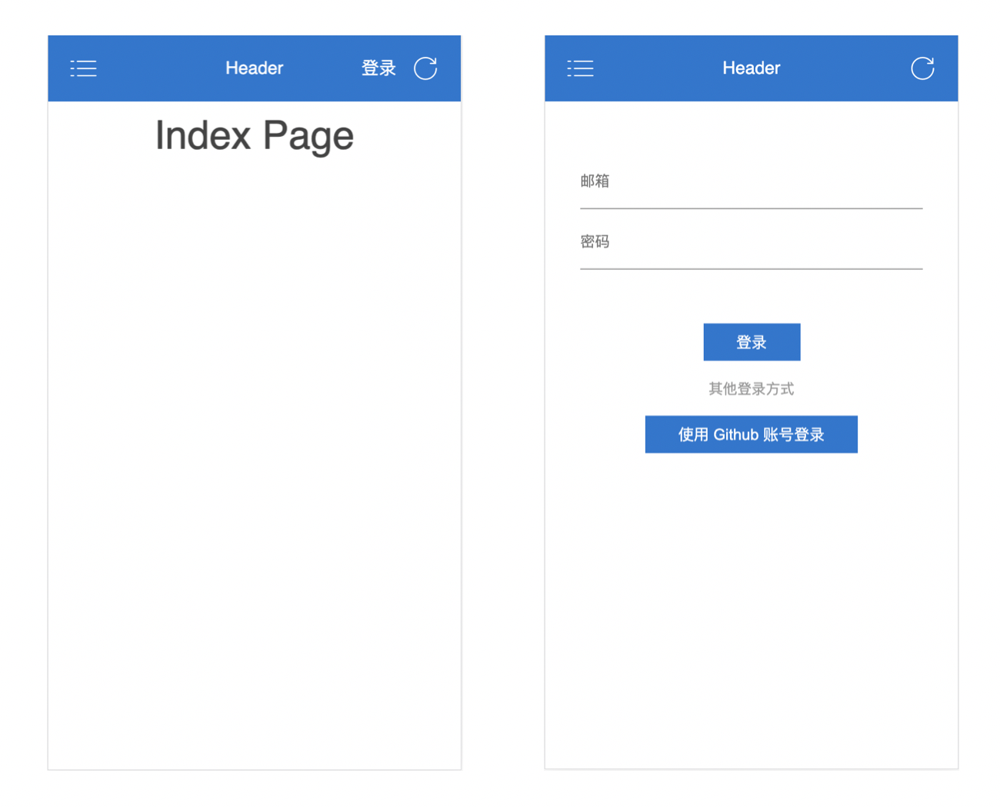
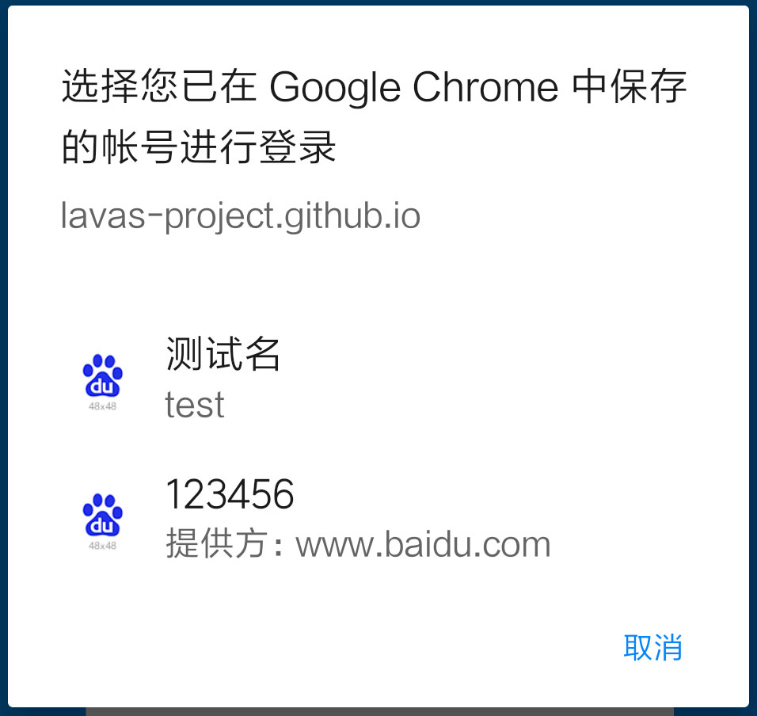

# 凭证管理 API

一直以来，登录网站总是一件非常麻烦的事情，尤其是在移动端，如果过早要求用户进行登录，转化率会大大降低。用户输入账号密码并提交给服务器进行校验，服务器校验通过之后将创建 session 保持会话。基于安全角度的考虑，用户的账号密码是不允许通过 JavaScript 写入本地存储之中的。当 session 会话过期时，用户将不得不再次输入账号密码信息进行登录，体验很差。使用浏览器提供的凭证管理 API（Credential Management API）可以在安全与体验之间找到更好的平衡。

在本节中，我们将为 PWA 示例设计登录功能，展示使用凭证管理 API 是如何优化用户登录体验的。在命令行中运行如下命令，下载示例代码到本地。

```bash
# 从 GitHub 下载代码到本地 pwa-book-demo 目录
$ git clone https://github.com/lavas-project/pwa-book-demo.git

# 进入到 chapter06/credentials 目录
$ cd chapter06/credentials

# 安装 npm 依赖
$ npm install

# 安装成功后启动 chapter06/credentials 示例
$ npm run server
```

在看到命令行中输出 `Server start on: http://127.0.0.1:8088`，意味着已经成功启动，这时，打开浏览器，访问 `http://127.0.0.1:8088` 能看到如下图所示的页面。我们在示例首页添加一个登录按钮，点击按钮会跳转至登录页面，用户在该页面表单进行账户密码输入。



在继续优化之前，先通过 “自动填充（autofill）”的功能改进浏览器表单。通过对表单元素增加 `autocomplete`属性，浏览器会根据这一属性进行表单类型识别，并将表单输入内容存储到浏览器中，这些存储的数据无法被 JavaScript 访问到，因此相对安全。比如下面的表单，浏览器会将 autocomplete 标识为 `username` 和 `current-password` 的字段内容提取出来，构造出用户身份凭证信息。有关自动填充的更详细的说明，请参考 [Form control infrastructure](https://html.spec.whatwg.org/multipage/form-control-infrastructure.html)。

在示例文件 `public/login.html` 中可以查看示例中的表单属性设置如下。

```html
<form id="login" class="login-form" method="post">
  <div class="login-input">
    <input id="email"
      name="email"
      type="email"
      placeholder="邮箱"
      autocomplete="username email"
      ></input>
  </div>
  <div class="login-input">
    <input
      id="password"
      name="password"
      type="password"
      autocomplete="current-password"
      placeholder="密码"></input>
  </div>
  <button class="submit-button" type="submit"> 登录 </button>
  <div class="login-third-party">
    <p>其他登录方式</p>
    <button class="github-login-button submit-button" type="submit"> 使用 Github 账号登录  </button>
  </div>
</form>
```

自动填充功能在一定程度上解决了用户重复输入账号密码的问题，但是还存在不少需要改进的地方。

1. 采用第三方账号登录的方式，由于登录流程不涉及表单填充，因此无法触发自动填充功能；
2. 对于采用 AJAX、Fetch 等方式异步提交的登录表单，无法被自动填充机制捕获并且保存；
3. 自动填充的行为对网站来说是完全不可见的，网站既不知道身份凭证已被浏览器存储，也不知道表单密码已被浏览器自动填充，无法更精细地控制登录流程；
4. 自动填充机制对更新密码的支持度较低。

因此，针对用户身份凭证目前所存在的问题，使用凭证管理 API 可以进一步优化表单登录的过程。需要注意的是，目前凭证管理 API 仍处于草案阶段，现有浏览器的支持程度不高，在使用前需要进行 API 检测并做好相应的降级处理。

```js
if (window.PasswordCredential || window.FederatedCredential) {
  // 进行凭证管理 API 的相关操作
}
```

## 保存用户凭证

优化表单登录的第一步，就是能够保存用户登录凭证。一旦用户登录网站验证通过，可以请求用户允许浏览器保存用户凭证。浏览器提供 `navigator.credentials.store()` 方法对用户身份凭证进行存储。

该方法需要传入一个类别为 `Credential` 的对象作为参数。目前存在两种派生自 `Credential` 的类，分别是密码凭证 `PasswordCredential` 和联合凭证 `FederatedCredential`，开发者需要根据用户的登录类型选择相应的凭证进行存储。如果用户使用账号密码进行登录的话，那么可以使用 `PasswordCredential` 构造并存储身份凭证。

```js
let cred = new PasswordCredential({
  id: 'example@baidu.com',
  password: 'example_password',
  name: '路人甲',
  iconURL: 'https://path/to/icon.png'
})
navigator.credentials.store(cred)
```

其中 `id` 和 `password` 为必填字段，分别对应用户登录信息的用户名和密码，`name` 和 `iconURL` 是选填字段，用于后续账号选择器的信息展示。

同时浏览器也提供 `navigator.credentials.create()` 方法实现异步实例化凭证，新的声明方法如下所示：

```javascript
// passwordcredential
let pwdCred = await navigator.credentials.create({
  password: {
    id: 'example@baidu.com',
      password: 'example_password',
      name: '路人甲',
      iconURL: 'https://path/to/icon.png'
    }
})
```

在本小节示例中查看 `public/script/login.js` 登录逻辑，我们在用户点击登录按钮时阻止表单提交事件，验证用户身份信息正确后，可以保存对应的用户信息。示例中表单已经添加 `autocomplete` 属性，因此可以直接利用表单 HTMLElement 创建 `PasswordCredential` 实例。

```javascript
let form = document.querySelector('#login')
form.addEventListener('submit', function (event) {
  event.preventDefault()
  fetch('/auth/password', {
    method: 'POST',
    credentials: 'include',
    body: new FormData(event.target)
  }).then(function (res) {
    // 验证用户邮箱密码
    if (res.status === 200) {
      return Promise.resolve()
    } else {
      return Promise.reject('login error')
    }
  }).then(function () {
    // 判断是否支持 Credential API
    if (window.PasswordCredential) {
      // 保存用户凭证
      var cred = new PasswordCredential(event.target)
      return navigator.credentials.store(cred)
    } else {
      return Promise.resolve()
    }
  }).then(function () {
    // 登录成功跳转至首页
    window.location.href = '/'
  }).catch(function (error){
    // 登录出错展示错误信息
    showErrorToast()
  })
})
```

本示例中在 `public/assets/mockData/user.json` 中模拟存储了测试账号，运行示例输入测试账号邮箱密码，可以看到浏览器弹出类似下图的对话框。


凭证保存的过程是一个异步的过程，在执行 `navigator.credentials.store(cred)` 进行保存时，方法会返回一个 promise 对象，同时在页面上弹出对话框提示用户是否进行密码存储，只有当用户选择“保存”时，promise 对象才会 resolve，点击“x”关闭对话框或者点击“一律不”时，promise 将 reject。

需要注意的是，如果用户选择了“一律不”，那么在后续调用 `navigator.credentials.store(cred)` 时，返回的 promise 对象将直接 resolve 而不会弹出任何对话框。因此在设计凭证存储流程时，一定要记住只在最合适的时候发起凭证存储，比如在发起凭证存储前先引导并提示用户，不要惹恼用户，否则用户一旦选择了“一律不”，后面就很难再有机会了，同时，存储流程需要考虑到凭证存储成功和失败之后的应对措施。

## 自动登录

当点击登录按钮时，常见的页面交互是弹出登录表单或者跳转至登录页面，用户继续在表单中进行繁琐的输入操作。而当浏览器存储用户凭证后，使用凭证管理 API，可以有效的缩短用户登录时间，实现只需点击登录按钮就可完成登录。接下来看看实现自动登录功能需要的几个步骤。

### 获取用户凭证

浏览器提供 `navigator.credentials.get()` 方法来获取存储的身份凭证，可以通过配置 `password` 和 `federated` 来指定要获取的用户凭证。另一个参数 `mediation` 用于配置账号选择器行为，为了实现自动登录通常设置 `mediation` 值为 `silent`，在用户登录时不会弹出账户选择器，在下文中会详细介绍其用法。

需要注意的是，由于执行 `navigator.credentials.get()` 将可能会弹出账号选择器打断用户操作，因此需要保证只有在真正需要登录的时候再去调用该方法，比如在调用前判断一下当前 session 会话是否过期。

```js
if (window.PasswordCredential || window.FederatedCredential) {
  if (!isLogin()) {
    // 获取用户凭证
    let cred = await navigator.credentials.get({
      password: true,
      mediation: 'silent'
    })
  }
}
```

### 发送凭证验证用户

获取用户凭证后，首先需要判断是否获取凭证成功。成功后，可以通过 `Credentials.type` 方法判断当前凭证的类型，可能的取值为 `password` 和 `federated`，分别对应密码凭证和联合凭证，开发者可以根据不同类型设计不同的凭证发送逻辑，同时对于联合凭证，则可以进一步通过 `provider` 属性区分不同第三方账号的登录逻辑。

在示例文件 `public/script/index.js` 中可以查看自动登录相关的逻辑，包括获取用户凭证和发送凭证的过程，同时支持 password 和 federated 两种方式，关于使用联合凭证登录在下文会很快提到。

```javascript
function autoLogin () {
  if (window.PasswordCredential || window.FederatedCredential) {
    return navigator.credentials.get({
      password: true,
      federated: {
        providers: ['https://github.com']
      },
      medition: 'silent'
    }).then(function (cred) {
      if (cred) {
        switch (cred.type) {
          case 'password':
            return loginWithPassword(cred)
          case 'federated':
            switch (cred.provider) {
              case 'https://github.com':
                return loginWithGithubAccount(cred)
            }
        }
      } else {
        return Promise.reject()
      }
    }).then(function (res) {
      if (res.status === 200) {
        return Promise.resolve()
      } else {
        return Promise.reject('login error')
      }
    })
  } else {
    return Promise.resolve()
  }
}
```

对于发送凭证，并没有太多要求，一般来说，只要是异步发送即可，比如 `AJAX`、`Fetch API` 都可以，本节示例中以密码凭证和 Fetch API 为例。`PasswordCredentials` 和 `FederatedCredentials` 实例对象都可以访问到生成凭证时所传入的参数，因此可以像正常对象那样读取属性，并构造出对应的身份认证请求参数即可。

```js
function loginWithPassword (cred) {
  let form = new FormData()
  form.append('email', cred.id)
  form.append('password', cred.password)
  return fetch('/auth/password', {
    method: 'POST',
    credentials: 'include',
    body: form
  })
}
```

在已保存凭证的示例中点击退出，退出登录后重新点击首页的登录按钮，此时浏览器会弹出类似下图的提示，不需要再跳转至登录页输入密码，就登录成功并更新首页登录状态。


发送到服务器端校验的凭证有可能会存在认证失败的情况，发生这种情况的原因一般是密码需要更新，因此需要在认证失败时及时展现登录表单，让用户重新填写身份凭证信息，重新校验，并更新存储的身份凭证。

## 第三方账号登录

用户希望使用第三方账号登录的情况越来越普遍，如果网站登录表单支持使用第三方账户登录，可以使用联合凭证的方式，先通过 `FederatedCredential` 对象构造并存储身份凭证。

创建联合登录凭证与密码凭证类似，其中 `id` 和 `provider` 为必填字段，其中 `id` 为标识账户的标志，可以是用户的 email、username 等等能够唯一标识用户的属性值。通常第三方账户登录使用 OAuth2.0 等方式授权，不能直接用 assess_token 等具有时效性的值作为 id，需要做好 id 与 assess_token 的映射关系。`provider` 为第三方账号提供方，需要填入符合 URL 校验规则的账号提供方网址。

```javascript
let cred = new FederatedCredential({
  id: 'example@baidu.com',
  provider: 'https://www.baidu.com',
  name: '路人甲',
  iconURL: 'https://path/to/icon.png'
})
navigator.credentials.store(cred)

let fedCred = await navigator.credentials.create({
  federated: {
    id: 'example@baidu.com',
    provider: 'https://www.baidu.com',
    name: '路人甲',
    iconURL: 'https://path/to/icon.png'
  }
})
```

一旦浏览器存储了网站的第三方登录凭证，用户再次登录网站时，可以直接获取用户凭证进行验证，实现只需要点击“使用 Github 账号登录”的表单按钮就直接完成了用户登录。

同时我们也可以如下代码所示，扩展支持多个第三方账户登录。

```javascript
navigator.credentials.get({
  password: true,
  federated: {
    providers: ['https://www.baidu.com', 'https://github.com']
  }
}).then(function (cred) {
  if (cred) {
    switch (cred.type) {
      case 'password':
        // PasswordCredential 凭证处理
        return loginWithPassword(cred)
      case 'federated':
        // FederatedCredential 凭证处理
        switch (cred.provider) {
          case 'https://www.baidu.com':
            // 调起百度第三方登录
            return loginWithBaiduAccount()
          case 'https://github.com':
            // 调起 github 第三方登录
            return loginWithGithubAccount()
        }
    }
  } else {
    return Promise.reject()
  }
})
```

## 修改凭证信息

当用户的密码修改之后，存储的身份凭证将会失效，需要及时进行更新。在具体实现上只需要调用 `navigator.credentials.store(cred)` 进行新凭证存储即可，此时页面会弹出凭证更新提示对话框，只有当用户同意时身份凭证才会更新成功。对于 `PasswordCredential` 类型的凭证，浏览器会根据 `id` 指定身份凭证信息进行覆盖；`FederatedCredential` 则会根据 `provider` 和 `id` 指定身份凭证信息进行覆盖。

## 使用账户选择器登录

一个网站用户可能拥有多个账户，在登录时直接提供账户选择器也可以跳过传统的表单登录方式。使用账号选择器登录的方法与自动登录一致。当用户点击登录按钮时，调用 `navigator.credentials.get()` 方法，并通过`mediation` 设定账号选择器的展现方式为`optional` 或 `required`。

 `mediation` 设置为 `required` 时，当用户登录时，账户选择器每次都会展现。而如果采用 mediation 为 `optional` 的模式获取凭证，即 `navigator.credentials.get({mediation: 'optional'})`，只要用户第一次选择好身份凭证，在下一次重新获取时，将不会弹出账号选择器而直接返回上次选择好的身份凭证信息，从而起到简化用户登录流程的作用。这时如果用户需要重新选择账户，可以通过调用 `navigator.credentials.preventSilentAccess()` 方法来取消这个静默获取凭证的过程。

使用方法非常简单，只需要直接执行该函数即可：

```js
navigator.credentials.preventSilentAccess()
```

这里需要注意的是，`preventSilentAccess()` 方法主要配合 `mediation` 为 `optional` 一起使用。如果 `mediation` 为 `silent`，即采用静默获取凭证的方式，`preventSilentAccess()` 会导致这种静默获取直接返回 null。

当 mediation 取值为 `silent` 或者 `optional`，且返回的账号选择列表中只有一个凭证，那么 `get()` 返回的 promise 对象将直接 resolve 该凭证信息，但是当账号选择列表存在多个凭证时，如果 mediation 为 `silent`，那么 promise 将 `resolve(null)`，而 `optional` 将弹出账号选择器供用户选择。除开以上这些情况，当用户并未从账号选择器中选择相应的账号信息，同样的 promise 也将 `resolve(null)`，因此在设计登录流程时，需要做好相应的降级措施。

举个例子，当站点已经存入身份凭证后，调用以下方法，将会弹出账号选择器：

```js
let promise = navigator.credentials.get({
  password: true,
  federated: ['https://www.baidu.com'],
  mediation: 'required'
})
```

此时弹出的账号选择器如下图所示，可以看到，由于配置了 password 和 federated，因此密码凭证和联合凭证都显示在账号选择列表中：



如果去掉 federated 的配置，那么仅有密码凭证类型的帐号信息展现在账号选择列表中：


## 小结

在本节中介绍了凭证管理 API 常见的使用方式，通过示例展现凭证管理 API 对 Web App 登录流程的优化效果，我们相信将凭证管理 API 应用于 PWA 中，会有效增加登录用户留存。
