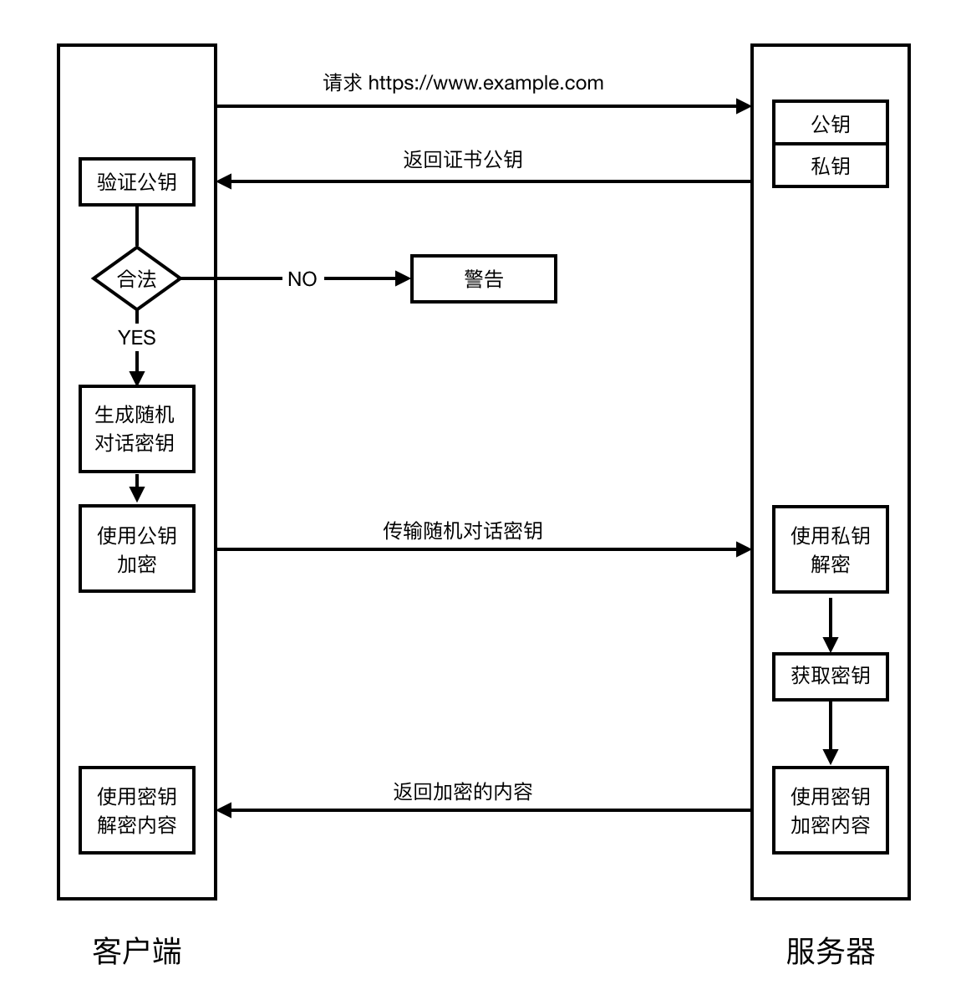
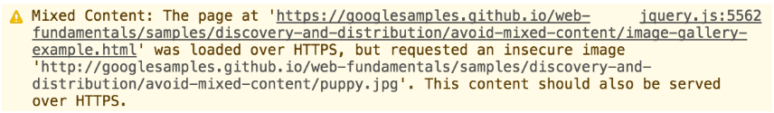
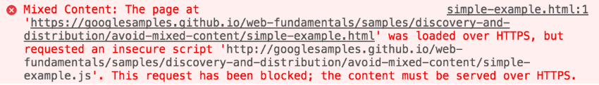
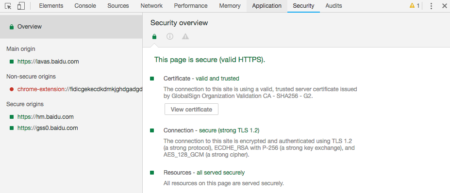
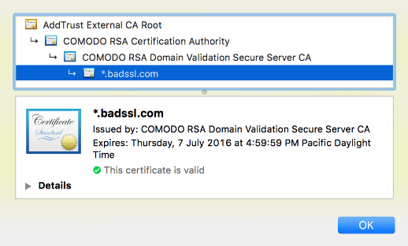

## 使用 HTTPS 保护站点安全

构建 PWA 应用时，HTTPS 是必不可少的条件之一。使用 HTTP 协议的应用存在着一定的安全隐患，这是因为 HTTP 本身不具备加密的功能，通信中使用明文传输请求和响应的内容，内容可能会被窃听，而且 HTTP 缺少对通信双方身份进行校验的环节，也无法证明报文内容的完整性，存在身份伪装和信息被篡改的风险。所以，我们应该严格地使用 HTTPS 协议来保护 PWA 的安全。

### HTTPS 的概念

HTTPS 即 HTTP over SSL/TLS（Secure Socket Layer/Transport Layer Security），是 HTTP 的安全版本。SSL/TLS 是介于 TCP 和 HTTP 之间的一层安全协议，是一种使用比较广泛的安全技术，简单的说，是在 HTTP 上加了一层处理加密信息的模块，所以使用 HTTPS 基本上不需要对 HTTP 页面进行太多的改造。有些浏览器访问 HTTPS 的站点时，在地址栏的前面会有一把绿色的锁一样的标识，表明 HTTPS 生效了。


HTTPS 的主要作用是：

1. 对数据进行加密，并建立一个信息安全通道，来保证传输过程中的数据安全;
2. 对网站服务器进行真实身份认证。

它的核心 SSL/TLS 协议采用非对称加密方式。HTTPS 服务器拥有一张数字证书，该证书由客户端、服务端都信赖的第三方机构颁发，它包含了经过认证的网站公钥和一些元数据。公钥用来加密信息，可以提供给所有需要进行通信的客户端，私钥保存在本地，不能泄露。客户端使用这份公钥对信息进行加密，将请求发送给服务器，服务器用私钥解密。反之，服务器对客户端的返回，则使用客户端提供的公钥进行加密，客户端使用本地对应的私钥来解密，保证通信安全。

基于 SSL/TLS 进行一次的 HTTPS 会话的过程，简单地说可以分成几步：

1. 客户端向服务器端索要并验证证书公钥，决定是否继续通信。
2. 客户端生成 "对话密钥"，并用公钥加密返回给服务器。
3. 服务器用私钥解密，获取密钥，使用密钥加密返回内容，返回给客户端。
4. 客户端使用 "对话密钥" 解密内容，拿到结果。



如上流程，经过了身份认证、信息加密等步骤，网络通信安全就得到了保障。在这里涉及到一些重要的安全术语，如公钥/私钥、证书办法机构，我们需要了解一下。

**公钥和私钥对**

公钥/私钥对是一对很长的数字，可用作加密密钥和解密密钥，它们共用一种特别的数学关系。最常见的密钥对系统之一就是 RSA 加密系统。公钥用于加密消息，并且消息只能使用对应的私钥来解密。服务器会将其公钥公布出来，客户端（如浏览器）将使用此密钥来建立一个与服务器安全通信的通道。

**证书颁发机构**

证书颁发机构 (Certificate Authority) 是一个受信任的第三方组织，它为每个使用公开密钥的站点客户发放一个数字证书，数字证书的作用是证明该站点合法地拥有证书中列出的公开密钥，CA 机构的数字签名使得该证书不能被伪造和篡改。包含有 CA 本身公钥的信任锚存储库维护在客户端（如浏览器）上，这些公钥被用来验证站点证书的真伪。CA 是数据安全和 HTTPS 通信的重要组成部分和核心环节。

### 使用 HTTPS 的理由

了解了 HTTPS 的基本原理后，不难看出，HTTP 协议采用明文传输信息，存在信息窃听、信息篡改和信息劫持的风险，使用 HTTPS 对我们构建安全可靠的 PWA 站点有着多方面的收益。

确保站点安全。HTTPS 的通信信息都是加密传播，第三方无法窃听，且具有校验机制，一旦信息被篡改，通信双方就能立刻发现，这样就能够有效防止入侵者篡改网络通信内容。这些入侵者包括但不局限于恶意攻击者，合法但极具威胁的竞争对手，通信运营商等等。特别是在国内，运营商劫持插入广告信息的现象早已屡见不鲜，这些都能通过升级 HTTPS 来规避。

保护用户隐私。并不只是涉及到敏感数据的网站才需要升级 HTTPS，事实上每一个不受保护的 HTTP 请求都有暴露用户行为、用户身份的风险。虽然这些单个请求看起来没有什么敏感信息，但攻击者可以长期监视用户的浏览活动，通过收集大量数据推断用户的行为、地理位置、生活习惯等，从而造成用户的隐私信息泄露。

未来的趋势所在。将 Web 应用升级成为 HTTPS 是大势所趋，HTTPS 可以保障站点的安全、保护用户的隐私。随着 Web 应用平台的多元化发展，拍照、视频等功能都需要较高的用户权限许可，而使用 Service Worker 启用离线应用功能、构建 PWA 站点等已经将 HTTPS 视为必要条件。Google 早就倡议所有的 Web 站点都应该使用 HTTPS， 而且将 HTTPS 站点的搜索结果排名权重进行提升，想必在未来，这也是促进站长将站点进行 HTTPS 化的一个重要理由。


### 升级 HTTPS

通过上面的内容，对于 HTTPS 的概念和作用我们已经足够清楚了，接下来，我们介绍下将站点升级成 HTTPS 的一般步骤。

1.获取证书

前面提到过，HTTPS 是由证书认证机构 CA 颁发的、并包含公开密钥拥有者信息、公开密钥、签发者信息、有效期以及一些扩展信息、能提供在互联网上进行身份验证的一种权威性数字文件。要保证数字证书的真实性，必须确保该数字证书是由具有权威性的国际 CA 中心签发的，如 Symantec 就是这样一家通过 Web Trust 认证的国际 CA。购买 CA 颁发的证书有很多类型，分为域名认证、公司认证、扩展认证三个级别，还分成单域名、通配符、多域名三种覆盖范围。认证级别越高、覆盖范围越广的证书，价格越贵。如今，国内一些云服务供应商也提供了配套的免费或收费证书服务，可以选择的类型很多。

2.在服务器安装证书

根据 Web 服务器的类型不同，证书分为多种，我们只需要下载对应的证书文件，然后选择对应的服务器进行配置即可，[Mozilla 便捷的配置生成器](https://www.w3.org/TR/CSP/)，列举了常见服务器的配置方式，对我们配置证书很有帮助。

我们以 Nginx 服务器的配置示例如下：

```nginx
server {
    listen 443 ssl http2;
    listen [::]:443 ssl http2;

    # certs sent to the client in SERVER HELLO are concatenated in ssl_certificate
    ssl_certificate /path/to/signed_cert_plus_intermediates;
    ssl_certificate_key /path/to/private_key;
    ssl_session_timeout 1d;
    ssl_session_cache shared:SSL:50m;
    ssl_session_tickets off;

    # Diffie-Hellman parameter for DHE ciphersuites, recommended 2048 bits
    ssl_dhparam /path/to/dhparam.pem;

    # intermediate configuration. tweak to your needs.
    ssl_protocols TLSv1 TLSv1.1 TLSv1.2;
    ssl_ciphers 'ECDHE-ECDSA-CHACHA20-POLY1305:ECDHE-RSA-CHACHA20-POLY1305:ECDHE-ECDSA-AES128-GCM-SHA256:ECDHE-RSA-AES128-GCM-SHA256:ECDHE-ECDSA-AES256-GCM-SHA384:ECDHE-RSA-AES256-GCM-SHA384:DHE-RSA-AES128-GCM-SHA256:DHE-RSA-AES256-GCM-SHA384:ECDHE-ECDSA-AES128-SHA256:ECDHE-RSA-AES128-SHA256:ECDHE-ECDSA-AES128-SHA:ECDHE-RSA-AES256-SHA384:ECDHE-RSA-AES128-SHA:ECDHE-ECDSA-AES256-SHA384:ECDHE-ECDSA-AES256-SHA:ECDHE-RSA-AES256-SHA:DHE-RSA-AES128-SHA256:DHE-RSA-AES128-SHA:DHE-RSA-AES256-SHA256:DHE-RSA-AES256-SHA:ECDHE-ECDSA-DES-CBC3-SHA:ECDHE-RSA-DES-CBC3-SHA:EDH-RSA-DES-CBC3-SHA:AES128-GCM-SHA256:AES256-GCM-SHA384:AES128-SHA256:AES256-SHA256:AES128-SHA:AES256-SHA:DES-CBC3-SHA:!DSS';
    ssl_prefer_server_ciphers on;

    # HSTS (ngx_http_headers_module is required) (15768000 seconds = 6 months)
    add_header Strict-Transport-Security max-age=15768000;

    # OCSP Stapling ---
    # fetch OCSP records from URL in ssl_certificate and cache them
    ssl_stapling on;
    ssl_stapling_verify on;

    ## verify chain of trust of OCSP response using Root CA and Intermediate certs
    ssl_trusted_certificate /path/to/root_CA_cert_plus_intermediates;

    resolver <IP DNS resolver>;

    ....
}
```

3.重定向配置

接下来我们需要将 HTTP 的访问请求 301 到 HTTPS

```nginx
server {
    listen 80;
    server_name domain.com www.domain.com;
    return 301 https://domain.com$request_uri;
}
```

4.修改资源链接

将站点所有的 HTTP 资源地址替换成 HTTPS，一个比较好的方法是直接将协议头替换成 `//`，这样浏览器会自动根据当前页面的协议加载相同协议头的资源，更为灵活。例如：

```html
<script src="http://a.com/jquery.js"></script>
```

改为

```html
<script src="//a.com/jquery.js"></script>
```

如果修改不完全，HTTPS 资源和 HTTP 资源混合出现，即页面包含混合内容，浏览器将警告用户已失去 HTTPS 的全部能力（直观的看，地址栏 HTTPS 的标识将处于失效状态）。事实上，如果是主动混合内容（脚本、插件、CSS、iframe），则浏览器通常根本不会加载或执行此内容，从而导致页面残缺。

5.可以进一步保证安全：设置 Cookie 安全标记

如果用户的身份验证 Cookie 在明文中暴露，则整个会话的安全保障将被破坏，因此，应该确保浏览器只在使用 HTTPS 时，才发送 Cookie。

在网站响应头里面，`Set-Cookie` 字段加上 Secure 标志即可。

```http
Set-Cookie: LSID=DQAAAK...Eaem_vYg; Secure
```

完成以上设置，重启服务器，HTTPS 就生效了。迁移成为 HTTPS 后，也不必过分担心额外的性能开销问题。HTTPS 和 HTTP 相比，在 TCP 三次握手的基础上，多了一个 SSL 握手的过程，主要是通信和加密有一定的时间损耗。而在页面内容和应用层性能优化得当的情况下，同时应用安全又得到了保障，总体的收益一定是积极和正向的。

### 避免 HTTPS 站点出现混合内容

前面升级 HTTPS 的过程中，需要将资源的协议头进行替换，我们提到了混合内容的概念。混合内容（Mixed Content）顾名思义：初始 HTML 内容通过安全的 HTTPS 连接加载，但其他资源（例如，图像、视频、样式表、脚本）则通过不安全的 HTTP 连接加载，即在同一个页面同时混合加载了 HTTP 和 HTTPS 资源。

混合图片内容，Chrome 给出警告：


对于混合脚本，Chrome 会阻止加载：


混合内容的存在会降低整个页面的安全性，因为这些请求容易受到 XSS，中间人等各种攻击。用户看到这些 Warning 的时候，如果存在威胁，很有可能已经被攻击。所以开发者有义务将资源替换成 HTTPS，减少安全风险。

考虑到这些威胁的存在，浏览器理应阻止所有混合内容的加载，但这会造成众多站点不可用。所以，当前大部分浏览器的策略是阻止最危险的混合内容类型（如 JavaScript 脚本），同时仍允许请求不太危险的混合内容类型（如图片等多媒体资源）。现代浏览器遵循[混合内容规范](https://w3c.github.io/webappsec-mixed-content/)，定义了可选择性地阻止的内容和可阻止的内容类别。

根据此规范，当前可选择性阻止的内容中仅包括图像、视频和音频资源以及预获取这些资源的链接等。随着时间的推移，此类别可能会缩小。可选择性阻止的内容以外的所有内容被视为可阻止的内容，将被浏览器阻止。

值得注意的是，不同浏览器供应商的不同版本的浏览器处理混合内容的方式不尽相同。所以对于开发者来说，修复 HTTPS 站点中的混合内容十分重要。

### 处理 HTTPS 站点中的混合内容

HTTPS 站点中的混合内容数量不多时，我们可以根据浏览器的 Warning 或 Error 提示，手动修改源码即可。如果想批量处理不安全的混合内容，则可以借助 CSP（Content Security Policy）即内容安全策略，下面简单介绍它在这种场景的使用，下一节我们将详细了解相关内容。

#### 使用 CSP 查找混合内容

给网站设置响应头：
```
Content-Security-Policy-Report-Only: default-src https: 'unsafe-inline' 'unsafe-eval'; report-uri https://example.com/reportingEndpoint

```
这样用户访问站点时，浏览器都会向 `https://example.com/reportingEndpoint` 发送请求，告诉你哪些内容不规范。

#### 自动升级不安全的请求

可以使用 CSP 的 [upgrade-insecure-requests](https://www.w3.org/TR/upgrade-insecure-requests/) 配置项，浏览器在请求 http 资源时，会自动升级请求对应的 HTTPS 资源。

如，配置请求头

```http
Content-Security-Policy: upgrade-insecure-requests
```

或，使用`meta`标签

```html
<meta http-equiv="Content-Security-Policy" content="upgrade-insecure-requests">
```

都能使浏览器将 `` 的请求转化成 `https://example.com/image.jpg`。但注意，这时需要保证升级后的资源地址可用，不然就会请求失败。

#### 阻止所有混合内容

对于不支持 upgrade-insecure-requests 属性的浏览器，还可以通过 CSP 的 block-all-mixed-content 属性来屏蔽所有的混合内容，有两种使用方式：

配置请求头

```http
Content-Security-Policy: block-all-mixed-content
```

或，使用`meta`标签

```html
<meta http-equiv="Content-Security-Policy" content="block-all-mixed-content">
```

这个属性将导致所有不安全的混合内容被浏览器阻止，很明显，它存在"误杀"的风险，慎重使用。

### 验证 HTTPS

借助 Chrome DevTools，我们可以方便地查看一个站点的 HTTPS 安全性，实现两个功能：

- 验证当前站点的 HTTPS 安全状况
- 查看连接和证书详情，找出具体的非 HTTPS 资源列表。

打开 Chrome DevTools 的 Security 面板，在 Overview 下面，可以看到站点整体的安全情况，如证书是否合法，连接是否安全，站点资源是否是 HTTPS 等，如下图所示。



可以点击 View certificate 查看站点的服务器证书信息。



不是 HTTPS 的站点会通过 `This page is not secure` 进行提示。如果一个 HTTPS 站点中包含了 HTTP 的资源，也就是我们提到的混合内容，站点仍会被标记为不安全。


我们可以点击 View request in Network Panel 来查看混合内容列表详情，作出对应的修改。


通过以上的步骤，我们就能很快发现站点中潜在的非 HTTPS 安全性问题，消除隐患。
