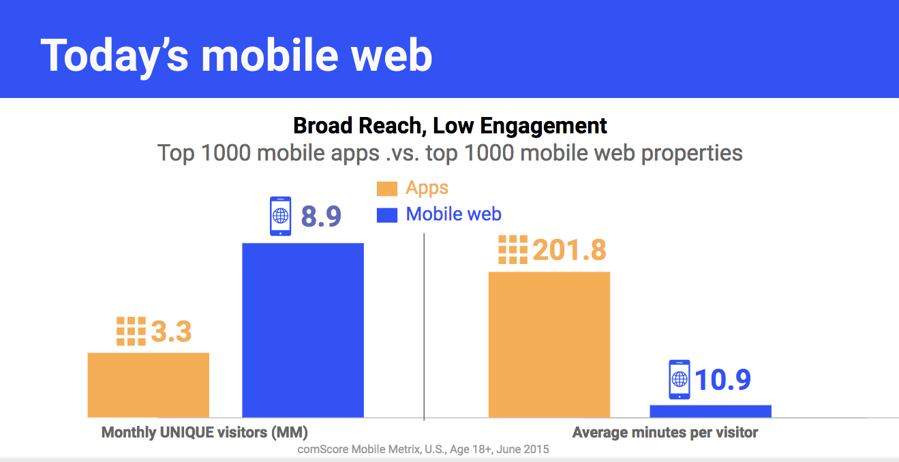

# 为什么会出现 PWA

PWA 是 Progressive Web Apps 的缩写，翻译为渐进式网络应用。早在 2014 年， W3C 就公布过 Service Worker 的相关草案，但是其在生产环境被 Chrome 支持是在 2015 年。因此，如果我们把 PWA 的关键技术之一 Service Worker 的出现作为 PWA 的诞生时间，那就应该是 2015 年。在关注 PWA 是什么之前，先来了解一下为什么会出现 PWA，它是在什么样的背景下被提出来的。

回顾一下历史，在 2015 年之前的那段时间，作为前端开发人员，我们主要精力花在哪里，对于我来说，移动站点的性能优化是投入精力很大的一部分，例如提升首屏速度，动画的流畅度，经过一段时间的优化，性能确实有不小的提升，但是无论怎么优化，还是比 Native App 要差很多，始终无法突破移动设备上 WebView 给 Web 的枷锁，这就是我们想说的第一个问题，**Web 的用户体验**。

除开用户体验问题之外，还有一个非常重要的问题，那就是**用户留存**。Native App 安装完毕后会在用户手机桌面上有一个入口，让用户打开 App 只需一次点击，而 Web App 在移动时代最主要的入口还是搜索引擎，用户从浏览器到站点需要经过搜索引擎，如果想访问上次同样的内容甚至还需要记住上次的搜索词，用户也可以记住 URL 并进行输入，但这些对于移动用户来说，无疑成本巨大，这就导致 Web 站点和用户之间的粘性非常脆弱。Native App 还能够通过发送通知让用户再次回到应用中来，而 Web 没有这个能力。

最后要说的一个问题是 0 和 1 的问题，**Device API 的不完善**。Android 和 iOS 提供了非常丰富的设备 API，Native App 只需获取用户授权就可以使用，而在 Web App 中，WebView 没有提供这样的 API，完全没法使用，如果我们开发一个需要使用 NFC 的 App，你一定不会考虑 Web，因为近场通信 API 在 Web 中还没有。虽然在近年来，W3C 已经提出了很多新的标准，但是浏览器对于 Device API 的支持仍然很不完善。

Google 在一篇名为《[Why Build Progressive Web Apps](https://developers.google.com/web/ilt/pwa/why-build-pwa)》的文章中披露过这样的一组数据，Web 站点每个月的 UV 是 Native App 的 3 倍，然而用户在 Native App 花费的时间却是 Web 的 20 倍，如下图所示，这之间巨大的反差，和上面所说的三个原因息息相关。

就在这样的背景条件下，PWA 以及支撑 PWA 的一系列关键技术应运而生。
