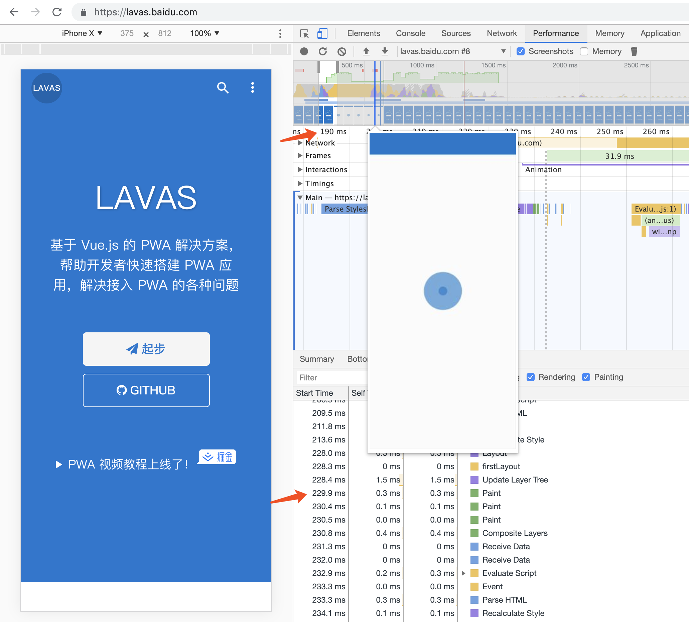

# App Shell

在第一章中已经简单介绍过 App Shell，这个小节我们会更深入学习如何构建和使用 App Shell。它并不是一种新的技术或者 API，而是设计与技术相结合产生的一种整站设计方案，减少用户进入页面的等待时间，用户能够快速看到页面的主体结构，虽然这时主体内容没有渲染出来，但是给用户感官上的体验是这个页面渲染很快，那么来看一下什么是 App Shell。

## 什么是 App Shell

PWA 多数采用单页应用（Single Page Application）的方式编写，这样能减少页面跳转带来的开销，并且开发者可以在页面切换时增加过渡动画，避免出现加载时的白屏。那么在页面切换时页面上固定不动的内容就是 App Shell 的一部分。

应用从显示内容上可以粗略的划分为内容部分和外壳部分。App Shell 就是外壳部分，即页面的基本结构，如下图所示：


上面只是 App Shell 显示的部分，那么是谁去加载内容区域呢，是谁接管了页面的状态呢，是谁初始化页面的样式呢？

也是 App Shell，它不仅包括用户能看到的页面框架部分，还包括用户看不到的代码逻辑。因此，我们可以总结一下 App Shell 的定义，App Shell 是页面能够展现所需的最小资源集合，即支持用户界面所需的最小的 HTML、CSS 和 JavaScript 等静态资源集合。采用 App Shell 的站点，每个页面都会先加载 App Shell 的内容，再由 App Shell 根据当前页面 URL 渲染对应的主体内容。

上图给出了基本的 App Shell 例子，它包含头部导航，侧边栏等，对于一个应用来说它有一个相对稳定的结构。但是一个站点可以有多个 App Shell，以电商网站举例，不同品类的商品主题馆，颜色不同，甚至结构也会有一些区别，这就需要开发者灵活处理，可以分为多个 Shell，或者在一些页面去掉 Shell。

## 如何正确使用 App Shell

单独使用 App Shell 并不是一个很好的主意，对于速度要求比较高的站点来说，它会导致用户看到主要内容的时间延后，那么有没有办法呢？这个时候开发者会提到使用浏览器的 HTTP 缓存，这确实是一个不错的主意，但它也有一些很难解决的问题。

* 难以确定合适的 HTTP 缓存设置时间，也不适合更新比较频繁的站点
* HTTP 缓存只有在 URL 相等的情况下才能起作用，这不符合 PWA 每个页面有唯一 URL 的要求

那么有没有更好的缓存方案呢？在第一章中，我们提到了 Service Worker 可以拦截网络请求和操作本地缓存，这给了我们足够的想象空间，可以结合 App Shell 和 Service Worker 来解决缓存问题。

1. 使用 Service Worker 预缓存 App Shell 的静态资源
2. 用户访问 Web 站点时，通过 Service Worker 拦截请求
3. Service Worker 返回缓存中的 App Shell 给浏览器
4. App Shell 根据当前的 URL 再去请求对应的数据来渲染

这样可以解决上面提到的所有问题。下面是 App Shell 和 Service Worker 结合使用的收益。

* 第二次访问速度极快且稳定。由于 App Shell 的内容已经缓存在本地缓存中，用户第二次访问会在极短的时间内渲染出 App Shell
* 为用户节省流量。用户在后续的访问都不会再请求 App Shell 的内容，而是只请求主体内容，不用加载一些公用的静态文件。
* 具有 Native App 的用户体验。无论是第一次访问还是后续页面的切换，都具有唯一不变的区域，没有传统 Web 页面切换的白屏。

## App Shell 的案例

[https://lavas.baidu.com](https://lavas.baidu.com) 是百度 Web 生态团队开发的 Lavas 的官网。这是一个体验比较好的 PWA 站点，那么来分析一下这个站点是如何结合 Service Worker 和 App Shell 的。

下图右侧就是 Service Worker 缓存在 [Cache Storage](https://developer.mozilla.org/en-US/docs/Web/API/CacheStorage) 中的 App Shell 内容，左侧顶上的 banner 就是 App Shell 的可见区域。整个页面的外壳部分被缓存起来，在下次访问时由 Service Worker 取出并直接返回，如果把网络断开再刷新页面，页面依然能够正常渲染。


经过我们前面的分析，App Shell 和 Service Worker 结合首屏展现速度会非常快，那么在这个案例中，首屏的性能到底如何呢，来看一下下面这张图，这张渲染性能的图是在 PC Chrome 上统计的。



从上图中，能看到大概在时间轴 200ms 的时候，已经渲染出了 App Shell。查看浏览器统计的详细 Event Log，上图中页面首次绘制是在 230ms，再减去上一个页面的销毁时间大概 80ms，实际上当前页面从开始发送请求到首屏渲染出来所花掉的时间是 **150ms**，对于用户来说，页面几乎是瞬间呈现，没有白屏时间。并且从上图中，也能看出渲染的顺序是先 App Shell，然后再渲染出主体内容，和我们预想的一样。

如果您觉得这个站点过于简单，无法体验 Service Worker 和 App Shell 结合的优势，下面列出了该团队提供的另一个较复杂的使用了 App Shell 模型的例子，也同样是体验非常良好的 PWA 站点。

[https://lavas.baidu.com/12306/](https://lavas.baidu.com/12306/)，这是百度 Web 生态团队开发的一个 demo，参考中国铁路在线售票系统 12306。

> 注意，这个站点只是 demo，不是 12306 官方的网站，不要输入密码等个人信息。

## 如何在 Vue 项目中使用 App Shell + Service Worker

第一章的例子也采用了 App Shell + Service Worker 的方式，但是没有采用任何框架辅助，在实际项目中，这样不借助任何框架编写 SPA 是比较少见的。在现代项目中，采用 Angular/React/Vue 来编写复杂 SPA 的项目占大多数，那么如何在这些框架中使用 App Shell 和 Service Worker 呢，下面我们用一个实际的例子来演示一下。

### 启动示例

和第一章的例子一样，您需要准备 Git，Node.js 和 npm 环境，准备完成后，可以通过下面的命令下载我们的示例，这个示例是根据 `vue-cli` 创建的很基本的 Webpack 模板，可以参考 npm 上的文档 [vue-cli 简介](https://www.npmjs.com/package/vue-cli)。

```bash
# 从 GitHub 下载代码到本地 pwa-book-demo 目录
$ git clone https://github.com/lavas-project/pwa-book-demo.git

# 进入到 chapter02/appshell 目录
$ cd chapter02/appshell

# 安装 npm 依赖
$ npm install

# 启动 chapter02 appshell 示例
$ npm run dev
```

在命令行中看到输出 `Your application is running here: http://localhost:8080` 后，代表服务已经启动成功，打开浏览器，访问 `http://localhost:8080`，能看到下图所示的页面。


这时，如果您打开 Chrome 调试工具，并定位到 Application 栏目，会发现没有注册 Service Worker，这是因为我们在开发模式下没有生成 `service-worker.js` 文件，根据我们的经验，在开发模式下启用 Service Worker 对开发调试会带来很大的影响，因为如果 Service Worker 写的不够完善，会导致开发中修改后的文件得不到及时的更新，没有经验的开发者会花较多的时间来排查，因此我们的 demo 只有在编译之后才会生成 `service-worker.js` 文件。

```bash
# 编译
$ npm run build
# 进入到编译后的 dist 目录
$ cd dist
# 安装静态文件调试服务
$ npm install -g edp
# 在 dist 目录中启动本地静态文件服务
$ edp ws start
```

在命令行输出了下面的文本后，即代表服务已经启动。

```
mockservice
edp INFO EDP WebServer start, http://xxx.xxx.xxx.xxx:8848
```

打开浏览器，输入 `http://localhost:8848`，能看到调试模式下相同的页面。不同的地方在于，这个时候已经安装了 Service Worker，打开 Chrome 调试工具，定位到 Application -> Service Worker，如下图所示。


点击 Chrome 调试工具左侧的 Cache -> Cache Storage，能看到有两个 Cache Storage 实例，其中一个以 `sw-precache-` 开头的实例里面预缓存了 App Shell 所需的静态文件，如下图。


### 示例解析

#### 哪些区域是 App Shell

在这个 Vue 的示例里，可见部分哪些是 App Shell 呢，我们可以查看 `src/App.vue` 文件。

```html
<template>
  <div id="app">
    
    <router-view/>
    <bottom-navigation></bottom-navigation>
  </div>
</template>
```

熟悉 Vue 的开发者都知道 `<router-view>` 标签在 Vue 项目里是用来嵌入子路由的，`Home.vue` 和 `NextPage.vue` 是这个例子中的两个页面。

可以简单的认为，在 `<router-view>` 标签之外的内容都可以认为是 App Shell，不仅包括上面的 img 标签，下面的 `bottom-navigation` 组件，还包括在 `<div id="app">` 标签外面的内容，如 `index.html` 文件中的其他部分。


#### 如何缓存 App Shell 内容

在这个示例中，`service-worker.js` 文件是通过 SW Precache Webpack Plugin 插件生成的，可以参考 [sw-precache-webpack-plugin](https://github.com/goldhand/sw-precache-webpack-plugin#readme) 文档。代码如下所示：

```javascript
// build/webpack.prod.js #13 行
// 引入 sw-precache-webpack-plugin 插件
const SWPrecacheWebpackPlugin = require('sw-precache-webpack-plugin');

// build/webpack.prod.js #121 行
// 添加 sw-precache-webpack-plugin 插件生成 Service Worker 文件
new SWPrecacheWebpackPlugin(config.swPrecache.build)
```

它的配置写在 `config/sw-preache.js` 文件中，开发者可以对它做一定的修改。

编译之后，会在 `dist` 目录中生成 `service-worker.js` 文件，第四章中有对 Service Worker 详细的介绍，在这里我们不必关心这个文件中过多的细节。插件生成的 Service Worker 做了很多事情，如下：

* 列出了项目中静态文件列表
* 预缓存了 App Shell 的静态文件
* 具有预缓存动态更新机制
* Service Worker 的更新机制

```javascript
// 预缓存文件列表，其中包含 App Shell 所有的文件
var precacheConfig = [["/index.html","cb8786927330e5bdd417a47314a7300b"],["/static/css/app.5be76b7d213b43df9723e8ab15122efb.css","5b0aa7a24708300b7176f0304923ab39"],["/static/images/icons/icon_144x144.png","4bf0757895bd1cda44ee9204fe06a661"],["/static/images/icons/icon_152x152.png","c69908d502224c5317453f8ae725bbf0"],["/static/images/icons/icon_192x192.png","c69908d502224c5317453f8ae725bbf0"],["/static/images/icons/icon_512x512.png","8eaee831d59442821083453b174df0f6"],["/static/js/0.2dd5b370dbfb9afda866.js","5455b40e8991749d4aeb904f09389394"],["/static/js/1.f740f9813d49b7661238.js","65b7858bacef211f345d0d88fda81092"],["/static/js/app.e9b2b9e109561a7201f5.js","a28433e856b3e149bac022df934eb94e"],["/static/js/manifest.69fbe521a6bc723a8ce1.js","c6b6fbf7902cd5325b5b1d43045db622"],["/static/js/vendor.7bb72363822163e0f3b3.js","38d1baa4e38eeab57826462846900d69"],["/static/manifest.json","a521180656694782bc69a54ee5900dfb"]];
var cacheName = 'sw-precache-v3-sw-cache-chapter02-appshell-' + (self.registration ? self.registration.scope : '');
```

## 总结

总结来说，App Shell 把站点内容划分为“变”和“不变”两个部分，再辅以 Service Worker 技术将“不变”的部分缓存起来，以达成快速加载页面的效果。

通过 App Shell 和 Service Worker，我们有办法让“不变”的部分快速展现，那么针对“变”的部分，我们有什么办法让它展现得更快呢，或者让它“看起来”更快？在这里我们再提出另一种方案，它虽然不能在实质上提升页面的加载速度，但可以让它在感官上更快，它就是下一节要介绍的骨架屏。

