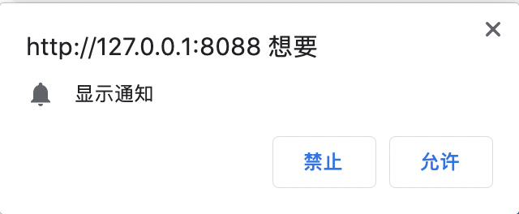
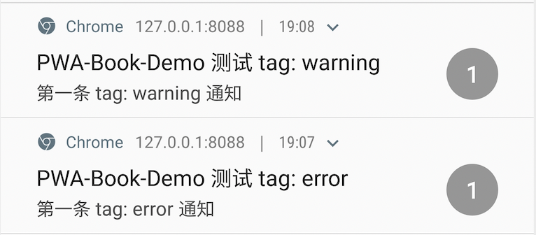

# 桌面通知

在 iOS 和 Android 移动设备中，Native App 向用户推送通知是很常见的行为，这是重新吸引用户访问应用最有效方法之一。然而推送通知一直被认为是 Web App 缺少的能力，在接下来的两节我们将介绍 Web App 如何实现推送通知。

Notification API 是 HTML5 新增的一套展示桌面通知的 API，桌面通知具有全局效果，它脱离了浏览器，采用和 Native App 相同的机制和 UI，因此无论网页是否打开，也无论浏览器是否在前台展现，只要浏览器在运行，就能够向用户展现通知。

应用通知主要有两种类型，一类是由应用本身生成的本地通知，另一类推送通知，是由服务器推送事件生成。在本节中主要先简单介绍如何使用 Notification API 进行本地通知，离线通知在下一节中会详细介绍。

在本节中我们将提供简单的通知示例，展示使用 Notification API 通知用户。在命令行中运行如下命令，下载示例代码到本地。

```bash
# 从 GitHub 下载代码到本地 pwa-book-demo 目录
$ git clone https://github.com/lavas-project/pwa-book-demo.git

# 进入到 chapter06/notification 目录
$ cd chapter06/notification

# 安装 npm 依赖
$ npm install

# 安装成功后启动 chapter06/notification 示例
$ npm run server
```

在看到命令行中输出 `Server start on: http://127.0.0.1:8088`，意味着已经成功启动。

## 申请通知权限

为避免网站滥用 Notification 给用户造成影响，在展示桌面通知之前，首先需要向用户获取通知权限，只有获得用户授权之后，Notification API 才会生效。对于同一个域名下的网页，只需要获取一次授权即可。那么，如何知道当前站点是否已经被授权？

### Notification.permission

`Notification.permission` 是 `Notification` 的静态属性，代表通知权限的授权状态，取值包括：

- granted：允许展现通知；
- denied：禁止展现通知；
- default：用户尚未授权，此时禁止展现通知，但可以向用户发送授权申请。

在使用桌面通知之前，可以通过这个属性首先判断用户授权状态，再去做下一步操作：

```js
if (Notification.permission === 'granted') {
  // 用户已授权，可展示通知
} else if (Notification.permission === 'denied') {
  // 用户已禁止
} else {
  // 用户尚未授权，需首先向用户申请通知权限
}
```

### Notification.requestPermission()

当用户尚未进行授权时，可以通过 `Notification.requestPermission()` 静态方法向用户申请通知权限，使用方法如下所示：

```js
Notification.requestPermission().then(permission => {
  // 通过 permission 判断用户的选择结果
})
```

这是一个异步函数，返回 Promise 对象。在调用函数的同时，页面会弹出通知权限请求对话框。在示例 `public/script/notification.js` 中，可以查看关于通知权限判断的逻辑。

打开浏览器，访问 `http://127.0.0.1:8088` ，浏览器弹出如下图所示的弹窗。



用户可以选择 “允许”、“禁止”，也可以直接点击关闭对话框，分别对应 `granted`、`denied` 和 `default` 这三种授权行为，这时 promise 对象将 resolve 授权结果，并且同步更新 `Notification.permission` 的值。

当用户选择 “允许” 或 “禁止” 之后，选择结果会被浏览器记录下来，并在下次再次调用 `Notification.requestPermission()` 时将直接返回该结果。因此一旦用户选择了 “禁止”，站点将不会允许展示通知，也不会再次展现授权提示。Chrome 桌面版浏览器可以通过访问 `chrome://settings/content/notifications` 去修改已经进行授权的站点，而目前大部分手机浏览器则需要清除浏览器数据，才能够重新恢复通知权限请求对话框的展示，无论哪一种对于用户来说都是非常麻烦的操作。因此要求开发者应该在最适当的时候申请通知权限，并且对用户加以引导，说明站点获取通知权限的用途，尽量避免用户打开网站立即弹出授权对话框。

获得用户的授权之后，就可以进入下一步的通知展现与交互了。

## 通知展现与交互

浏览器提供通过实例化 `Notification` 对象来显示通知。实例化 `Notification` 的语法如下所示：

```js
const notification = new Notification(title, options)
```

在实例化 `Notification` 对象的同时，会生成一条通知并展现出来。在表现形式上桌面端和移动端存在一定差异，其中桌面端的通知会以卡片的形式从屏幕右上角或者右下角弹出，而移动端则显示在通知栏里。

通过实例化 `Notification` 时传入的不同参数，可以定制通知显示的内容和功能，下文介绍了常见参数的用法，更多用法可以参考 [Notification 规范](<https://notifications.spec.whatwg.org/#concept-notification>)。需要注意的是，截止目前上述可选参数仅有 `body`、`icon`、`data`、`tag` 得到了稳定的支持，其余参数仅有部分浏览器支持，因此需要考虑部分配置失效的可能。

另外对于部分手机浏览器比如 Chrome for Android，要求必须依赖 Service Worker 所提供的方法来展现通知，使用 `new Notification()` 这种方式没有任何效果，因此本小节示例都使用 Service Worker 方法，在下文中会单独详细介绍使用 Service Worker 中的方法来展现通知。

### 展现配置项

#### title 和 body

标题和文本用于显示不同的通知信息，是最常见的通知形式。当标题和文本过长时，不同的浏览器和系统会展现不同的效果，有的会对通知进行截断处理。

```javascript
const title = 'PWA-Book-Demo Notification Title'
const options = {
	body: 'Simple piece of body text.\nSecond line of body text :)'
}
const notification = new Notification(title, options)
```

以上示例在 PC Chrome 上显示效果如下图：


在手机上显示效果为：


#### icon

配置图片 URL 地址，用来在标题和文本旁边显示的小图片。目前对于图标使用的图片尺寸，并没有可靠的规范和指导，如果我们的设备像素比（DPR）是 3，使用 192px 或更高的图片大小是比较好的选择。

在手机上展示效果类似下图：


#### image

用于在通知中增加预览图片，由于桌面和移动设备的比例不同，不同手机上效果裁剪和比例也可能不同，同样很难对图片尺寸制定规范。

在手机上包含图片的通知有时会被折叠，需要用户向下滑动才将通知中的图片展示出来。下图是一个包含图片通知的示例：


#### badge

展现缩略信息时使用的单色图标，用于向用户描述有关通知来源的更多信息，此选项只适用于移动设备，一般默认显示为浏览器的缩略图标。根据 Native App 经验，建议图片大小为 24px 乘像素比率，因此图片大小最好使用 72px 及以上。


####  direction

dir 参数用于设置文本的显示方向，默认值为 `auto`，可取值为 `ltr` 和 `rtl`，分别代表“从左往右”和“从右往左”。在默认情况下，中文、英语、法语等会默认从左往右显示，而阿拉伯语等从右往左显示。

#### vibrate

用于设置通知的振动模式，参数格式为数字数组，数组描述了振动交替的毫秒数。例如 [200, 100] 代表首先振动 200 毫秒，然后停止 100 毫秒，如此反复。

### 交互配置项

#### tag

标签选项是一个字符串 ID，具有相同 tag 的通知会被分类到一起，可以简单的向用户显示多个通知。

通过以下示例可以了解 tag 的用法，先展示一个有 tag 为 "error" 的通知：

```javascript
const title = 'PWA-Book-Demo 测试 tag: error'
const options = {
  body: '第一条 tag: error 通知',
  tag: 'error'
}
const notification = new Notification(title, options)
```

第一条提示如下图：


接着发送第二条新的 tag 为 "warning" 通知，如图所示：



最后仍然发送 tag 为  "error" 的第三条消息，可以看到这条消息静默替换了第一条消息：


#### renotify

使用 tag 进行通知替代时，是没有声音和震动的。使用 `renotify: true ` 可以在展示多个通知时也能够通过声音和震动提示用户。需要注意的是，renotify 是和 tag 选项配合使用的，如果设置了 `renotify: true` 但没有使用 `tag` 参数，浏览器可能会提示发生错误。

#### silent

通知展现的时候是否关闭声音和振动，默认为 `false`，表示默认展现通知时有声音有振动。如果通知不希望用户立即关注，可以设置为 `true`。如果同时定义了 silent 和 renotify，silent 优先级更高。

#### requireInteraction

在桌面端默认情况下，通知会在显示一段时间后自动隐藏，而在移动端上会一直显示通知，直到用户与其交互。如果希望桌面和移动端一致，可将  `requireInteraction` 设置为 `true` 。在使用这个配置项时需要格外而注意，因为这样可能会导致用户体验下降。

### 交互事件

Notification 实例具有以下方法：

- close()：关闭通知

举个例子，比如希望通知在展示 2 秒之后关闭，那么可以这么实现：

```js
let notification = new Notification('你好');
setTimeout(function () {
  notification.close()
}, 2000)
```

Notification 实例化对象具有以下事件句柄：

- onclick：通知点击事件
- onclose：通知关闭事件，无论是用户手动关闭，还是调用 `Notification.close()` 均会触发
- onshow：通知显示
- onerror：通知显示异常事件

下面举一个简单的例子来展示通知的展现以及事件的处理。以下代码会弹出通知 “我是李雷，交个朋友吧”，点击通知后自动打开百度首页。

```js
const notification = new Notification('你好', {
  body: '我叫李雷，交个朋友吧',
  icon: 'https://path/to/icon',
  data: {
    url: 'https://www.baidu.com'
  }
})

notification.onclick = function (e) {
  // 关闭通知
  notification.close()

  // 通过 notification.data 对象可以访问到实例化时传入的 data 参数
  // 这里演示点击通知之后自动打开百度首页
  window.open(notification.data.url)
}
```

## 在 Service Worker 线程中展现通知

上面所介绍的 Notification API 用法全是写在页面主线程里的，在对应网页打开的情况下，即使切换标签页，最小化浏览器，都可以展现通知。但是一旦关闭网页，通知的相关代码随之失效，也就无法继续展现通知。因此需要将 Notification API 放到常驻后台的进程中去运行。

通过第四章对 Service Worker 的介绍，我们知道，Service Worker 是一个独立的 worker 线程，即使在关闭网页的情况下，Service Worker 依然能够被唤醒，因此我们可以将展现通知的代码写到 Service Worker 文件中，就能够在页面关闭的情况下也可以向用户展现通知了。

在 Service Worker 作用域下无法直接使用 Notification，需要通过一些 Service Worker 所提供的函数去实现通知的展现与交互。其中，`ServiceWorkerRegistration` 对象提供了 `showNotification()` 和 `getNotifications()` 等方法，同时在 Service Worker 作用域下提供了 `notificationclick` 和 `notificationclose` 的全局事件回调。在本节后续的内容当中将会对这些方法和事件做详细的介绍。

ServiceWorkerRegistration 对象可通过以下方法获得：

1. 在主线程中通过注册 Service Worker 所得到的异步返回对象即为 `ServiceWorkerRegistration` 的实例：

```javascript
// 注册 Service Worker 获取 registration
navigator.serviceWorker.register('/service-worker.js').then(function (registration){
  console.log(registration)
})

// 使用 getRegistration 方法获取 registration
navigator.serviceWorker.getRegistration().then(function (registration) {
  console.log(registration)
})
```

2. 在 Service Worker 作用域下可直接通过 `self.registration` 获得：

```javascript
let registration = self.registration
```

在本节示例中，这两种方式我们都有用到，对于展现类的通知我们在 `public/script/notification.js` 直接封装了 displayNotification 方法，而与交互相关的事件监听在 `public/sw.js` 的 Service Worker 文件中可以查看。示例提供了不同类型的通知展示，如图点击对应的按钮可以查看通知效果。


### 展现通知

在 Service Worker 作用域下，通过 `ServiceWorkerRegistration.showNotification()` 方法来展现通知，其参数与上一小节 `Notification` 实例化的参数一致。该方法将返回一个 promise 对象，当通知正常展现时，promise 会 resolve 并返回 undefined，假如通知展示未获许可，那么 promise 将会 reject 并且抛出 `TypeError` 的异常，因此需要做好容错方案。

在 Service Worker  文件中展示通知如下。

```javascript
self.registration.showNotification('你好', {/* options */})
.then(function () {
  // 通知展现成功
})
.catch(function (e) {
  // 通知展现未授权
})
```

在主线程中展示通知如下。

```js
navigator.serviceWorker.getRegistration().then(function (registration) {
  registration.showNotification('你好', {/* options */})
  .then(function () {
  // 通知展现成功
	})
	.catch(function (e) {
  // 通知展现未授权
	})
})
```

### 添加 Actions

通知除了可以为用户展现信息，还可以在设计简单的交互来处理信息，用户不需要打开页面就可以快速与网站或服务交互。当使用 `showNotification` 展现通知时，第二个参数 `options` 将在原有基础上额外支持 action 参数。action 参数是一组自定义行为数组，该数组包括一组对象用于定义向用户显示的按钮。action 对象包括以下几个配置：

- action：按钮 ID 作为标识符字符串
- title：向用户显示的文本的标题
- icon：在动作旁边显示的图像的位置的图标

下面是一个简单的例子，在通知上展现一个 “点赞” 按钮，点击该按钮，将在控制台打印出 “点击了点赞按钮”：

```javascript
self.registration.showNotification('PWA-Book-Demo 测试 actions', {
  body: '点赞按钮可点击',
  actions: [
    {
      action: 'like',
      title: '点赞',
      icon: '/assets/images/like-icon.png'
    }
  ]
})
// 监听通知点击事件
self.addEventListener('notificationclick', function (e) {
  // 关闭通知
  e.notification.close()

  if (e.action === 'like') {
    // 点击了“点赞”按钮
    console.log('点击了点赞按钮')
  } else {
    // 点击了对话框的其他部分
    console.log('点击了对话框')
  }
})
```

actions 的展现样式会受到系统的影响，例如在 Android Nougat 及以上版本，并不会展示 action 的 icon，上面示例效果如图：


### 通知关闭事件

当用户选择忽略通知，比如点击通知的关闭十字或者滑动关闭通知时，`notificationclose` 事件会被调用，该事件通常用来分析用户与通知的交互情况。

```javascript
self.addEventListener('notificationclose', function(event) {
  const dismissedNotification = event.notification

  const promiseChain = notificationCloseAnalytics()
  event.waitUntil(promiseChain
})
```

如上面示例所示，回调对象 event 提供常用的属性和方法用于控制后续逻辑。

* `event.notification` 获取 notification 实例，访问 notification 实例的属性和方法。

* `event.waitUntil` 方法允许传入 Promise 对象，待 Promise 异步操作完成后再结束事件。
* 如果通知定义展示了 actions  按钮，通过 `event.action` 可访问对应的 action。

### 通知点击事件

当用户点击通知时，默认不会关闭或者删除通知，也不会发生任何事情。而此时用户通常希望直接跳转到可以获取更多有关信息的位置，我们通过在 Service Worker 下监听点击事件 `notificationclick` 来处理相关逻辑。

示例中，在 Service Worker 作用域下是无法访问 `window` 对象的，但我们可以通过 `clients.openWindow()` 方法来实现在 Service Worker 作用域下打开网页。

查看示例中 Service Worker 文件  `public/sw.js` ，其中监听 `notificationclick` 事件。

```javascript
// 首先监听 notificationclick 事件：
self.addEventListener('notificationclick', function (e) {
  // 关闭通知
  e.notification.close()
  // 打开网页
  e.waitUntil(clients.openWindow(e.notification.data.url))
})
```

在 `public/script/notification.js` 文件中触发通知展示。

```js
// 接着触发显示通知
registration.showNotification('你好', {
	body: '我叫李雷，交个朋友吧',
  icon: 'https://gss0.baidu.com/9rkZbzqaKgQUohGko9WTAnF6hhy/assets/pwa/demo/pwa-icon.png',
  data: {
    time: new Date(Date.now()).toString(),
    url: 'https://www.baidu.com'
  }
})
```

点击示例页面中 "事件：notificationclick " 选项的按钮，对应的弹窗效果以及点击页面跳转情况如下图所示，可以看到即使在 Service Worker 作用域下，依然可以正常展示通知，并且能够引导打开网页：


这样整个弹出通知和打开网页的过程都完全脱离了网页生命周期的制约，我们已经能做到在未打开对应网页的情况下弹出离线通知，再通过点击通知引导用户打开网页了。当然，仅靠 Notification API 和 clients 并不能做到完全的离线通知，这是因为在目前的条件下，一旦页面销毁，Service Worker 也将很快进入休眠状态。因此需要给 Service Worker 注册可在离线情况下唤醒的事件，这样就能够完整地实现离线通知了。

这个事件就是接下来的小节将要介绍的如何实现在离线状态下的推送通知。
